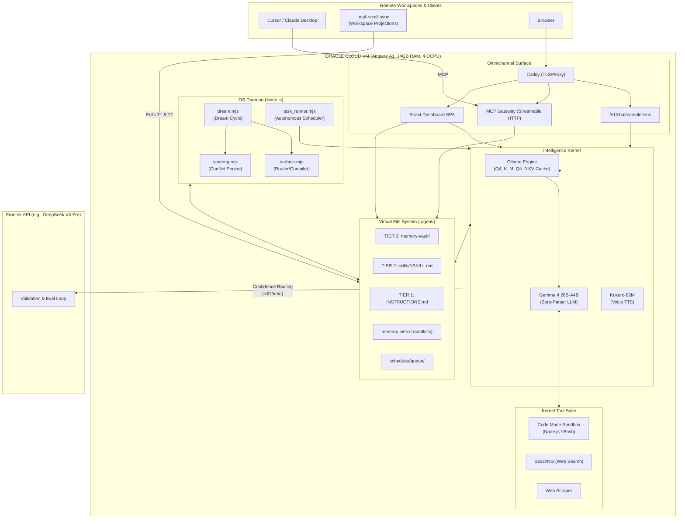

# Total Recall 3.0 — Architecture Document

> Derived directly from the PRD v3.0. Total Recall is a sovereign AI system powered by the proprietary SSSS schema and a local Gemma 4 26B-A4B kernel running on Oracle Cloud ARM infrastructure.

## 1. System Topology (The Sovereign Cloud)



## 2. Directory Layout & SSSS Memory Vault

```text
.agent/
├── memory-vault/                      # TIER 3: Permanent Vault (Source of Truth)
│   ├── invariants/                    # priority: absolute (compiles to T1)
│   ├── preferences/                   # User preferences
│   ├── anti-patterns/                 # Negative examples ("Never do X")
│   ├── patterns/                      # Positive examples ("Always do X")
│   ├── decisions/                     # Architectural logic
│   ├── concepts/                      # Domain concepts
│   ├── facts/                         # Assertions
│   └── lore/                          # Backstory and context
├── memory-derived/                    # Disposable JSONL indexes
│   ├── graph-index.jsonl              
│   └── dream-report.jsonl             
├── memory-inbox/                      # Quarantine for new observations
│   ├── pending/                       # Awaiting conflict resolution
│   └── conflicts/                     # Needs explicit human resolution
├── skills/                            # TIER 2: Progressive Disclosure
│   └── <skill-name>/
│       └── SKILL.md                   # Contains <!-- BEGIN INJECTED MEMORY -->
├── scheduler/                         # Continuous Intelligence
│   └── queue/                         # type: task Markdown files
├── config/                            # Secrets & Auth
│   ├── frontier.yml                   
│   ├── auth.yml                       
│   └── secrets.enc                    
├── files/                             # Sovereign 200GB Storage
├── logs/                              # JSONL system logs
└── .backups/                          # Nightly tar.gpg archives

INSTRUCTIONS.md                        # TIER 1: Compiled Hot Memory
```

## 3. The Zero-Parser Kernel

Unlike earlier agent frameworks that use brittle ASTs or regex loops to parse commands, Total Recall natively uses **Gemma 4 26B-A4B** as the workflow interpreter.

### 3.1 Inference Engine Specification
- **Model**: Gemma 4 26B-A4B (MoE, ~3.8B active parameters)
- **Quantization**: Q4_K_M (~15.5GB RAM usage)
- **Context Capacity**: 256K max, but restricted to ~32K-48K via Q4_0 KV Cache to fit within the 24GB Oracle VM RAM constraint.
- **In-Context Learning Strategy**: No fine-tuning required out of the box. Context is heavily packed with: `[Hot Memory] + [Progressive Skills] + [Few-Shot SSSS Examples] + [Current Task]`.

### 3.2 SSSS Workflow Execution
The LLM reads `type: workflow` files and autonomously executes steps like `## Step N:`, parallel fanout `[Parallel]`, and error bounds `[Retry: N, OnError: Step M]`. It translates these intent structures directly into kernel tool invocations (Sandbox execution, file write, web search).

## 4. Continuous Intelligence & Observability

The OS daemon orchestrates a priority-driven task scheduler that ensures the kernel is constantly working (1,000+ daily inferences at $0 cost). A dedicated `watchdog.mjs` service continuously tails immutable JSONL logs to execute active safety nets and automated triggers, especially critical during YOLO Mode.

### Priority Queue Weights:
- **P0:** User-Facing (Real-time Chat, Dashboard usage)
- **P1:** Memory Maintenance (Dream Cycle, compression, indexing)
- **P2:** Skill Engineering (Autonomous research to draft `SKILL.md` files)
- **P3:** Proactive Research (Web searching current events, knowledge refresh)
- **P4:** Self-Evaluation (Frontier eval runs)
- **P5:** Exploration (Speculative background curiosities)

### Automated Triggers:
- **Sandbox Circuit Breakers:** Automatically quarantines workflows upon >3 consecutive non-zero exit codes.
- **Exfiltration Anomalies:** Triggers instant API routing suspensions if abnormal token limits are detected.
- **Resource Recovery:** Flushes KV cache if latency drifts >2x baseline.

## 5. SSSS Frontmatter Schema (v2)

All VFS files rely on strict YAML frontmatter, verified by Zod.

```yaml
---
# === Identity ===
type: memory                          # memory | task | workflow | assistant | rule
slug: descriptive-lowercase-slug
category: patterns                    # invariants | preferences | etc.
title: "Human-readable description"
schema_version: 2

# === Lifecycle ===
status: active                        # active | draft | superseded | deprecated
created: 2026-05-01T14:30:00Z
updated: 2026-05-10T14:03:00Z
last_accessed: 2026-05-09T17:55:00Z

# === Weight & Enforcement ===
importance: 3                         # 1–5
priority: normal                      # normal | high | absolute
confidence: 0.92                      # 0.00–1.00
modality: must                        # must | must_not | should | should_not | descriptive | preference

# === Semantic Ontology (O(1) conflict check) ===
subject: agent
predicate: use_pm2_reload
object: deployment
sentiment_polarity: directive_must
sentiment_target: "deployment"

# === Provenance & Relationships ===
source:
  type: chat
  session_id: 7f3a2b1c
supersedes: []
superseded_by: null
contradicts: []
tags: [deploy, ops, pm2, zero-downtime]
routes_to_skills: []
---
```

## 6. Tiered Intelligence Architecture

While Gemma 4 26B-A4B handles 99% of work locally and securely, high-stakes reasoning or self-evaluation utilizes a BYOK (Bring Your Own Key) **Frontier API** (e.g., DeepSeek V4 Pro, OpenAI).

- **Confidence Routing**: If Gemma 4 lacks confidence on a complex step, it escalates to the Frontier API.
- **Eval Loop Flywheel**: Gemma 4 autonomously builds skills -> self-tests -> sends to Frontier model for ~$0.012 eval -> receives corrections -> applies them to VFS -> learns from it as a few-shot example on future iterations.

## 7. Component Boundaries & Engines

| Component | Responsibility | Mechanics |
|:---|:---|:---|
| **`dream.mjs`** | Memory Maintenance | Light Sleep (scan modified), REM (pattern recognition, dream scoring), Deep Sleep (recompile surface). Decays stale memories, promotes active ones. |
| **`steering.mjs`** | Conflict Detection | Layer 1: O(1) Ontology Check (SPO). Layer 2: Fuzzy Similarity (Jaccard + Cosine). Quarantines conflicts to `.agent/memory-inbox/conflicts/`. |
| **`surface.mjs`** | Skill Routing | Hybrid BM25 + TF-IDF router. Injects top 7 memory nodes into relevant `SKILL.md` boundaries. Compiles T1 `INSTRUCTIONS.md` from `priority: absolute` nodes. |
| **Sandbox** | JIT Code Execution | Default offline network namespace, scoped to `.agent/`, 512MB RAM cap, 60s timeout. `yolo_mode: true` bypasses manual user-approval blockers. Credential injection via `{{secrets.*}}` AES-256 decrypted at runtime. |
| **Dashboard** | Omnichannel Interface | React SPA reverse proxied by Caddy, exposes visual SSSS manager, code playground, and file explorer. Renderable inside IDEs via MCP iframe. |

## 8. Backup & Security Model

- **Data Sovereignty:** The "Frontier Firewall" redacts `privacy: local_only` nodes before routing to Cloud APIs. Defaults to `allow_frontier_export: ask_per_skill`, or `always` for YOLO Mode.
- **Network & Access:** Ports 443 (HTTPS) and 22 (SSH Key-Only) allowed. Auth via bcrypt + TOTP (Dashboard) and OAuth 2.1 (MCP). Token bucket rate limits apply.
- **Code Mode Isolation:** Scripts run offline by default in experimental-vm-modules Node threads. Cannot access host outside `~/.agent/`.
- **Encryption at Rest:** The entire SSSS Virtual File System is encrypted at the block volume layer.
- **Backup Strategy:** Nightly encrypted tarballs (AES-256 + GPG) to local block storage, with optional rsync to S3/B2. Recovers via `npx total-recall restore`.
- **Secrets Management:** Argon2id master password protects AES-256-GCM `secrets.enc`. No plaintext keys written to disk.

## 9. Repo-Expert Utilities

The `repo-expert` skill includes autonomous automation scripts located in `.agent/skills/repo-expert/scripts/` to help manage the Omnichannel Surface capabilities:

### 9.1 API Mapping (`map-api.mjs`)
Scans `src/server/api.mjs` using regular expressions to dynamically extract all registered Express routes (`GET`, `POST`, `PUT`, `DELETE`). It outputs a localized routing index (`api-map.json`) which serves as a source of truth for the available API endpoints.
- **Usage:** `node .agent/skills/repo-expert/scripts/map-api.mjs`

### 9.2 MCP Tool Scaffolding (`create-mcp-tools.mjs`)
Consumes the `api-map.json` index to autonomously scaffold Model Context Protocol (MCP) tool registrations. This allows agents to seamlessly map any newly created REST endpoints directly to the MCP gateway in `src/server/mcp.mjs`.
- **Usage:** `node .agent/skills/repo-expert/scripts/create-mcp-tools.mjs`


<!-- BEGIN INJECTED MEMORY: do not edit by hand; rebuilt by total-recall surface -->
<!-- @route: tfidf, generated_at: 2026-05-19T22:45:39.176Z -->

<!-- END INJECTED MEMORY -->
