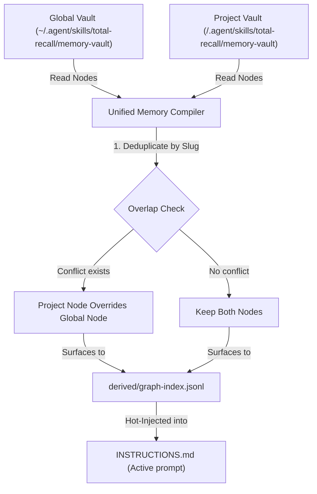

# Total Recall — Dual-Layer Brain Architecture

This document details the design, orchestration, file resolution precedence, and conflict detection structures of the **Dual-Layer Memory System** in the Total Recall OS.

---

## 🗺️ 1. Orchestration & VFS Hierarchy

Total Recall separates core intelligence into two distinct virtual file system (VFS) layers. This allows broad, general rules to live globally while specialized, repository-level facts live within active coding projects.

```
~ (User Home)
└── .agent/skills/total-recall/    <-- GLOBAL BRAIN LAYER
    ├── config/brain.json          # Master configuration & API keys
    ├── memory-vault/              # Broad user preferences & SOUL.md
    └── memory-derived/            # disposable global caches

/Users/greg/Github/total-recall/   <-- LOCAL PROJECT BRAIN LAYER
└── .agent/skills/total-recall/
    ├── memory-vault/              # Project-specific facts & patterns
    └── memory-derived/            # Unified project-local compiled index
```

---

## ⚡ 2. Precedence & Compilation Merge Flow

When the OS rebuilder compiles the vault, it executes the unified compilation loop inside `src/core/surface.mjs`:



### Precedence Rules:
1. **Local Vault Dominance**: If a memory node with the same `slug` exists in both the global vault and the project vault, the **project vault version is treated as the source of truth** and overrides the global version.
2. **Unified Indexing**: The compiler reads all files from both directories and outputs a single, combined `graph-index.jsonl` cache under the project's `.agent/skills/total-recall/memory-derived/` directory.
3. **Instruction Injection**: Absolute invariants (`priority: absolute` and `modality: must|must_not`) from both layers are injected directly into the active prompt keeper (`INSTRUCTIONS.md` / `.cursorrules`).

---

## 🔍 3. Dual-Layer Drift Detection

Discrepancies between canonical vault markdown files and disposable index caches are verified by the **Drift Detector** (`src/core/drift-detector.mjs`).

To support the dual-layer brain without generating false positives (ghost records), the `detectIndexDrift` engine implements the following check sequence:
1. Resolves directories of both the project brain and global brain.
2. Scans for canonical `.md` memory nodes in BOTH folders.
3. Loads the compiled `graph-index.jsonl` entries.
4. Verifies that every canonical node exists in the index (missing checks) and that every index entry maps back to a valid file in either the local or global vault (ghost records verification).

---

## 🛡️ 4. Conflict Detection, Quarantine, & Auto-Resolution

When new rules are learned or memories are saved, they go through the **Steering and Conflict Engine** (`src/core/conflict-detector.mjs`):

### The Quarantine State Machine:
1. **Clash Detection**: The engine scans incoming frontmatter modalities and semantic targets against existing active nodes.
2. **Invariant Quarantine**: If a new rule contradicts an existing `priority: absolute` invariant, the engine aborts automated ingestion, logs a conflict record under `.agent/skills/total-recall/memory-inbox/conflicts/`, and flags it for **Human Quarantine Review** to protect memory integrity.
3. **Auto-Resolution (Human vs. Machine)**: If a newly saved human-created node conflicts with an older, machine-generated research node, the engine automatically resolves the conflict in favor of the human, applying `superseded` status to the machine node and compiling the vault immediately without interrupting the developer.
