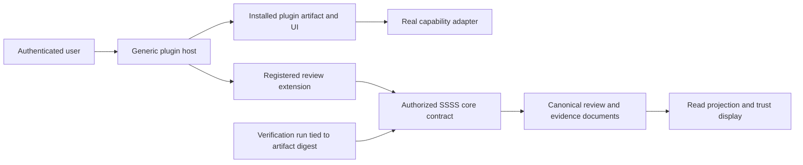
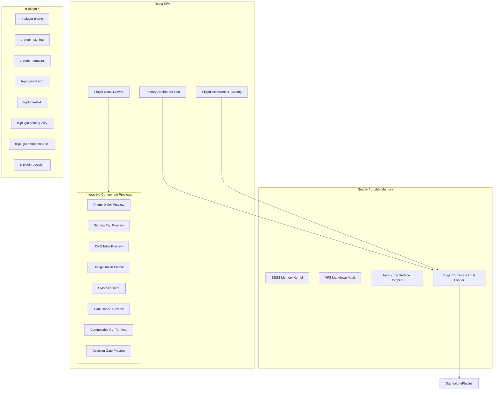

> **Consolidated 2026-10-07:** Historical source record. Active ownership and priorities moved to [TR_CORE_PLUGIN_SPLIT](../../../in-progress/TR_CORE_PLUGIN_SPLIT/TR_CORE_PLUGIN_SPLIT_PROJECT_TRACKER.md). This record is superseded, not certified complete.


# PLUGIN_SHOWCASE_UI — Architecture Document

> **Project Prefix**: `PLUGIN_SHOWCASE_UI` · **Project ID**: `8dcccc83-ff9a-4804-b2d0-dcc3304fb92d`
> **Repository**: `total-recall`
> **Kanban State**: 🚧 In progress
> **Author**: Antigravity with Greg Iteen
> **Date**: 2026-09-30
> **Reconciliation**: Codex; original authorship and historical text retained below


> **Based on audit**: [PLUGIN_SHOWCASE_UI_AUDIT.md](PLUGIN_SHOWCASE_UI_AUDIT.md), reconciled 2026-09-30.

> **Product-scope qualification (PIC-023):** Genuine opt-in authenticated authored review text is a proposed reconciliation of contradictory project requirements. This documentation does not establish Greg's approval of additional social features. Review schema/storage/provenance corrections repair existing defects; enabling expanded reviews or numerical ratings requires explicit requirements agreement. All review-specific target requirements below are conditional on that agreement. Measured artifact-bound conformance remains separate from user opinion.

## Corrected target architecture — not a claim of current implementation

The host owns generic discovery, artifact integrity, authorized execution, and UI loading. Installed plugins own capability adapters, commands, data projections, and functional UI. Do not maintain a second set of simulated capability implementations inside the host. Remove or replace the eight current host mock previews only after the functional plugin boundary and honest unavailable state are established (PIC-001).



### Reviews and provenance (PIC-002, PIC-003)

Use a registered plugin extension primitive with validated universal frontmatter and explicit canonical category. Resolve its namespace through the registry and make the reader use the same projection as the writer. Do not treat a locally invented `plugin_review` type as registered. No direct application-state writes bypass the SSSS operation pipeline. The implementation must select the registry-compliant primitive identifier before changing the route contract.

Derive reviewer identity from the authenticated requester and store the applicable plugin artifact identity. Reviewer text and rating are user assertions. Provider delivery, test results, and conformance are separate evidence objects that reviewers cannot manufacture through `verified_conformance`. Include ownership checks, idempotent mutation, revision/conflict behavior, and authorized deletion. Tests exercise actual persistence and cleanup in an isolated vault.

### Conformance and evidence (PIC-004)

Return separate publisher claims and verified evidence. Verified evidence includes artifact digest, verification date, environment, executed command, actual exit status, counts, coverage scope, and sanitized log reference. Unknown, expired, absent, or digest-mismatched evidence produces an unverified state. A test-count percentage describes the executed suite only; it cannot imply completeness or delivery success. Reuse an appropriate registered evidence primitive or register the extension through the canonical schema process; no loose JSON persistence.

### Routes and UI integration (PIC-005)

The three existing review/conformance routes are present in source but their operational contract remains incomplete. Reconcile them with the route manifest, authorization tests, API client, and documentation after state/evidence corrections. Add required review mutation endpoints only through the tracked contract. PluginsPage loads the installed UI through the generic host and maps real capability readiness to enabled actions. Empty/offline/error/loading states must reflect actual availability.

### Distribution and verification

Public person-to-person sharing uses explicit sharing state, artifact integrity checks, and separate user ownership. Private mesh sharing remains supported. Verify the actual public sender-to-recipient path without substituting private mesh behavior. Capability functionality is proven in each installed plugin; credentials resolve through the secrets store and never appear in reviews or logs. The final gate runs on the Mac mini and preserves the prior verified artifact plus user vault data for rollback.

## Cross-project requirement reconciliation (PIC-023)

`PLUGIN_P2P` historically forbade ratings/reviews/verified badges while this project's historical PRD requested them. That contradictory instruction set helped produce disconnected trust features. Current target: no invented social proof or manifest-only verified badge. Authenticated review text is a planned opt-in capability, subject to registered schema, actual persistence round trips, and identity provenance. Numerical ratings and aggregate stars must not be presented as established product functionality; expose them only after requirements agree and their real data path is verified. Verification evidence remains distinct from user opinion. This aligns with the dated P2P reconciliation and makes no deployment claim.

---

**Finding mapping:** PIC-020 owns authenticated review identity and rejection of caller-controlled verification/provenance; PIC-023 owns the cross-project requirements conflict and public-sharing scope. PIC-004 owns measured conformance evidence. See the [central correction tracker](../PLUGIN_IMPLEMENTATION_CORRECTIONS/PLUGIN_IMPLEMENTATION_CORRECTIONS_PROJECT_TRACKER.md).

---

## Historical record — superseded by the reconciliation above

The following original planning text is retained for traceability. It is not an assertion of current implementation, verified plugin status, or operational readiness.


## 1. System Topology & Separation



---

## 2. Frontend Component Architecture

### 2.1 Primary Dashboard Hub (`frontend/src/pages/DashboardPage.tsx`)
- Mounts at `/` as the central operational cockpit.
- **Header**: Active brain switch, system memory count, and mesh status.
- **Hero Hub**: Quick-access cards for installed capability plugins.
- **Activity Stream**: Recent memory writes, audit events, and background agent status.

### 2.2 Re-architected Plugin Showcase (`frontend/src/pages/PluginsPage.tsx`)
- **Filters**: Category selector (`All`, `Telecom & Comms`, `Security & Quality`, `Infrastructure`, `Design & Media`, `CLI & Workflow`, `Intelligence`).
- **Showcase Cards (`PluginCard.tsx`)**:
  - Plugin icon, version, and publisher provenance badge.
  - Conformance badges (`SSSS v2`, `100% Tested`, `White-Label`).
  - Peer star rating and review count.
  - Action buttons (`Preview`, `Open`, `Run`, `Install`).
- **Detail Drawer Tabs**:
  1. `preview`: Live interactive mockup of the extracted UI component.
  2. `marketing`: Detailed value proposition, use case scenarios, and architectural highlights.
  3. `reviews`: User ratings, peer comments, and community feedback.
  4. `run`: Interactive CLI subcommand executor with argument inputs.
  5. `readme`: Rendered GitHub-style markdown documentation.

### 2.3 Interactive Preview Registry (`frontend/src/components/plugins/previews/`)
Each capability plugin maps to an interactive preview component rendering real UI logic:
- `PhonePreview`: Renders the extracted dialer layout from `festech-modular`, with clickable DTMF keypad, call timer, and active audio device controls.
- `SigningPreview`: Renders the Documenso agreement viewer layout with recipient fields and signature placement markers.
- `DomainsPreview`: Renders the Vercel DNS record table with live filtering by record type (`A`, `CNAME`, `TXT`, `MX`) and TTL status.
- `DesignPreview`: Renders the `DESIGN.md` CSS variable palette with primary color swatches, typography hierarchy, and glassmorphic button variants.
- `TextPreview`: Renders the Telnyx two-way SMS thread interface with inbound and outbound message bubbles.
- `CodeQualityPreview`: Renders the unified gate matrix with passing and failing status badges.
- `ComposableCliPreview`: Renders the interactive terminal emulator showing custom registered commands and help output.
- `DecisionPreview`: Renders the interactive decision evaluator with confidence threshold sliders and fallback routes.

---

## 3. SSSS Data Model for Reviews & Conformance

All review data persists in the SSSS filesystem vault:
- **Location**: `memory-vault/reviews/review-<plugin_id>-<node_id>.md`
- **Frontmatter Schema**:
```yaml
---
type: plugin_review
title: Review for tr-plugin-phone
description: Peer audit review and usability assessment
timestamp: 2026-09-30T20:30:00Z
plugin_id: phone
rating: 5
reviewer_node: macmini
verified_conformance: true
portability: structural
tags: [plugin, review, phone, telecom]
---

Extracted WebRTC dialer works reliably across the local mesh network. All 42 unit tests passed during validation.
```

---

## 4. API Endpoints

Add routes to `src/server/routes/plugins.mjs`:
- `GET /api/plugins/:id/reviews`: Reads all `plugin_review` nodes from the vault filtered by `plugin_id`.
- `POST /api/plugins/:id/reviews`: Validates and writes a new `plugin_review` SSSS document via standard Total Recall operations.
- `GET /api/plugins/:id/conformance`: Returns automated static analysis results, SSSS test pass rates, and white-label verification flags.
