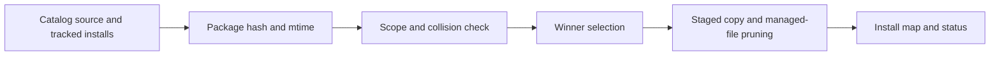

> **Consolidated 2026-10-07:** Historical source record. Active ownership and priorities moved to [TR_CORE_PLUGIN_SPLIT](../../../in-progress/TR_CORE_PLUGIN_SPLIT/TR_CORE_PLUGIN_SPLIT_PROJECT_TRACKER.md). This record is superseded, not certified complete.

# SKILL_PROPAGATION_REPAIR — Architecture

> **Project Prefix**: `SKILL_PROPAGATION_REPAIR`
> **Kanban State**: 🏗️ In Progress
> **Author**: Codex
> **Date**: 2026-09-30
> **Based on audit**: `SKILL_PROPAGATION_REPAIR_AUDIT.md` (Complete, `e5d9aad`)

---

## Package identity and copy path

`src/core/skills-registry.mjs` will enumerate package files in stable path order, excluding only the same generated entries that `copySkillDir()` excludes. The package hash incorporates relative paths and file bytes, including nested support files. Package mtime is the maximum mtime of those files. Layered packages retain their existing `core/` hash and repo-layer separation.

The install map will record the relative paths managed by the last successful deployment. A staged replacement will remove a previously managed path if the new package omits it. Files never recorded as managed remain in place. The staged swap and rollback remain the write boundary.

## Ownership boundary

Direct deploy refreshes known installs. A divergent existing destination without an explicit install record is a collision. Legacy unlayered deployment rejects that collision unless `--force` is supplied. Layered deployment retains explicit core adoption because it changes only `core/`. Sync skips divergent discovered-only copies and reports the conflict instead of promoting or overwriting them. `repo_scoped` and repo-owned source guards remain in force.

## Flow

## State, API, and SSSS

The existing registry YAML install rows gain a `managed_files` list. No REST endpoint or VFS document type is added. The path list is a projection of package contents, not user memory. The repair uses the existing skill registry persistence and atomic replacement path; it does not introduce new persistent application state or bypass a VFS operation in a new feature.

## Security and integration

Managed paths are generated from the package walker and validated as relative paths before staged deletion. The copy never follows a destination symlink, and a failed stage leaves the previous install intact. CLI flags and current registry configuration determine all repository roots; product code contains no personal or host-app path. `sync-repo.mjs` remains separate and receives a support-file test.
