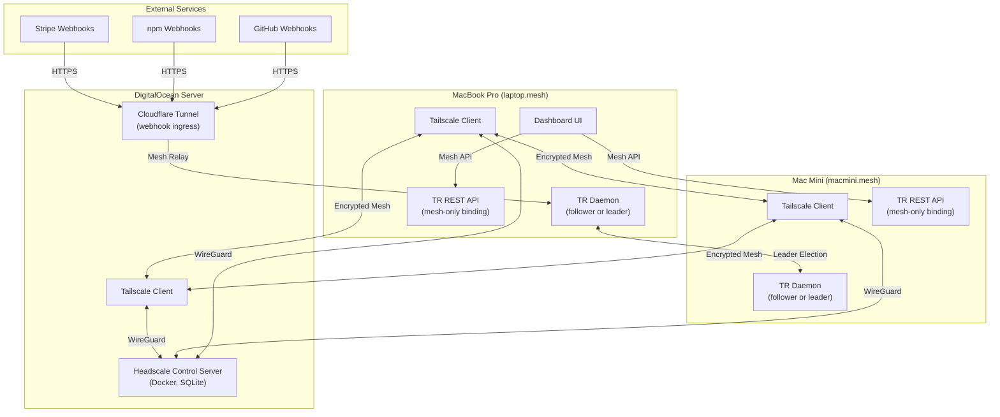
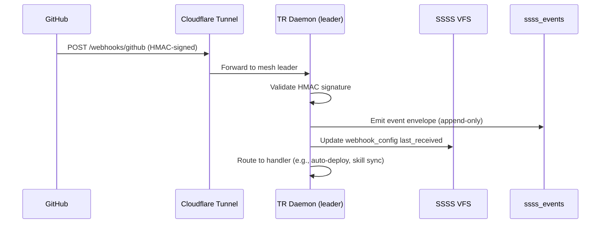

# HEADSCALE_MESH_INTEGRATION — Architecture

> **Companion**: [Audit](./HEADSCALE_MESH_INTEGRATION_AUDIT.md) · [PRD](./HEADSCALE_MESH_INTEGRATION_PRD.md) · [Dev Plan](./HEADSCALE_MESH_INTEGRATION_DEVELOPMENT_PLAN.md) · [Tracker](./HEADSCALE_MESH_INTEGRATION_PROJECT_TRACKER.md)

---

## High-Level System Design



---

## Component Architecture

### 1. Headscale Control Server

**Deployment**: Docker on DigitalOcean server

```yaml
# docker-compose.headscale.yml
services:
  headscale:
    image: headscale/headscale:0.28
    container_name: headscale
    restart: unless-stopped
    ports:
      - "8080:8080"    # gRPC + HTTP
      - "9090:9090"    # Metrics
    volumes:
      - ./headscale/config:/etc/headscale
      - ./headscale/data:/var/lib/headscale
    command: serve
```

**Config** (`config.yaml`):
- Server URL: `https://headscale.totalrecall.dev` (or IP-based)
- Database: SQLite (`/var/lib/headscale/db.sqlite`)
- DERP: Use Tailscale's public DERP servers for NAT traversal
- DNS: Enable MagicDNS with base domain `mesh`
- Pre-auth keys: Generate per-device for automated enrollment

### 2. Mesh Node Registry (SSSS VFS Primitive)

**Path**: `memory-vault/system/mesh-nodes/<hostname>.md`

**SSSS Primitive Type**: `mesh_node`

```yaml
---
type: mesh_node
title: "Mac Mini"
description: "Background compute node for Total Recall daemon"
timestamp: 2026-07-15T22:19:00Z
hostname: macmini
mesh_ip: 100.64.0.2           # Tailscale IP (assigned by Headscale)
lan_ip: 10.0.0.132
os: macos
role: compute                   # compute | development | cloud
daemon_capable: true
last_heartbeat: 2026-07-15T22:19:00Z
status: online                  # online | offline | degraded
headscale_node_id: "abc123"
---

# Mac Mini

Background compute node. Runs daemon and dream cycle when elected as leader.
```

**Mutations via SSSS Core Contract**: `patch` envelopes for heartbeat updates, status changes.

### 3. Daemon Leader Election

**Mechanism**: Simple lease-based election via SSSS VFS.

```yaml
# memory-vault/system/daemon-leader.md
---
type: daemon_leader
title: "Daemon Leader Lease"
description: "Current active daemon leader across the mesh"
timestamp: 2026-07-15T22:19:00Z
leader_hostname: macmini
leader_mesh_ip: 100.64.0.2
lease_acquired: 2026-07-15T22:19:00Z
lease_ttl_seconds: 300          # 5-minute lease, must be renewed
lease_id: "lease-abc123"
---
```

**Election Flow**:
1. On startup, daemon reads `daemon-leader.md` from VFS
2. If no leader or lease expired → acquire lease via SSSS `patch` envelope with `lease_id`
3. If leader exists and lease valid → become follower, enter standby mode
4. Leader renews lease every 60 seconds via SSSS `patch`
5. If leader fails to renew (crash, network loss) → followers detect expired lease → re-election
6. Follower periodically checks leader heartbeat via mesh ping

**Follower Mode**:
- No daemon-loop execution
- No research, dream cycle, or embedding compilation
- Only: heartbeat emission, mesh health reporting, ready to take over

### 4. Webhook Ingress

**Architecture**: Cloudflare Tunnel → daemon webhook endpoint



**Webhook Receiver** (`src/server/routes/webhooks.mjs`):

```
POST /api/webhooks/:provider
  → validateSignature(provider, headers, body)  // HMAC-SHA256
  → parseEvent(provider, body)
  → emitSsssEvent(event)                        // append-only audit
  → routeToHandler(provider, eventType)          // dispatch to action
```

**Webhook Config VFS Primitive** (`memory-vault/system/webhook-configs/<provider>.md`):

```yaml
---
type: webhook_config
title: "GitHub Webhook"
description: "GitHub push/PR/release webhook subscription"
timestamp: 2026-07-15T22:19:00Z
provider: github
endpoint: /api/webhooks/github
secret_key_ref: github_webhook_secret    # reference to secrets.enc key
events_subscribed:
  - push
  - pull_request
  - release
status: active
last_received: null
total_received: 0
---
```

### 5. Secrets Sync Over Mesh

**Mechanism**: Encrypted sync via mesh + SSSS events.

**Flow**:
1. On secret write (via CLI or API) → encrypt `secrets.enc` locally
2. Emit SSSS `event` envelope: `{ event_type: "secrets_updated", checksum: "sha256:...", hostname: "laptop" }`
3. Other mesh nodes receive event via mesh heartbeat poll
4. Follower nodes pull encrypted `secrets.enc` from leader via mesh HTTPS
5. Decrypt locally with shared `TR_SECRETS_PASSWORD`

**Conflict Resolution**: Leader's `secrets.enc` is canonical. Followers always pull from leader.

### 6. REST API Mesh Binding

**Current** (insecure):
```javascript
app.listen(3100, '0.0.0.0');  // exposed to entire LAN
```

**Target** (mesh-only):
```javascript
const meshIp = getMeshIp();     // from Tailscale status
app.listen(3100, meshIp);       // only accessible via mesh
app.listen(3100, '127.0.0.1');  // also localhost for local dev
```

### 7. Dashboard UI Extensions

**MeshPage.tsx** — New dashboard page:
- Connected nodes table: hostname, mesh IP, status, role, last heartbeat
- Leader indicator: which node is the active daemon leader
- Latency matrix: ping times between mesh nodes
- Force leader election button

**WebhooksPage.tsx** — New dashboard page:
- Registered webhooks table: provider, endpoint, status, last received, total count
- Recent webhook events: scrollable log from `ssss_events`
- Add/edit/delete webhook configuration
- Test webhook button (send test payload)

**Navigation**: Both pages added to dashboard sidebar under a "Network" group (alongside the NetworkPage from NETWORK_SAFETY_AND_SECRETS).

---

## Security Considerations

1. **WireGuard encryption**: All inter-device traffic encrypted at the network layer
2. **Mesh-only API binding**: REST API not accessible from LAN or public internet
3. **Webhook HMAC validation**: Every incoming webhook verified with provider-specific signature
4. **ACL enforcement**: Headscale ACLs restrict which nodes can access which services
5. **Pre-auth key rotation**: Keys generated per-device, rotatable without mesh disruption
6. **Secrets sync over mesh**: Encrypted file transferred over encrypted tunnel — double encryption
7. **Leader lease**: Time-bounded, prevents stale leader from making decisions

---

## Integration Points

| System | Integration |
|--------|------------|
| `daemon-loop.mjs` | Leader election on startup; follower mode if not leader |
| `throttled-fetch.mjs` | Mesh-internal requests exempt from rate limiting (local traffic) |
| `secrets-store.mjs` | Sync trigger on write; pull from leader on startup |
| `rest.mjs` | Bind to mesh IP; register webhook routes |
| `routes/network.mjs` | Extended with mesh node status |
| Dashboard | MeshPage, WebhooksPage, nav group |
| Cloudflare Tunnel | Configured for webhook ingress endpoint |
| DigitalOcean | Docker Compose for Headscale server |
