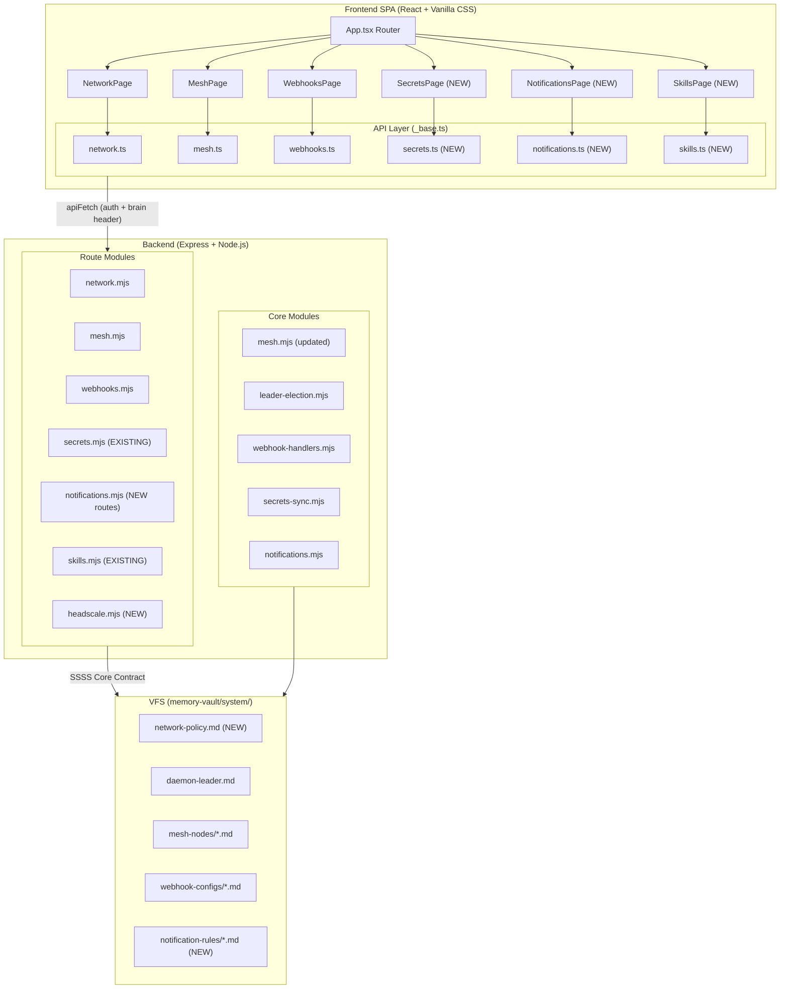

# MESH_DASHBOARD_UI — Architecture

> **Companion:** [Audit](./MESH_DASHBOARD_UI_AUDIT.md) · [PRD](./MESH_DASHBOARD_UI_PRD.md)

---

## High-Level System Design



---

## Component Architecture

### Frontend Components

Each page follows a consistent pattern:

```
PageComponent
├── useEffect → loadData() on mount + interval polling
├── State: data, error, loading, modal visibility
├── Error banner (alert alert-error)
├── Header with title + action buttons
├── Content cards/tables using design system classes
└── Modal dialogs for CRUD operations
```

**Shared CSS classes used across all pages:**
- Layout: `mesh-page`, `mesh-header` (rename to generic `page-container`, `page-header`)
- Cards: `card`
- Tables: `data-table`
- Buttons: `btn`, `btn-primary`, `btn-ghost`, `btn-sm`
- Badges: `badge`, `badge-online`, `badge-offline`, `badge-leader`, `badge-follower`
- Forms: `input`, `select` (need to be defined)
- Alerts: `alert`, `alert-error`, `alert-success` (need to be defined)

### CSS Strategy

All new page-specific styles go in dedicated CSS files:
- `NetworkPage.css` — rewritten from scratch
- `MeshPage.css` — already exists, extend
- `WebhooksPage.css` — new, stop depending on MeshPage.css
- `SecretsPage.css` — new
- `NotificationsPage.css` — new
- `SkillsPage.css` — new

Global utility classes (`alert`, `input`, `data-table`, `badge`, `page-container`, `page-header`) are added to `index.css`.

### API Layer

**Every** API client module MUST use `_base.ts` helpers (`get`, `post`, `del`). No raw `fetch()`.

```typescript
// Pattern for all API modules
import { get, post, del } from './_base';

export async function fetchThing(): Promise<Thing[]> {
  return get('/api/thing');
}
```

`network.ts` must be refactored from raw `fetch()` to this pattern.

---

## API Design

### Existing Routes (fix/keep)

| Method | Path | Auth | Module | Notes |
|--------|------|------|--------|-------|
| GET | `/api/network/stats` | ✅ | network.mjs | Keep as-is |
| GET | `/api/network/policy` | ✅ | network.mjs | Needs `network-policy.md` VFS doc created |
| PUT | `/api/network/policy` | ✅ | network.mjs | Needs VFS doc to function |
| POST | `/api/network/block` | ✅ | network.mjs | Needs VFS doc to function |
| DELETE | `/api/network/block/:domain` | ✅ | network.mjs | Needs VFS doc to function |
| GET | `/api/network/audit` | ✅ | network.mjs | Keep as-is |
| GET | `/api/mesh/leader` | ❌→✅ | mesh.mjs | **Add auth** (Uses local Tailscale CLI) |
| GET | `/api/mesh/nodes` | ❌→✅ | mesh.mjs | **Add auth** (Uses local Tailscale CLI) |
| POST | `/api/mesh/election/force` | ✅ | mesh.mjs | Keep as-is (Uses local Tailscale CLI) |
| POST | `/api/webhooks/:provider` | Signature | webhooks.mjs | Keep — public endpoint, signature-verified |
| GET | `/api/webhooks/configs` | ✅ | webhooks.mjs | Keep as-is |
| GET | `/api/webhooks/events` | ✅ | webhooks.mjs | Keep as-is |
| POST | `/api/webhooks/configs` | ✅ | webhooks.mjs | Keep as-is |
| DELETE | `/api/webhooks/configs/:provider` | ✅ | webhooks.mjs | Keep as-is |
| POST | `/api/webhooks/test/:provider` | ✅ | webhooks.mjs | Keep as-is |
| GET | `/api/secrets/checksum` | ✅ | secrets.mjs | Keep as-is |
| GET | `/api/secrets/sync` | ❌→✅ | secrets.mjs | **Add auth** |

### New Routes

| Method | Path | Auth | Module | Purpose |
|--------|------|------|--------|---------|
| GET | `/api/secrets/list` | ✅ | secrets.mjs | List all secret key names (not values) + metadata |
| POST | `/api/secrets/sync/trigger` | ✅ | secrets.mjs | Force immediate sync to followers |
| GET | `/api/secrets/sync/status` | ✅ | secrets.mjs | Sync status per node (checksum comparison) |
| GET | `/api/notifications/rules` | ✅ | notifications.mjs | List configured alert rules |
| POST | `/api/notifications/rules` | ✅ | notifications.mjs | Create alert rule |
| PUT | `/api/notifications/rules/:id` | ✅ | notifications.mjs | Update alert rule |
| DELETE | `/api/notifications/rules/:id` | ✅ | notifications.mjs | Delete alert rule |
| GET | `/api/notifications/history` | ✅ | notifications.mjs | Notification delivery history |
| POST | `/api/notifications/test` | ✅ | notifications.mjs | Send test notification |
| GET | `/api/skills/list` | ✅ | skills.mjs | List installed skills with metadata |
| GET | `/api/skills/:name` | ✅ | skills.mjs | Skill detail (rendered SKILL.md) |
| POST | `/api/skills/sync` | ✅ | skills.mjs | Trigger skill sync across mesh |
| GET | `/api/skills/sync/status` | ✅ | skills.mjs | Sync status per node |
| GET | `/api/headscale/node` | ✅ | headscale.mjs | List Headscale nodes via REST API |
| DELETE | `/api/headscale/node/:id` | ✅ | headscale.mjs | Delete Headscale node via REST API |
| GET | `/api/headscale/preauthkey` | ✅ | headscale.mjs | List Pre-Auth Keys via REST API |
| POST | `/api/headscale/preauthkey` | ✅ | headscale.mjs | Create Pre-Auth Key via REST API |
| GET | `/api/headscale/user` | ✅ | headscale.mjs | List Headscale users via REST API |

---

## Data Model

### VFS Documents (New)

#### `memory-vault/system/network-policy.md` (MISSING — must create)

```yaml
---
type: network_policy
id: network-policy
title: "Network Firewall Policy"
description: "Global network policy governing outbound request filtering and rate limiting"
timestamp: 2026-07-16T00:00:00Z
blocked_domains:
  - tracking.example.com
max_global_concurrency: 20
max_per_domain_concurrency: 5
default_timeout_ms: 30000
domain_limits: {}
whitelist_mode: false
allowed_domains: []
---

# Network Policy

This document governs the throttled-fetch network gate. Mutations via SSSS Core Contract only.
```

#### `memory-vault/system/notification-rules/*.md` (NEW)

```yaml
---
type: notification_rule
id: notify-node-offline
title: "Node Offline Alert"
description: "Alert when a mesh node goes offline"
timestamp: 2026-07-16T00:00:00Z
event: node_offline
channel: desktop
priority: critical
enabled: true
quiet_hours: false
---
```

### Frontend Types (New)

```typescript
// secrets.ts
export interface SecretEntry {
  key: string;
  lastModified: string;
  syncStatus: Record<string, 'synced' | 'pending' | 'divergent'>;
}

// notifications.ts
export interface NotificationRule {
  id: string;
  event: string;
  channel: 'desktop' | 'webhook' | 'email';
  priority: 'critical' | 'high' | 'low';
  enabled: boolean;
  quietHours: boolean;
}

export interface NotificationEntry {
  id: string;
  title: string;
  message: string;
  channel: string;
  status: 'delivered' | 'failed';
  timestamp: string;
}

// skills.ts
export interface SkillInfo {
  name: string;
  version: string;
  description: string;
  lastSynced: string;
  fileCount: number;
}
```

---

## SSSS Compliance

| Requirement | Implementation |
|-------------|---------------|
| All state in VFS | ✅ Network policy, webhook configs, notification rules, mesh nodes, daemon leader — all in `memory-vault/system/` |
| Mutations via Core Contract | ⚠️ Fix `webhooks.mjs` and `network.mjs` mock req/res pattern — route mutations through proper SSSS API |
| Audit as events | ✅ Webhook events already emitted as SSSS events. Add notification delivery events. |
| API reads from VFS | ✅ All GET routes read from vault-cache |

---

## Security Considerations

| Issue | Fix |
|-------|-----|
| Mesh routes (`/leader`, `/nodes`) have no auth | Add `requireAuth` middleware |
| Secrets sync endpoint has no auth | Add `requireAuth` + mesh-only IP check |
| Webhook secrets missing from VFS configs | Document in setup wizard; fall back to env vars is acceptable |
| Webhook endpoint open if no secret configured | Add explicit reject if no secret found (don't skip verification) |

---

## Routing Updates (App.tsx)

| Route | Component | Sidebar Group |
|-------|-----------|---------------|
| `/network` | `<NetworkPage />` | Network |
| `/mesh` | `<MeshPage />` | Network |
| `/webhooks` | `<WebhooksPage />` | Network |
| `/secrets` | `<SecretsPage />` | Security (NEW group) |
| `/notifications` | `<NotificationsPage />` | System (NEW group) |
| `/skills` | `<SkillsPage />` | System |
