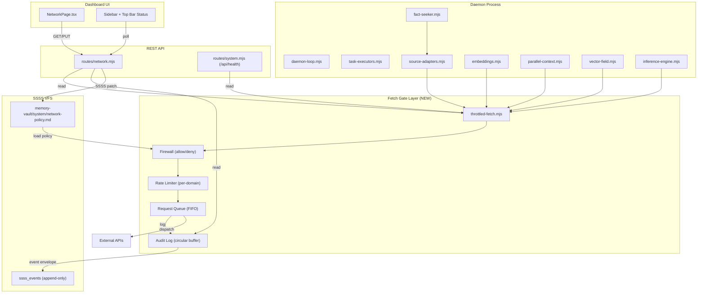

# NETWORK_SAFETY_AND_SECRETS — Architecture

> **Companion**: [Audit](./NETWORK_SAFETY_AND_SECRETS_AUDIT.md) · [PRD](./NETWORK_SAFETY_AND_SECRETS_PRD.md) · [Dev Plan](./NETWORK_SAFETY_AND_SECRETS_DEVELOPMENT_PLAN.md) · [Tracker](./NETWORK_SAFETY_AND_SECRETS_PROJECT_TRACKER.md)

---

## High-Level System Design



---

## Component Architecture

### 1. Fetch Gate (`src/core/throttled-fetch.mjs`)

The central chokepoint for ALL outbound HTTP requests.

**Internal State:**
- `globalInFlight: number` — current total active connections
- `domainInFlight: Map<string, number>` — per-domain active connection counts
- `waitQueue: Array<QueueEntry>` — FIFO queue of pending requests
- `blockedDomains: Set<string>` — domains that are immediately rejected
- `allowedDomains: Set<string>` — if non-empty, whitelist mode (only these pass)
- `domainLimits: Map<string, DomainConfig>` — per-domain concurrency overrides
- `auditBuffer: CircularBuffer<AuditEntry>` — last 200 request outcomes

**Request Flow:**
```
throttledFetch(url, options, timeoutMs)
  → extractDomain(url)
  → checkFirewall(domain)        // blocked? → throw. whitelist miss? → throw.
  → canDispatch(domain)?
    → YES: acquireSlot → executeFetch → releaseSlot → drainQueue
    → NO:  enqueue → wait for slot → executeFetch → releaseSlot → drainQueue
  → logToAuditBuffer(entry)
  → emitSsssEvent(entry)         // append-only event envelope
```

**Exports:**
- `throttledFetch(url, opts, timeoutMs)` — drop-in `fetch()` replacement
- `safeFetch(url, opts, timeoutMs)` — convenience wrapper
- `getGateStats()` — observability snapshot
- `getAuditLog(filter?)` — recent request audit
- `blockDomain(domain)` / `unblockDomain(domain)`
- `loadPolicy(policyDoc)` — load from VFS frontmatter
- `resetGateStats()` — for testing

### 2. Network Policy VFS Document

**Path:** `memory-vault/system/network-policy.md`

**SSSS Primitive Type:** `network_policy`

**Frontmatter Schema:**
```yaml
---
type: network_policy
title: "Network Policy"
description: "Application-level firewall and rate limiting configuration for the Total Recall daemon"
timestamp: 2026-07-15T22:18:00Z
# Firewall
blocked_domains: []
allowed_domains: []          # empty = allow all (no whitelist)
# Rate limits
global_concurrency: 6
per_domain_default: 3
domain_limits:
  generativelanguage.googleapis.com:
    max_concurrent: 2
    min_interval_ms: 200
  api.openai.com:
    max_concurrent: 2
    min_interval_ms: 200
  api.search.brave.com:
    max_concurrent: 1
    min_interval_ms: 500
# Timeouts
default_timeout_ms: 15000
---

# Network Policy

This document controls the Total Recall daemon's outbound network behavior.
Changes to this document are applied immediately via VFS hot-reload.
```

**Mutation via SSSS Core Contract:**
```json
{
  "envelope": "patch",
  "workspace_id": "system",
  "path": "system/network-policy.md",
  "frontmatter": {
    "blocked_domains": ["evil.com", "tracking.example.com"],
    "global_concurrency": 4
  }
}
```

### 3. Audit Event Envelope

Each completed request emits an append-only SSSS `event`:

```json
{
  "envelope": "event",
  "workspace_id": "system",
  "path": "events/network-audit",
  "payload": {
    "event_type": "network_request",
    "timestamp": "2026-07-15T22:18:00.000Z",
    "domain": "generativelanguage.googleapis.com",
    "method": "POST",
    "status": 200,
    "duration_ms": 342,
    "queue_wait_ms": 0,
    "global_in_flight_at_dispatch": 3,
    "outcome": "success"
  }
}
```

### 4. Network REST API (`src/server/routes/network.mjs`)

| Method | Endpoint | Description | SSSS Role |
|--------|----------|-------------|-----------|
| GET | `/api/network/stats` | Gate stats + audit log | Read-only projection |
| GET | `/api/network/policy` | Current firewall policy | Read VFS frontmatter |
| PUT | `/api/network/policy` | Update firewall policy | SSSS `patch` envelope |
| POST | `/api/network/block` | Add blocked domain | SSSS `patch` envelope |
| DELETE | `/api/network/block/:domain` | Remove blocked domain | SSSS `patch` envelope |
| GET | `/api/network/audit` | Filtered audit log | Read from event projections |

All mutation endpoints internally submit SSSS envelopes through `POST /api/v1/ssss`. They never write files directly.

### 5. Dashboard UI (`frontend/src/pages/NetworkPage.tsx`)

**Sections:**
1. **Live Stats Panel** — polling every 2s: in-flight gauge, queue depth, completed/error/timeout counters, peak values
2. **Per-Domain Breakdown** — table of active domains with traffic, latency, error rates
3. **Audit Log** — scrollable table of last 200 requests, filterable by domain/status/time
4. **Firewall Config** — blocklist chips, whitelist toggle, per-domain rate sliders, global concurrency slider
5. **Top Bar Indicator** — green/amber/red dot reflecting gate health

**API Client:** `frontend/src/api/network.ts`

### 6. PID Lockfile (`src/core/daemon-loop.mjs`)

- Write `<brainDir>/daemon.pid` on startup with current PID
- Check on startup: if file exists and process alive → exit with "already running" error
- Remove on SIGTERM, SIGINT, uncaughtException
- Simple `fs.writeFileSync` / `fs.unlinkSync` — this is process metadata, not application state, so it does NOT go through SSSS

### 7. Secrets Encryption (`src/core/crypto.mjs` + `src/core/secrets-store.mjs`)

**Current architecture (broken):**
```
setup.mjs → JSON.stringify() → fs.writeFileSync('secrets.enc')  // PLAINTEXT
```

**Target architecture:**
```
setup.mjs → secrets-store.writeSecrets(data)
  → crypto.encrypt(JSON.stringify(data), password)    // AES-256-GCM
  → fs.writeFileSync('secrets.enc', encryptedBuffer)   // ENCRYPTED

runtime.mjs → secrets-store.readSecrets()
  → fs.readFileSync('secrets.enc')
  → crypto.decrypt(buffer, password)                   // AES-256-GCM
  → JSON.parse(plaintext)
```

**Password source:** `TR_SECRETS_PASSWORD` environment variable (already documented in `src/cli/secret.mjs` L120).

---

## Security Considerations

1. **Fetch gate prevents resource exhaustion** — max 6 concurrent connections prevents NAT table overflow
2. **Domain firewall prevents data exfiltration** — blocklist/whitelist controls which external services the daemon can contact
3. **Audit log provides forensic trail** — every outbound request logged with timing and outcome
4. **Encrypted secrets at rest** — AES-256-GCM with scrypt key derivation
5. **PID lock prevents duplicate daemons** — eliminates 2x network load from uncoordinated instances
6. **SSSS compliance** — policy changes are auditable, idempotent, and version-controlled through VFS

---

## Integration Points

| System | Integration |
|--------|------------|
| `daemon-loop.mjs` | PID lockfile on startup/shutdown; loads network policy from VFS |
| `source-adapters.mjs` | All `fetch()` calls replaced with `throttledFetch()` |
| `embeddings.mjs` | All `fetch()` calls replaced with `throttledFetch()` |
| `parallel-context.mjs` | All `fetch()` calls replaced with `throttledFetch()` |
| `vector-field.mjs` | Verify it goes through `embeddings.mjs` (already gated) |
| `inference-engine.mjs` | All `fetch()` calls replaced with `throttledFetch()` |
| `routes/system.mjs` | `/api/health` includes gate stats |
| `rest.mjs` | Register `routes/network.mjs` |
| Dashboard sidebar | Add "Network" nav item |
| Dashboard top bar | Add gate health indicator |
