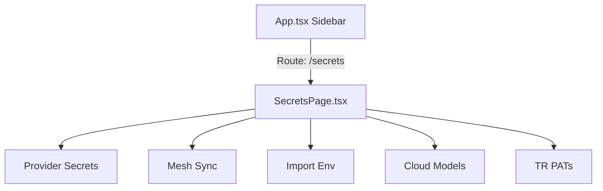

# Secrets Consolidation Architecture

## Component Design

We will unify all key/secret operations inside a single page **`SecretsPage.tsx`** using a clean tabbed layout. We will map this page to the `/secrets` route and redirect `/keys` to `/secrets`.

### Tabs Layout (`Tab` type):
- `catalog`: Provider secrets (env credentials editor + "Add Secret" button to trigger create panel).
- `pats`: Personal Access Tokens (TR PATs key generator).
- `import`: Env scanning/migration imports.
- `cloud`: Cloud model configurations.
- `sync`: Mesh nodes sync status, force sync button, and sync log events.

### Key Changes
1. **Unification of APIs**:
   - `SecretsPage.tsx` will replace `ApiKeysPage.tsx`. We will combine the logic and styles of both pages into this single component.
2. **Secrets Creation**:
   - Introduce a "Create Secret" button in the catalog toolbar.
   - When clicked, it sets `selected = null` and a state `isCreating = true`.
   - The right side panel renders input fields for `Key Name`, `Secret Value`, `Provider`, `Scope`, and `Repos`.
   - Submitting the form calls `addSecret(key, value, provider)` and reloads the catalog.
3. **Sidebar / Route Refactoring**:
   - Remove the redundant `/keys` route definition in `App.tsx` and instead map `/keys` to redirect to `/secrets`.
   - Update the `/secrets` sidebar navigation item label to "Secrets & Keys" and ensure it is active.
   - Delete obsolete pages from the directory: `ApiKeysPage.tsx`, `ModelsPage.tsx`, `VaultPage.tsx` and their corresponding `.spec.tsx` files.
