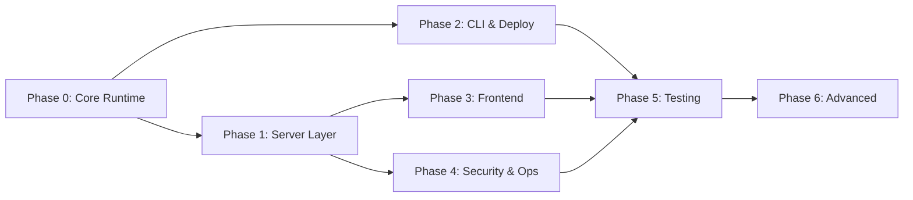
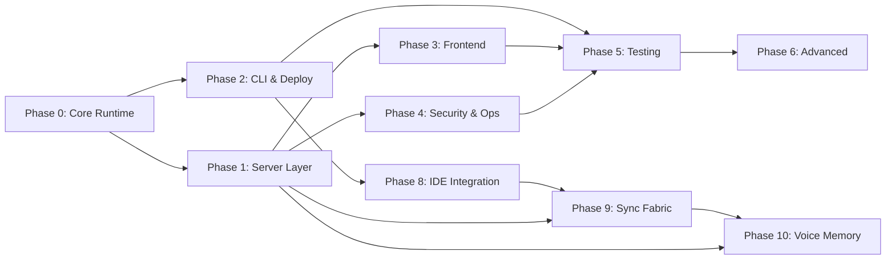

# Total Recall 3.0 — Development Plan

> Phased implementation roadmap derived from PRD v3.0 and ARCHITECTURE.md.
> Each phase produces a testable, self-contained deliverable.

---

## Build Strategy

This repo is an npm package. The build order is:

1. **Core Runtime** — The modules that run on the target machine (mostly done)
2. **Server Layer** — HTTP endpoints that expose the core (mostly done)
3. **CLI & Deploy** — The `npx total-recall deploy` pipeline (not started)
4. **Frontend** — React SPA dashboard (scaffolded, not built)
5. **Security & Ops** — TLS, auth, backup, monitoring (not started)
6. **Testing & Validation** — E2E tests proving acceptance criteria (not started)

---

## Phase 0: Core Runtime

> **Goal:** All `src/core/` modules exist and are individually functional.

### Deliverables
- `src/core/vault.mjs` — Atomic read/write/walk of SSSS nodes
- `src/core/schema.mjs` — Zod validators for schema v2
- `src/core/surface.mjs` — BM25+TF-IDF routing + Tier 1 INSTRUCTIONS.md compiler
- `src/core/steering.mjs` — Conflict detection (SPO + fuzzy layers)
- `src/core/sandbox.mjs` — Isolated Node.js/Bash execution with credential injection
- `src/core/dream.mjs` — Dream cycle daemon (Light/REM/Deep sleep phases)
- `src/core/task_runner.mjs` — P0–P5 priority queue manager
- `src/core/frontier.mjs` — BYOK frontier API routing client
- `src/core/pattern_detector.mjs` — User pattern recognition → task generation
- `src/core/blackboard.mjs` — Workflow state tracking
- `src/core/evolution.mjs` — Schema self-evolution proposals
- `src/core/watchdog.mjs` — Log monitor + automated circuit breakers

### Acceptance
- Each module can be imported and called independently
- `schema.mjs` validates a sample memory node without error
- `vault.mjs` can read/write/walk a test vault directory

---

## Phase 1: Server Layer

> **Goal:** Unified Express server exposing all interfaces.

### Deliverables
- `src/server/index.mjs` — Main server entry that mounts all routes
- `src/server/api.mjs` — `/v1/chat/completions` OpenAI-compatible proxy
- `src/server/mcp.mjs` — `/mcp` Streamable HTTP gateway (tools, resources, prompts)
- Health check endpoint (`GET /health`)
- Static file serving for built frontend assets

### Acceptance
- `node src/server/index.mjs` starts a server on the configured port
- `POST /v1/chat/completions` proxies to Ollama or frontier API
- `POST /mcp` completes MCP initialization handshake
- `GET /health` returns JSON system status

---

## Phase 2: CLI & Deploy Pipeline

> **Goal:** `npx total-recall deploy` provisions a target machine end-to-end.

### Deliverables
- `bin/total-recall.mjs` — CLI entrypoint with subcommand routing
- `src/cli/deploy.mjs` — Host provisioning (detect arch, install Ollama, pull models, scaffold VFS, install Caddy, create systemd units, start services)
- `src/cli/compile.mjs` — Rebuild indexes + INSTRUCTIONS.md
- `src/cli/dream.mjs` — Manually trigger dream cycle
- `src/cli/reindex.mjs` — Delete + regenerate derived indexes
- `src/cli/lint.mjs` — Validate vault nodes against schema v2
- `src/cli/daemon.mjs` — start/stop/status for background daemon
- `src/cli/backup.mjs` — Encrypted tarball creation (AES-256 + GPG)
- `src/cli/restore.mjs` — Restore from backup + reindex
- `src/cli/export.mjs` — Portable VFS export
- `src/cli/import.mjs` — Import VFS on new host
- `src/cli/upgrade.mjs` — Swap kernel model
- `scaffold/.agent/` — VFS directory skeleton with defaults
- `templates/Caddyfile` — Reverse proxy + auto-TLS config
- `templates/total-recall-server.service` — systemd unit for Express server
- `templates/total-recall-daemon.service` — systemd unit for dream cycle daemon
- `templates/default-config/frontier.yml` — Default frontier API config
- `templates/default-config/security.yml` — Default privacy/export controls
- `package.json` `"bin"` field → `"total-recall": "./bin/total-recall.mjs"`

### Acceptance
- `npx total-recall deploy` runs on a fresh Ubuntu 24.04 ARM64 VM and produces a working Brain
- `npx total-recall compile` rebuilds indexes from the vault
- `npx total-recall backup` + `npx total-recall restore` round-trips without data loss
- All CLI commands print `--help` with usage info

---

## Phase 3: Frontend Dashboard

> **Goal:** React SPA that provides a visual interface for all Brain operations.

### Deliverables
- Chat/Voice unified interface component
- SSSS VFS Graph Explorer (browse memory nodes, view conflicts)
- Code Sandbox playground (run Code Mode from the browser)
- Task scheduler viewer (pending/completed tasks)
- System health dashboard (inference stats, disk, uptime)
- File manager for sovereign storage (`~/.agent/files/`)
- Settings/Config editor (frontier.yml, security.yml)
- Voice mode toggle (Kokoro-82M TTS)

### Acceptance
- `cd frontend && npm run build` produces static assets
- Dashboard served by Express at `/*` (SPA catch-all)
- Chat interface sends/receives messages via `/v1/chat/completions`
- VFS explorer reads memory nodes via MCP resources

---

## Phase 4: Security & Operations

> **Goal:** Production-ready security, TLS, auth, and observability.

### Deliverables
- Caddy auto-TLS configuration (Let's Encrypt)
- `src/core/crypto.mjs` — Argon2id master password + AES-256-GCM encryption for `secrets.enc`
- Session auth: bcrypt password + cookie sessions for dashboard
- Bearer PAT authentication for API and MCP endpoints
- Rate limiting (token bucket per endpoint)
- `src/core/watchdog.mjs` — Log monitor with:
  - Sandbox circuit breaker (≥3 consecutive failures → quarantine)
  - Exfiltration monitor (abnormal token spikes → suspend routing)
  - Latency anomaly trigger (>2x baseline → KV cache flush)
  - Disk space monitor (>80% → rotation, >95% → halt writes)
  - Auth lockout (≥5 failures → IP firewall block)
- JSONL structured logging for all subsystems
- `/health` endpoint with full system diagnostics

### Acceptance
- All endpoints require authentication (except `/health` on localhost)
- `secrets.enc` is AES-256-GCM encrypted, decrypted at runtime with master password
- Watchdog correctly triggers circuit breaker after 3 sandbox failures
- Caddy serves valid HTTPS certificate on port 443

---

## Phase 5: Testing & Validation

> **Goal:** Prove the acceptance criteria from PRD §12.

### Deliverables
- Vitest specs for `steering.mjs` collision layers
- Vitest specs for `surface.mjs` BM25+TF-IDF routing accuracy
- Vitest specs for `schema.mjs` validation (valid + invalid nodes)
- Clean-account walkthrough: `npx total-recall deploy` on empty VM
- Code Mode sandbox escape prevention test
- MCP handshake + tool call integration test
- API proxy memory injection integration test
- Backup/restore round-trip test
- Dream cycle completion test (Light → REM → Deep)
- Full acceptance criteria matrix mapped to test IDs

### Acceptance
- All PRD acceptance criteria (AC-1 through AC-14) have at least one test
- `npm test` passes with zero failures
- Clean deploy on a fresh VM completes in under 10 minutes

---

## Phase 6: Advanced Features (Future)

> **Goal:** Recursive self-improvement and fine-tuning.

### Deliverables
- SSSS schema evolution engine (propose → test → apply)
- Friction detection (identify workflow bottlenecks)
- QLoRA fine-tuning pipeline (optional, cloud-burst or on-device)
- `TotalRecall-Gemma-SSSS` custom weights generation

### Acceptance
- System proposes ≥1 schema improvement/month
- Frontier model validates proposed changes
- No regression in existing workflow execution

---

## Dependency Graph

**Phases 0, 1, and 2 can be developed in parallel.** Phase 3 (Frontend) and Phase 4 (Security) depend on the server being stable. Phase 5 (Testing) validates everything. Phase 6 is future work.

---

## Phase 8: IDE Integration & Deployment Bootstrapping

> **Goal:** Ensure Total Recall is non-destructively deployable into any existing developer project, with all IDE agents (Antigravity, Cursor, Claude Code) reading from a single compiled source of truth.

### Background

Session on 2026-05-12 revealed that the product could not be installed into an existing project without overwriting or ignoring existing IDE instruction files. Additionally, the compiler crashed when processing nodes without `tags`, and the `compile` CLI ignored its own path override flags.

### Deliverables

- `src/cli/init.mjs` — `npx total-recall init` bootstraps any existing project repo
- `src/core/surface.mjs` — Non-destructive injection into existing IDE files using `<!-- BEGIN INJECTED MEMORY -->` blocks
- `src/core/surface.mjs` — Auto-generates IDE shims (`GEMINI.md`, `.cursorrules`, `CLAUDE.md`, `AGENTS.md`, `.clauderules`) when they don't exist
- `src/cli/compile.mjs` — Respects `--skills`, `--derived`, `--instructions` path overrides
- `scaffold/.agent/memory-vault/invariants/operating-instructions.md` — Default SSSS operating protocol node seeded on every deploy/init
- `README.md` — Documents `npx total-recall init` as Option A for existing projects

### Remaining Deliverables

**Hybrid Mode (Cloud ↔ Local Sync)**
- `src/cli/init.mjs` — Add `--brain <url>` flag to register the workspace with a cloud brain, save URL to `.agent/config/brain.json`
- `src/cli/sync.mjs` — New command: pull latest compiled `INSTRUCTIONS.md` from the brain's `/api/instructions` endpoint, inject into local IDE files. `--watch` flag for continuous 60s polling.
- `src/cli/status.mjs` — New command: show brain connection status, last sync time, local vs. remote vault hash, stale rule count
- `src/server/api.mjs` — New `GET /api/instructions` endpoint: serve the compiled `INSTRUCTIONS.md` for remote sync consumers

**Session Persistence**
- `src/server/api.mjs` — Write every chat exchange to `.agent/sessions/<session_id>.jsonl` after completion. Dream Cycle Light Sleep already scans this directory.

**Scaffold Completeness**
- `scaffold/.agent/skills/ssss/SKILL.md` — Include a minimal SSSS schema reference skill in the scaffold so it ships with `npm install` (currently only exists in the dev `.agent/` directory, not the shipped scaffold)

**Documentation**
- PRD §4.2.2 → §4.3 rewrite — Reconcile the Proxy Architecture with the Local Init Model. Eliminate the internal contradiction ("No local .cursorrules files" vs. `npx total-recall init`). ✅ Done.
- ARCHITECTURE.md — Add §7 IDE Instruction File Management section. ✅ Done.
- README.md — Add "Option A: Adding to an Existing Project" section. ✅ Done.

### Acceptance

- `npx total-recall init` run in a project with existing `GEMINI.md` preserves all existing content and injects the Total Recall block
- `npx total-recall init --brain <url>` saves the brain URL and pulls initial instructions
- `npx total-recall sync` pulls instructions from a running brain and updates local IDE files
- `npx total-recall status` reports brain connection health
- `npx total-recall compile` generates correct output with `--instructions ./path` override
- `npx total-recall compile` does not crash on nodes missing optional fields (`tags`, `confidence`, etc.)
- All IDE shims are created or updated automatically; no manual symlink steps required
- Cloud chat sessions are persisted to `.agent/sessions/` as JSONL
- SSSS skill ships with the npm package in the scaffold directory

---

## Phase 9: Sync Fabric (Ubiquitous Knowledge Distribution)

> **Goal:** The cloud brain's autonomously generated knowledge (skills, research, vault nodes) is automatically distributed to every registered target — local workspaces, Google Drive, S3, git repos — and changes at bidirectional targets flow back to the brain.

### Background

The cloud brain runs ~1,400 inference calls/day autonomously building skills, researching, and maintaining memory. Without distribution, that knowledge is trapped on the VM. The Sync Fabric turns the brain into a ubiquitous knowledge layer that follows the user across every surface.

### Deliverables

**Core Engine**
- `src/core/sync/engine.mjs` — Sync orchestrator: after every compile, diff against last sync state, push changes to all registered targets, pull from bidirectional targets, run conflict detection on imports
- `src/core/sync/state.mjs` — Sync state tracking: per-target last-sync timestamp, file hashes, conflict history. Stored in `.agent/config/sync-state.json`

**Transport Adapters**
- `src/core/sync/adapters/workspace.mjs` — Local filesystem read/write. Uses `injectIntoExisting()` for IDE files.
- `src/core/sync/adapters/git.mjs` — Git CLI adapter: pull, commit, push. SSH key or PAT auth from secrets.
- `src/core/sync/adapters/s3.mjs` — S3-compatible API adapter. Works with AWS, Backblaze B2, Cloudflare R2, MinIO.
- `src/core/sync/adapters/gdrive.mjs` — Google Drive API v3 adapter. OAuth 2.0 refresh token. Maps vault categories to Drive folders.
- `src/core/sync/adapters/webhook.mjs` — HTTP POST event notifications. Bearer token or HMAC auth.

**CLI**
- `src/cli/sync.mjs` — Expanded: `sync add`, `sync remove`, `sync list`, `sync now`, `sync --watch`
- `bin/total-recall.mjs` — Register sync subcommands

**Configuration**
- `templates/default-config/sync.yml` — Default sync configuration (empty targets list)
- Schema validation for `sync.yml` in `schema.mjs`

**Integration**
- `src/core/dream.mjs` — Hook sync engine into Deep Sleep phase (Phase 3 of dream cycle): after recompile, trigger sync to all targets
- `src/core/dream.mjs` — Hook bidirectional pull into Light Sleep phase (Phase 1): check bidirectional targets for incoming changes before processing

**Dashboard**
- `frontend/src/pages/SyncPage.tsx` — Sync target management UI: add/remove targets, view sync history, force manual sync, resolve import conflicts

### Acceptance

- After a dream cycle compile, changes propagate to a registered workspace target within 60 seconds
- A vault node written at a bidirectional workspace target is imported into the brain on next sync cycle
- Conflicting imports are quarantined in `memory-inbox/conflicts/`, not auto-resolved
- Deletions at a target do NOT propagate back unless explicitly confirmed
- All sync events logged to `~/.agent/logs/sync.jsonl`
- `sync add --type workspace --path /path` correctly registers a new target
- `sync list` shows all targets with last sync timestamps
- `sync now` forces immediate sync to all targets

---

## Updated Dependency Graph

**Phase 9 depends on Phase 8** (IDE integration must work before sync can distribute to workspaces) and **Phase 1** (the Express server must expose `/api/instructions` for remote sync). Phase 9 is the bridge that makes every previous phase's work accessible everywhere.

**Phase 10 depends on Phase 9** (voice memos create vault nodes that need to sync everywhere) and **Phase 1** (the Express server hosts the `/api/voice/memorize` endpoint).

---

## Phase 10: Voice Memory Bank

> **Goal:** Users capture memories by speaking into their phone. Audio is uploaded to the brain, transcribed, processed into structured vault nodes, and synced everywhere.

### Background

The vault shouldn't require a keyboard. Users should be able to capture a thought while driving, walking, or lying in bed. The brain already has Kokoro-82M for TTS (text → speech). This phase adds whisper.cpp for STT (speech → text) and the full capture pipeline.

**Key fact:** Gemma 4 26B-A4B does NOT support native audio input (only E2B/E4B edge models do). Kokoro is TTS-only. A dedicated STT model is required. whisper.cpp (MIT license, self-hosted, fully sovereign, runs on the same ARM CPU) is the right tool — it's the same relationship as llama.cpp to Meta's models.

### Deliverables

**Server**
- `src/server/api.mjs` — New `POST /api/voice/memorize` endpoint: accept multipart audio upload, orchestrate the transcription → extraction → vault write pipeline
- `src/core/transcribe.mjs` — whisper.cpp integration: load model on-demand, transcribe audio file, return text, unload model
- `src/server/api.mjs` — Extraction prompt: send transcript to Gemma 4 with SSSS-aware instructions to generate structured vault nodes

**Deploy**
- `src/cli/deploy.mjs` — Compile whisper.cpp from source during deployment (alongside llama.cpp). Download tiny/small GGML model weights
- `templates/default-config/voice.yml` — Default voice configuration (STT model, TTS voice, capture settings)

**Mobile Clients**
- `templates/shortcuts/memorize.shortcut` — Downloadable iOS Shortcut: Record Audio → POST to brain API → Show confirmation
- `docs/guides/android-voice-setup.md` — Step-by-step guide for Tasker/Automate setup on Android
- `frontend/src/pages/ShortcutsPage.tsx` — Dashboard page with QR code download for iOS shortcut and Android setup instructions

**Voice Storage**
- `~/.agent/files/voice/` — Archive directory for raw audio files (created during deploy scaffold)
- Voice config supports `archive_audio: true/false` and `max_duration_seconds`

### Acceptance

- `POST /api/voice/memorize` with a WAV file returns structured vault nodes within 30 seconds
- Transcription runs locally via whisper.cpp — no external API calls
- Gemma 4 correctly extracts category, importance, modality, and content from the transcript
- Extracted nodes appear in the vault, get compiled, and sync to all targets
- iOS Shortcut installs with one tap and successfully records + uploads
- Audio files archived to `~/.agent/files/voice/` when `archive_audio: true`
- whisper.cpp model loads on-demand and unloads after transcription (no permanent RAM cost)
