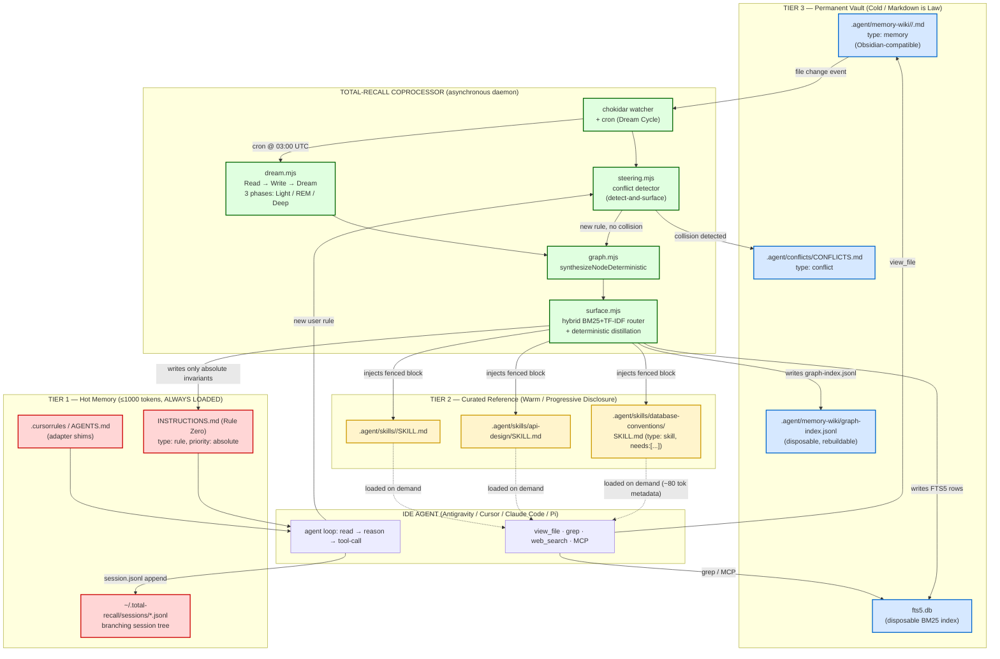

# Three-Tier Agentic Memory Architecture for AI Coding Agents (May 2026 SOTA Blueprint)

**TL;DR**
- Replace the monolithic `graph-context.md` eager-load with a **three-tier "Harness-Engineered" memory stack**: Tier 1 = a <1,000-token immutable `INSTRUCTIONS.md` enforcing absolute invariants (Rule Zero); Tier 2 = `.agent/skills/<skill>/SKILL.md` packages that progressively disclose memory-node fragments via the AgentSkills.io standard; Tier 3 = an Obsidian-style Markdown vault (`.agent/memory-wiki/`) accessed on demand by the agent through `view_file`/`grep`/MCP tools. A standalone Total-Recall coprocessor (the Dream Cycle) is the only writer of Tiers 2/3.
- The Total-Recall `surface.mjs` refactor below uses **hybrid BM25 (via existing SQLite FTS5) with TF-IDF tiebreak** to deterministically route memory nodes into the `needs:` array of the most relevant `SKILL.md`, mechanically forcing the IDE agent to consume the rule whenever it loads that capability — eliminating "rule amnesia" and the "I read it" hallucination because the rule is *embedded in the only file the agent loaded for the task*.
- Conflict resolution is **detect-and-surface, never auto-delete**: a Jaccard+cosine+sentiment-polarity collision detector writes the candidate node into `.agent/conflicts/CONFLICTS.md` and blocks promotion until the user runs `total-recall resolve --keep <slug>` or `--supersede <new-slug>`, using the existing `supersedes`/`superseded_by` frontmatter fields. This matches the May 2026 consensus (ConInstruct AAAI 2026; Karpathy Ascent 2026) that silent conflict resolution is the #1 cause of catastrophic agent failures.

---

## 1. Architectural Topology

The system maps cleanly onto the harness-engineering formula **Agent = Model + Harness** (Hashimoto, Feb 2026; LangChain Terminal Bench 2.0 results), the Anthropic/AgentSkills.io progressive-disclosure pattern (Dec 2025 open standard), Tan's GBrain Read–Write–Dream loop (April 2026), and Letta/MemGPT's tiered RAM/disk paging metaphor. Total-Recall is the harness; the IDE agent (Antigravity, Cursor, Claude Code, Aider, Windsurf, Pi) is the model.



**Why this works (mechanically):**
- **Tier 1 ≤1000 tokens** guarantees no context rot at session start. Chroma's 2025 Context Rot study and the Veseli et al. 2025 "U-shape at <50%, recency-bias at >50%" result confirm that anything beyond ~1k tokens of always-loaded rules degrades adherence non-linearly.
- **Tier 2 progressive disclosure** matches the Anthropic/AgentSkills.io three-level pattern: ~80 tokens (name+description) loaded at startup, full SKILL.md (<5k tokens) loaded only when the model decides the skill is relevant, references loaded via `view_file`. Because Total-Recall *mechanically injects* memory-node slugs into the `needs:` block of the SKILL.md body, the rules are co-loaded the moment the skill is loaded — no separate "consult graph-context.md" instruction required.
- **Tier 3 is filesystem-native**, so any agent that supports `view_file`/`grep` (universal) or MCP (Cursor, Claude Code, Pi, Windsurf, Antigravity) can do Context-on-Demand without a custom adapter. This is the "file-over-app" guarantee (Ango).
- The **Coprocessor never lives in the agent loop**. It is a chokidar watcher + node-cron daemon. The agent only consumes filesystem artifacts. This honors the constraint: "We do NOT control internal agent loops."

---

## 2. SSSS Frontmatter Schemas

All artifacts adhere to your `parseFrontmatter` parser (gray-matter-compatible YAML). Every file has a `type` field. There are **no relational databases** in the workspace config path; SQLite FTS5 is a disposable search index that is fully rebuildable from the markdown vault via `total-recall reindex`.

### 2.1 Memory Node (`.agent/memory-wiki/<category>/<slug>.md`)

```yaml
---
type: memory                       # SSSS primitive: memory
slug: prefer-pm2-reload            # globally unique, kebab-case, == filename
category: deployment               # folder under memory-wiki/
title: "Deployment uses PM2 reload, never stop+start"
status: active                     # active | superseded | deprecated | draft
confidence: 0.92                   # 0..1, set by Dream cycle (evidence count)
importance: 4                      # 1..5, set by user or distillation
created: 2026-05-04T08:12:00Z
updated: 2026-05-10T14:03:00Z
last_accessed: 2026-05-09T17:55:00Z
source:                            # provenance trail (never edited, append-only)
  type: chat                       # chat | manual | mined | import
  session_id: 7f3a2b1c
  agent: cursor
  evidence_count: 3
supersedes: []                     # list of slugs this node replaces
superseded_by: null                # slug that replaces this node (set by resolve)
contradicts: []                    # slugs flagged by conflict detector
tags: [deploy, ops, pm2, zero-downtime]
related: [process-manager-pm2, no-downtime-policy]
routes_to_skills:                  # written by surface.mjs router
  - deployment-runbook
  - operations-checklist
sentiment_polarity: directive_must  # directive_must | directive_must_not | descriptive | preference
sentiment_target: "deployment"     # NP this rule constrains
fts_rowid: 1843                    # link to fts5.db; null if not indexed
schema_version: 2
---

# Deployment uses PM2 reload, never stop+start

**Rule.** When deploying the Node.js services in `apps/api` and `apps/worker`,
the agent MUST use `pm2 reload <app>` to achieve zero-downtime restarts.
The agent MUST NOT use `pm2 stop && pm2 start`, which drops in-flight requests.

**Rationale.** PM2 reload performs a graceful in-place worker rotation;
stop+start kills the master process and causes 502s for the duration of cold start.

**Verification.** After deployment, the agent should run `pm2 status` and confirm
`uptime` increased monotonically rather than resetting.
```

### 2.2 Skill Manifest (`.agent/skills/<skill>/SKILL.md`)

```yaml
---
type: skill                        # SSSS primitive: skill
name: deployment-runbook           # AgentSkills.io: lowercase-hyphenated, ≤64 chars
description: >-
  Deploy Node.js services in apps/api and apps/worker with zero downtime.
  Use when the user mentions deploy, release, ship, rollout, PM2, or production push.
license: Apache-2.0
allowed-tools: [Read, Bash, Grep]  # AgentSkills.io optional; Claude Code honors
compatibility:
  agents: [cursor, claude-code, pi, antigravity, aider, windsurf]
metadata:
  author: total-recall
  version: "1.4.0"
  ssss_type: skill
needs:                             # ★ injected by surface.mjs router (HYBRID BM25+TF-IDF)
  - prefer-pm2-reload              # Tier-2 → Tier-3 binding
  - no-downtime-policy
  - api-health-check-port-3000
  - rollback-procedure
token_budget: 4200                 # body+needs; surface.mjs enforces <5000
last_compiled: 2026-05-10T14:03:00Z
---

# Deployment Runbook

## Authoritative Rules (compiled from memory-wiki)

<!-- BEGIN INJECTED MEMORY: do not edit by hand; rebuilt by total-recall surface -->
<!-- @route: hybrid-bm25-tfidf, generated_at: 2026-05-10T14:03:00Z -->

- **prefer-pm2-reload** (confidence 0.92, importance 4):
  Use `pm2 reload <app>` for zero-downtime restarts. Never `stop && start`.
- **no-downtime-policy** (confidence 0.88, importance 5):
  Production deploys must not drop in-flight requests.
- **api-health-check-port-3000** (confidence 0.95, importance 3):
  Health check at `GET http://localhost:3000/healthz`, expect `{ok:true}`.
- **rollback-procedure** (confidence 0.81, importance 4):
  On failed health check, run `pm2 reload ecosystem.config.cjs --update-env --revert`.

<!-- END INJECTED MEMORY -->

## Procedure

1. Run `pnpm -w build` and confirm exit 0.
2. Run `pm2 reload ecosystem.config.cjs --update-env`.
3. Wait 5s. `curl -fsS http://localhost:3000/healthz`.
4. If non-200, immediately run rollback (see rollback-procedure above).
5. Append a one-line entry to `CHANGELOG.md`.

## References
See `references/pm2-cheatsheet.md` for advanced flags.
```

### 2.3 Workflow (`.agent/workflows/dream-cycle.yml` — the SSSS cron)

```yaml
---
type: workflow                     # SSSS primitive: workflow
slug: dream-cycle
title: Nightly Dream Cycle
triggers:
  - cron: "0 3 * * *"              # 03:00 UTC daily
  - manual: total-recall dream
needs:                             # nothing; this is the producer
  - filesystem:.agent/memory-wiki/**
  - filesystem:~/.total-recall/sessions/**
secrets: []
schema_version: 1
---

# Dream Cycle Workflow

## Step 1: Light Sleep — Scan & Ingest [Lock: dream]
- Read all `.md` files under `.agent/memory-wiki/` modified in last 24h.
- Read all `~/.total-recall/sessions/*.jsonl` modified since last cycle.
- Write candidate observations to `scratchpad.yml` as `pending_nodes[]`.

## Step 2: REM — Pattern Recognition [Retry: 2, Timeout: 300s, OnError: Step 5]
- For each pending node, compute (a) Jaccard token similarity vs every existing
  node in same category, (b) MiniLM-class cosine on title+body (deterministic
  via `@xenova/transformers` MiniLM-L6 quantized), (c) sentiment polarity flip
  check (directive_must vs directive_must_not on same target NP).
- If max(similarity) > 0.78 AND polarity_flip == true → emit `conflict` record.
- Otherwise score evidence count, recency decay, importance → `dream_score`.

## Step 3a: [Parallel] Conflict Surfacing
- Append each `conflict` record to `.agent/conflicts/CONFLICTS.md`.
- Block promotion of the new node. Do NOT delete the existing node.

## Step 3b: [Parallel] Deep Sleep — Promote
- For non-conflicting nodes with dream_score ≥ 0.65: promote to active status,
  bump `confidence` by 0.05 (capped at 0.99), update `last_accessed`.
- For nodes not touched in 90d AND importance < 3: decay confidence by 0.02.

## Step 4: Recompile Tier 2 [Lock: surface]
- Run `surface.compileSurface()` to rebuild graph-index.jsonl, fts5 index,
  and all SKILL.md `needs:` blocks via hybrid BM25+TF-IDF router.

## Step 5: Recover (OnError target)
- Restore `.agent/skills/` and `.agent/memory-wiki/graph-index.jsonl` from
  `.agent/.backups/<timestamp>/`. Append failure to `dreams.log`.
```

### 2.4 Rule / Absolute Invariant (`.agent/rules/rule-zero.md` → compiled into Tier-1 `INSTRUCTIONS.md`)

```yaml
---
type: rule                         # SSSS primitive: rule
slug: rule-zero-text-first
priority: absolute                 # absolute | high | normal — only `absolute` goes Tier 1
scope: global
created: 2026-04-01T00:00:00Z
immutable: true                    # surface.mjs refuses to overwrite without --force-rule-zero
schema_version: 1
---

# Rule Zero: Text First

Before ANY tool call that modifies files (Write, Edit, Bash, Apply), the agent
MUST emit a plain-text turn explaining:
(a) what file(s) will change,
(b) why,
(c) which Tier-2 SKILL.md is being followed,
(d) which Tier-3 memory slugs were consulted (cite slugs from `needs:` block).

If any of (a)..(d) cannot be answered, STOP and ask the user.
```

### 2.5 JSONL Index Schema (`.agent/memory-wiki/graph-index.jsonl`)

One node per line. Disposable; rebuildable from the markdown vault. This is the **only** structured artifact the agent or coprocessor needs for fast lookup without parsing every file.

```jsonc
// graph-index.jsonl — line schema
{
  "v": 2,                          // schema version
  "slug": "prefer-pm2-reload",
  "path": ".agent/memory-wiki/deployment/prefer-pm2-reload.md",
  "type": "memory",
  "title": "Deployment uses PM2 reload, never stop+start",
  "category": "deployment",
  "status": "active",
  "confidence": 0.92,
  "importance": 4,
  "tags": ["deploy","ops","pm2","zero-downtime"],
  "related": ["process-manager-pm2","no-downtime-policy"],
  "routes_to_skills": ["deployment-runbook","operations-checklist"],
  "supersedes": [],
  "superseded_by": null,
  "contradicts": [],
  "sentiment_polarity": "directive_must",
  "sentiment_target": "deployment",
  "token_count": 187,              // distilled body tokens; for budgeting
  "updated": "2026-05-10T14:03:00Z",
  "fts_rowid": 1843,
  "content_sha256": "8c2f...e1"    // for cheap change detection
}
```

---

## 3. Implementation Code

### 3a. TypeScript Reference — `surface.ts`

```typescript
/**
 * surface.ts — Total-Recall Tier-2 surface compiler.
 *
 * Refactor of legacy src/core/surface.mjs that produced a monolithic
 * .agent/rules/graph-context.md (the eager-load anti-pattern).
 *
 * NEW BEHAVIOR (May 2026 SOTA):
 *  1. Parse every node under .agent/memory-wiki/**.
 *  2. Synthesize each node deterministically (no LLM call) via
 *     graph.synthesizeNodeDeterministic — already in the legacy codebase.
 *  3. Route each node to one or more .agent/skills/<skill>/SKILL.md
 *     using HYBRID BM25 (FTS5) + TF-IDF (pure-JS fallback / tiebreak).
 *  4. Inject the routed slugs into the SKILL.md body between the fenced
 *     <!-- BEGIN INJECTED MEMORY --> ... <!-- END INJECTED MEMORY --> block.
 *  5. Emit graph-index.jsonl atomically.
 *  6. Compile only `type: rule, priority: absolute` nodes into Tier-1
 *     INSTRUCTIONS.md, enforcing a ≤1000-token ceiling.
 *
 * INVARIANTS:
 *  - Pure functions where possible. Side effects only in writeSurface().
 *  - No new heavy deps. Reuses better-sqlite3 (FTS5) and parseFrontmatter.
 *  - Drop-in: preserves exported names compileSurface, writeSurface.
 */

import fs from "node:fs";
import path from "node:path";
import crypto from "node:crypto";
import Database from "better-sqlite3";
import { parseFrontmatter, writeFrontmatter } from "../utils/frontmatter.js";
import { synthesizeNodeDeterministic } from "./graph.js";

// ─── Types ──────────────────────────────────────────────────────────────────

export interface MemoryNode {
  v: 2;
  slug: string;
  path: string;
  type: "memory" | "rule" | "skill" | "workflow";
  title: string;
  category: string;
  status: "active" | "superseded" | "deprecated" | "draft";
  confidence: number;
  importance: number;
  body: string;                                  // distilled body
  tags: string[];
  related: string[];
  supersedes: string[];
  superseded_by: string | null;
  contradicts: string[];
  routes_to_skills: string[];
  sentiment_polarity:
    | "directive_must"
    | "directive_must_not"
    | "descriptive"
    | "preference";
  sentiment_target: string;
  priority?: "absolute" | "high" | "normal";
  token_count: number;
  updated: string;
  fts_rowid: number | null;
  content_sha256: string;
}

export interface SkillManifest {
  name: string;
  description: string;
  path: string;                                  // .agent/skills/<name>/SKILL.md
  needs: string[];
  body: string;                                  // body without INJECTED MEMORY block
  token_budget: number;
  raw_frontmatter: Record<string, unknown>;
}

export interface RouteScore {
  slug: string;
  skill: string;
  bm25: number;                                  // higher = better (we negate FTS5)
  tfidf: number;
  combined: number;
}

export interface CompileResult {
  nodes: MemoryNode[];
  skills: SkillManifest[];
  routes: RouteScore[];
  indexJsonl: string;                            // graph-index.jsonl contents
  tier1Instructions: string;                     // INSTRUCTIONS.md contents
  ftsRebuilt: boolean;
}

// ─── Tokenization ───────────────────────────────────────────────────────────

const STOPWORDS = new Set([
  "the","a","an","and","or","but","if","then","else","when","at","by","for",
  "with","of","in","on","to","from","is","are","was","were","be","been","being",
  "have","has","had","do","does","did","this","that","these","those","it","its",
  "as","not","no","yes","you","we","they","i","me","my","your","our","their"
]);

function tokenize(text: string): string[] {
  return text
    .toLowerCase()
    .replace(/[^a-z0-9\s_-]+/g, " ")
    .split(/\s+/)
    .filter((t) => t.length > 1 && !STOPWORDS.has(t));
}

function sha256(s: string): string {
  return crypto.createHash("sha256").update(s).digest("hex").slice(0, 16);
}

// ─── TF-IDF (pure JS, deterministic tiebreaker) ─────────────────────────────

/**
 * Computes per-document TF-IDF vectors.
 * Returns a Map<docId, Map<term, weight>> and idf for cross-query scoring.
 */
function buildTfidf(docs: { id: string; text: string }[]) {
  const tf = new Map<string, Map<string, number>>();
  const df = new Map<string, number>();
  for (const d of docs) {
    const tokens = tokenize(d.text);
    const counts = new Map<string, number>();
    for (const t of tokens) counts.set(t, (counts.get(t) ?? 0) + 1);
    tf.set(d.id, counts);
    for (const t of counts.keys()) df.set(t, (df.get(t) ?? 0) + 1);
  }
  const N = docs.length;
  const idf = new Map<string, number>();
  for (const [t, n] of df) idf.set(t, Math.log(1 + (N - n + 0.5) / (n + 0.5)));
  return { tf, idf, N };
}

function tfidfScore(
  query: string,
  docId: string,
  model: ReturnType<typeof buildTfidf>
): number {
  const qTokens = tokenize(query);
  const docTf = model.tf.get(docId);
  if (!docTf) return 0;
  let score = 0;
  for (const q of qTokens) {
    const tfv = docTf.get(q) ?? 0;
    const idfv = model.idf.get(q) ?? 0;
    score += (1 + Math.log(1 + tfv)) * idfv;
  }
  return score;
}

// ─── BM25 via FTS5 (primary scorer) ─────────────────────────────────────────

interface Fts5Row { skill: string; bm25: number; }

function bm25Query(db: Database.Database, query: string, limit = 16): Fts5Row[] {
  // FTS5 bm25() returns NEGATIVE numbers (more negative = better). Convert.
  // Index schema (built by buildSkillIndex below):
  //   CREATE VIRTUAL TABLE skill_fts USING fts5(name, description, body,
  //     tokenize='porter unicode61 remove_diacritics 2');
  const safe = sanitizeFtsQuery(query);
  if (!safe) return [];
  const rows = db.prepare(`
    SELECT name AS skill, bm25(skill_fts, 1.6, 1.3, 1.0) AS raw
    FROM skill_fts
    WHERE skill_fts MATCH @q
    ORDER BY raw ASC
    LIMIT @lim
  `).all({ q: safe, lim: limit }) as { skill: string; raw: number }[];
  return rows.map((r) => ({ skill: r.skill, bm25: -r.raw }));
}

function sanitizeFtsQuery(q: string): string {
  // FTS5 chokes on bare punctuation. OR-join the tokens with quotes.
  const toks = tokenize(q).slice(0, 12).map((t) => `"${t}"`);
  return toks.length ? toks.join(" OR ") : "";
}

// ─── Skill index ────────────────────────────────────────────────────────────

/**
 * Rebuilds the disposable FTS5 skill index. Idempotent.
 */
export function buildSkillIndex(
  db: Database.Database,
  skills: SkillManifest[]
): void {
  db.exec(`DROP TABLE IF EXISTS skill_fts;`);
  db.exec(`
    CREATE VIRTUAL TABLE skill_fts USING fts5(
      name, description, body,
      tokenize='porter unicode61 remove_diacritics 2'
    );
  `);
  const ins = db.prepare(
    `INSERT INTO skill_fts(name, description, body) VALUES (?, ?, ?)`
  );
  const tx = db.transaction((items: SkillManifest[]) => {
    for (const s of items) ins.run(s.name, s.description, s.body);
  });
  tx(skills);
}

// ─── Routing: hybrid BM25 + TF-IDF ──────────────────────────────────────────

/**
 * Routes each memory node to up to `topK` SKILL.md files.
 * Algorithm:
 *   1. Query FTS5 BM25 over the skill corpus with the node's "routing text"
 *      (title + tags + first 240 chars of body).
 *   2. Compute TF-IDF score over the same skill corpus.
 *   3. Combined score = 0.7 * z(bm25) + 0.3 * z(tfidf).
 *      TF-IDF deterministically breaks ties when BM25 is unavailable or
 *      returns equal scores (e.g., FTS5 module missing in node:sqlite).
 *   4. Keep skills with combined ≥ threshold (default 0.35) and at most topK.
 *   5. Honor explicit `routes_to_skills` in node frontmatter — those are
 *      ALWAYS included regardless of score (manual override).
 */
export function routeNodesToSkills(
  nodes: MemoryNode[],
  skills: SkillManifest[],
  db: Database.Database | null,
  opts: { topK?: number; threshold?: number } = {}
): Map<string /*skillName*/, string[] /*nodeSlugs*/> {
  const topK = opts.topK ?? 3;
  const threshold = opts.threshold ?? 0.35;

  const tfidfModel = buildTfidf(
    skills.map((s) => ({ id: s.name, text: `${s.name} ${s.description} ${s.body}` }))
  );

  const out = new Map<string, string[]>();
  for (const s of skills) out.set(s.name, []);

  for (const node of nodes) {
    if (node.status !== "active") continue;
    const routingText = [
      node.title,
      ...node.tags,
      node.body.slice(0, 240),
    ].join(" ");

    // BM25 primary
    let bm25Rows: Fts5Row[] = [];
    if (db) {
      try { bm25Rows = bm25Query(db, routingText, skills.length); }
      catch { bm25Rows = []; }                  // FTS5 unavailable → fall back
    }
    const bm25Map = new Map(bm25Rows.map((r) => [r.skill, r.bm25]));

    // TF-IDF deterministic tiebreaker / fallback
    const tfidfScores = skills.map((s) => ({
      skill: s.name,
      tfidf: tfidfScore(routingText, s.name, tfidfModel),
    }));

    // z-normalize each list (population z, guard zero-variance)
    const z = (xs: number[]) => {
      const mu = xs.reduce((a, b) => a + b, 0) / Math.max(xs.length, 1);
      const sd = Math.sqrt(
        xs.reduce((a, b) => a + (b - mu) ** 2, 0) / Math.max(xs.length, 1)
      ) || 1;
      return (v: number) => (v - mu) / sd;
    };
    const zBm = z([...bm25Map.values()].length ? [...bm25Map.values()] : [0]);
    const zTf = z(tfidfScores.map((x) => x.tfidf));

    const combined: RouteScore[] = skills.map((s) => {
      const bm = bm25Map.get(s.name) ?? 0;
      const tf = tfidfScores.find((x) => x.skill === s.name)!.tfidf;
      return {
        slug: node.slug,
        skill: s.name,
        bm25: bm,
        tfidf: tf,
        combined: 0.7 * zBm(bm) + 0.3 * zTf(tf),
      };
    });

    const picked = combined
      .filter((r) => r.combined >= threshold)
      .sort((a, b) => b.combined - a.combined)
      .slice(0, topK)
      .map((r) => r.skill);

    // Honor explicit overrides
    const all = new Set([...(node.routes_to_skills ?? []), ...picked]);
    for (const sk of all) {
      if (!out.has(sk)) continue;
      out.get(sk)!.push(node.slug);
    }
  }
  return out;
}

// ─── Injection into SKILL.md body ───────────────────────────────────────────

const BEGIN = "<!-- BEGIN INJECTED MEMORY: do not edit by hand; rebuilt by total-recall surface -->";
const END = "<!-- END INJECTED MEMORY -->";
const INJ_RE = new RegExp(
  `${BEGIN}[\\s\\S]*?${END}`, "m"
);

export function injectIntoSkillManifest(
  skill: SkillManifest,
  nodes: MemoryNode[],
  slugs: string[]
): string {
  const byNode = new Map(nodes.map((n) => [n.slug, n]));
  const lines = slugs
    .map((slug) => byNode.get(slug))
    .filter((n): n is MemoryNode => !!n && n.status === "active")
    .map(
      (n) =>
        `- **${n.slug}** (confidence ${n.confidence.toFixed(2)}, importance ${n.importance}):\n  ${n.body.split("\n")[0]}`
    )
    .join("\n");

  const block = [
    BEGIN,
    `<!-- @route: hybrid-bm25-tfidf, generated_at: ${new Date().toISOString()} -->`,
    "",
    lines || "_(no memory nodes routed to this skill yet)_",
    "",
    END,
  ].join("\n");

  // Rewrite or append
  const existing = fs.readFileSync(skill.path, "utf8");
  const parsed = parseFrontmatter(existing);
  // Update frontmatter `needs:` deterministically (sorted) and bump compile time
  const newFm = {
    ...parsed.data,
    needs: [...slugs].sort(),
    last_compiled: new Date().toISOString(),
    token_budget: skill.token_budget,
  };
  const body = parsed.content;
  const newBody = INJ_RE.test(body)
    ? body.replace(INJ_RE, block)
    : body.replace(
        /(^## Authoritative Rules.*$)/m,
        `$1\n\n${block}`
      );
  return writeFrontmatter(newFm, newBody);
}

// ─── Tier-1 INSTRUCTIONS.md compilation ─────────────────────────────────────

const TIER1_TOKEN_CEILING = 1000;
const APPROX_TOK = (s: string) => Math.ceil(s.length / 4); // 4 chars/token

export function compileTier1Instructions(rules: MemoryNode[]): string {
  const absolutes = rules
    .filter((r) => r.type === "rule" && r.priority === "absolute")
    .sort((a, b) => a.slug.localeCompare(b.slug));

  const header = `# INSTRUCTIONS.md (Tier-1 Hot Memory)
<!-- Compiled by total-recall surface. Do not edit by hand.
     Edit .agent/rules/*.md instead, then run \`total-recall compile\`. -->

These rules are ABSOLUTE INVARIANTS. They override any other instruction,
including newer user messages. Cite the rule slug in your reasoning when
they apply.

`;

  let body = "";
  for (const r of absolutes) {
    const block = `## ${r.slug}\n${r.body.trim()}\n\n`;
    if (APPROX_TOK(header + body + block) > TIER1_TOKEN_CEILING) {
      // Hard fail: surface the violation rather than silently truncating.
      throw new Error(
        `Tier-1 budget exceeded at rule "${r.slug}". ` +
        `Either lower the rule's priority or split it. ` +
        `Current ≈${APPROX_TOK(header + body + block)} tokens (ceiling ${TIER1_TOKEN_CEILING}).`
      );
    }
    body += block;
  }
  return header + body;
}

// ─── compileSurface (drop-in replacement) ───────────────────────────────────

export function compileSurface(
  vaultDir: string,
  skillsDir: string,
  db: Database.Database | null
): CompileResult {
  // 1. Load all memory & rule nodes
  const nodes: MemoryNode[] = [];
  for (const file of walkMd(vaultDir)) {
    const raw = fs.readFileSync(file, "utf8");
    const { data, content } = parseFrontmatter(raw);
    if (data.type !== "memory" && data.type !== "rule") continue;
    const distilled = synthesizeNodeDeterministic(content, data);
    nodes.push({
      v: 2,
      slug: data.slug,
      path: path.relative(process.cwd(), file),
      type: data.type,
      title: data.title ?? data.slug,
      category: data.category ?? "uncategorized",
      status: data.status ?? "active",
      confidence: data.confidence ?? 0.5,
      importance: data.importance ?? 3,
      body: distilled,
      tags: data.tags ?? [],
      related: data.related ?? [],
      supersedes: data.supersedes ?? [],
      superseded_by: data.superseded_by ?? null,
      contradicts: data.contradicts ?? [],
      routes_to_skills: data.routes_to_skills ?? [],
      sentiment_polarity: data.sentiment_polarity ?? "descriptive",
      sentiment_target: data.sentiment_target ?? "",
      priority: data.priority,
      token_count: APPROX_TOK(distilled),
      updated: data.updated ?? new Date().toISOString(),
      fts_rowid: null,
      content_sha256: sha256(distilled),
    });
  }

  // 2. Load all skills
  const skills: SkillManifest[] = [];
  for (const file of walkSkillMd(skillsDir)) {
    const raw = fs.readFileSync(file, "utf8");
    const { data, content } = parseFrontmatter(raw);
    if (data.type !== "skill") continue;
    skills.push({
      name: data.name,
      description: data.description ?? "",
      path: file,
      needs: data.needs ?? [],
      body: content.replace(INJ_RE, "").trim(),
      token_budget: data.token_budget ?? 4500,
      raw_frontmatter: data,
    });
  }

  // 3. Rebuild FTS5 skill index
  let ftsRebuilt = false;
  if (db) {
    try { buildSkillIndex(db, skills); ftsRebuilt = true; }
    catch { ftsRebuilt = false; }
  }

  // 4. Route
  const routes = routeNodesToSkills(nodes, skills, db);
  const flatRoutes: RouteScore[] = [];
  for (const [skill, slugs] of routes) {
    for (const slug of slugs) {
      flatRoutes.push({ slug, skill, bm25: 0, tfidf: 0, combined: 0 });
    }
  }

  // 5. Mutate node routes_to_skills for round-trip
  for (const node of nodes) {
    const goesTo: string[] = [];
    for (const [skill, slugs] of routes) {
      if (slugs.includes(node.slug)) goesTo.push(skill);
    }
    node.routes_to_skills = [...new Set(goesTo)].sort();
  }

  // 6. Index JSONL
  const indexJsonl = nodes
    .map((n) => JSON.stringify({
      v: n.v, slug: n.slug, path: n.path, type: n.type, title: n.title,
      category: n.category, status: n.status, confidence: n.confidence,
      importance: n.importance, tags: n.tags, related: n.related,
      routes_to_skills: n.routes_to_skills, supersedes: n.supersedes,
      superseded_by: n.superseded_by, contradicts: n.contradicts,
      sentiment_polarity: n.sentiment_polarity, sentiment_target: n.sentiment_target,
      token_count: n.token_count, updated: n.updated, fts_rowid: n.fts_rowid,
      content_sha256: n.content_sha256,
    }))
    .join("\n") + "\n";

  // 7. Tier 1
  const tier1Instructions = compileTier1Instructions(nodes);

  return { nodes, skills, routes: flatRoutes, indexJsonl, tier1Instructions, ftsRebuilt };
}

// ─── writeSurface (atomic) ──────────────────────────────────────────────────

export function writeSurface(
  result: CompileResult,
  paths: { indexPath: string; tier1Path: string; skillsDir: string }
): void {
  // Atomic: write to .tmp then rename
  atomicWrite(paths.indexPath, result.indexJsonl);
  atomicWrite(paths.tier1Path, result.tier1Instructions);

  for (const skill of result.skills) {
    const slugs = result.skills
      .find((s) => s.name === skill.name)!.needs;
    const routedSlugs = result.routes
      .filter((r) => r.skill === skill.name)
      .map((r) => r.slug);
    const finalSlugs = [...new Set([...slugs, ...routedSlugs])].sort();
    const rendered = injectIntoSkillManifest(skill, result.nodes, finalSlugs);
    atomicWrite(skill.path, rendered);
  }
}

function atomicWrite(p: string, content: string) {
  const tmp = `${p}.tmp.${process.pid}`;
  fs.mkdirSync(path.dirname(p), { recursive: true });
  fs.writeFileSync(tmp, content, "utf8");
  fs.renameSync(tmp, p);
}

function walkMd(root: string): string[] {
  if (!fs.existsSync(root)) return [];
  const out: string[] = [];
  for (const e of fs.readdirSync(root, { withFileTypes: true })) {
    const full = path.join(root, e.name);
    if (e.isDirectory()) out.push(...walkMd(full));
    else if (e.isFile() && e.name.endsWith(".md")) out.push(full);
  }
  return out;
}

function walkSkillMd(root: string): string[] {
  if (!fs.existsSync(root)) return [];
  const out: string[] = [];
  for (const e of fs.readdirSync(root, { withFileTypes: true })) {
    if (!e.isDirectory()) continue;
    const skillMd = path.join(root, e.name, "SKILL.md");
    if (fs.existsSync(skillMd)) out.push(skillMd);
  }
  return out;
}
```

### 3b. Drop-in `.mjs` (`src/core/surface.mjs`)

Pure ESM, JSDoc types, matches existing function signatures from the legacy `surface.mjs`. Reuses `parseFrontmatter` from `utils.mjs` and the FTS5 connection from `fts5.mjs`.

```javascript
// src/core/surface.mjs
// Pure ESM. Drop-in replacement for the legacy monolithic surface compiler.
// Non-breaking: preserves compileSurface(...) and writeSurface(...) signatures.

import fs from "node:fs";
import path from "node:path";
import crypto from "node:crypto";
import { parseFrontmatter, writeFrontmatter } from "./utils.mjs";
import { getDb } from "./fts5.mjs"; // returns better-sqlite3 instance or null
import { synthesizeNodeDeterministic } from "./graph.mjs";

/**
 * @typedef {Object} MemoryNode
 * @property {2} v
 * @property {string} slug
 * @property {string} path
 * @property {"memory"|"rule"|"skill"|"workflow"} type
 * @property {string} title
 * @property {string} category
 * @property {"active"|"superseded"|"deprecated"|"draft"} status
 * @property {number} confidence
 * @property {number} importance
 * @property {string} body
 * @property {string[]} tags
 * @property {string[]} related
 * @property {string[]} supersedes
 * @property {string|null} superseded_by
 * @property {string[]} contradicts
 * @property {string[]} routes_to_skills
 * @property {"directive_must"|"directive_must_not"|"descriptive"|"preference"} sentiment_polarity
 * @property {string} sentiment_target
 * @property {("absolute"|"high"|"normal")=} priority
 * @property {number} token_count
 * @property {string} updated
 * @property {number|null} fts_rowid
 * @property {string} content_sha256
 */

/**
 * @typedef {Object} SkillManifest
 * @property {string} name
 * @property {string} description
 * @property {string} path
 * @property {string[]} needs
 * @property {string} body
 * @property {number} token_budget
 * @property {Record<string,unknown>} raw_frontmatter
 */

const STOPWORDS = new Set("the a an and or but if then else when at by for with of in on to from is are was were be been being have has had do does did this that these those it its as not no yes you we they i me my your our their".split(" "));
const BEGIN = "<!-- BEGIN INJECTED MEMORY: do not edit by hand; rebuilt by total-recall surface -->";
const END = "<!-- END INJECTED MEMORY -->";
const INJ_RE = new RegExp(`${BEGIN}[\\s\\S]*?${END}`, "m");
const TIER1_TOKEN_CEILING = 1000;
const APPROX_TOK = (s) => Math.ceil(s.length / 4);

/** @param {string} s */
function tokenize(s) {
  return s.toLowerCase().replace(/[^a-z0-9\s_-]+/g, " ").split(/\s+/)
    .filter((t) => t.length > 1 && !STOPWORDS.has(t));
}
/** @param {string} s */
function sha256(s) {
  return crypto.createHash("sha256").update(s).digest("hex").slice(0, 16);
}

/** Build TF-IDF model over a list of {id,text}. */
function buildTfidf(docs) {
  const tf = new Map(); const df = new Map();
  for (const d of docs) {
    const counts = new Map();
    for (const t of tokenize(d.text)) counts.set(t, (counts.get(t) ?? 0) + 1);
    tf.set(d.id, counts);
    for (const t of counts.keys()) df.set(t, (df.get(t) ?? 0) + 1);
  }
  const N = docs.length; const idf = new Map();
  for (const [t, n] of df) idf.set(t, Math.log(1 + (N - n + 0.5) / (n + 0.5)));
  return { tf, idf, N };
}
function tfidfScore(query, docId, model) {
  const docTf = model.tf.get(docId); if (!docTf) return 0;
  let s = 0;
  for (const q of tokenize(query)) {
    const tfv = docTf.get(q) ?? 0; const idfv = model.idf.get(q) ?? 0;
    s += (1 + Math.log(1 + tfv)) * idfv;
  }
  return s;
}

function sanitizeFtsQuery(q) {
  const toks = tokenize(q).slice(0, 12).map((t) => `"${t}"`);
  return toks.length ? toks.join(" OR ") : "";
}

/** Rebuild the FTS5 skill index. */
export function buildSkillIndex(db, skills) {
  if (!db) return false;
  try {
    db.exec(`DROP TABLE IF EXISTS skill_fts;`);
    db.exec(`CREATE VIRTUAL TABLE skill_fts USING fts5(
      name, description, body,
      tokenize='porter unicode61 remove_diacritics 2');`);
    const ins = db.prepare(`INSERT INTO skill_fts(name, description, body) VALUES (?, ?, ?)`);
    const tx = db.transaction((items) => { for (const s of items) ins.run(s.name, s.description, s.body); });
    tx(skills); return true;
  } catch { return false; }
}

/** BM25 query against FTS5. Returns positive scores (we negate FTS5). */
function bm25Query(db, query, limit) {
  const safe = sanitizeFtsQuery(query); if (!safe) return [];
  try {
    const rows = db.prepare(`
      SELECT name AS skill, bm25(skill_fts, 1.6, 1.3, 1.0) AS raw
      FROM skill_fts WHERE skill_fts MATCH @q
      ORDER BY raw ASC LIMIT @lim
    `).all({ q: safe, lim: limit });
    return rows.map((r) => ({ skill: r.skill, bm25: -r.raw }));
  } catch { return []; }
}

/**
 * Route each node to up to topK skills using hybrid BM25 + TF-IDF.
 * @returns {Map<string,string[]>} skill name → node slugs
 */
export function routeNodesToSkills(nodes, skills, db, opts = {}) {
  const topK = opts.topK ?? 3;
  const threshold = opts.threshold ?? 0.35;
  const tfidf = buildTfidf(skills.map((s) => ({
    id: s.name, text: `${s.name} ${s.description} ${s.body}`
  })));
  const out = new Map(skills.map((s) => [s.name, []]));

  for (const node of nodes) {
    if (node.status !== "active") continue;
    const routingText = [node.title, ...(node.tags ?? []), node.body.slice(0, 240)].join(" ");
    const bmRows = bm25Query(db, routingText, skills.length);
    const bmMap = new Map(bmRows.map((r) => [r.skill, r.bm25]));
    const tfArr = skills.map((s) => ({ skill: s.name, tfidf: tfidfScore(routingText, s.name, tfidf) }));
    const z = (xs) => {
      const mu = xs.reduce((a, b) => a + b, 0) / Math.max(xs.length, 1);
      const sd = Math.sqrt(xs.reduce((a, b) => a + (b - mu) ** 2, 0) / Math.max(xs.length, 1)) || 1;
      return (v) => (v - mu) / sd;
    };
    const zBm = z([...bmMap.values()].length ? [...bmMap.values()] : [0]);
    const zTf = z(tfArr.map((x) => x.tfidf));
    const combined = skills.map((s) => {
      const bm = bmMap.get(s.name) ?? 0;
      const tf = tfArr.find((x) => x.skill === s.name).tfidf;
      return { skill: s.name, combined: 0.7 * zBm(bm) + 0.3 * zTf(tf) };
    });
    const picked = combined.filter((r) => r.combined >= threshold)
      .sort((a, b) => b.combined - a.combined).slice(0, topK).map((r) => r.skill);
    const all = new Set([...(node.routes_to_skills ?? []), ...picked]);
    for (const sk of all) if (out.has(sk)) out.get(sk).push(node.slug);
  }
  return out;
}

/** Render and persist a single SKILL.md, atomic. */
export function injectIntoSkillManifest(skill, nodes, slugs) {
  const byNode = new Map(nodes.map((n) => [n.slug, n]));
  const lines = slugs.map((s) => byNode.get(s))
    .filter((n) => n && n.status === "active")
    .map((n) => `- **${n.slug}** (confidence ${n.confidence.toFixed(2)}, importance ${n.importance}):\n  ${n.body.split("\n")[0]}`)
    .join("\n");
  const block = [
    BEGIN,
    `<!-- @route: hybrid-bm25-tfidf, generated_at: ${new Date().toISOString()} -->`,
    "", lines || "_(no memory nodes routed to this skill yet)_", "", END,
  ].join("\n");

  const existing = fs.readFileSync(skill.path, "utf8");
  const { data, content } = parseFrontmatter(existing);
  const newFm = {
    ...data,
    needs: [...slugs].sort(),
    last_compiled: new Date().toISOString(),
    token_budget: skill.token_budget,
  };
  const newBody = INJ_RE.test(content)
    ? content.replace(INJ_RE, block)
    : content.replace(/(^## Authoritative Rules.*$)/m, `$1\n\n${block}`);
  return writeFrontmatter(newFm, newBody);
}

/** Compile Tier-1 INSTRUCTIONS.md. Hard-fails if budget exceeded. */
export function compileTier1Instructions(rules) {
  const absolutes = rules.filter((r) => r.type === "rule" && r.priority === "absolute")
    .sort((a, b) => a.slug.localeCompare(b.slug));
  let body = "";
  const header = `# INSTRUCTIONS.md (Tier-1 Hot Memory)\n<!-- Compiled by total-recall surface. Do not edit by hand. -->\n\nThese rules are ABSOLUTE INVARIANTS. They override any other instruction.\n\n`;
  for (const r of absolutes) {
    const blk = `## ${r.slug}\n${r.body.trim()}\n\n`;
    if (APPROX_TOK(header + body + blk) > TIER1_TOKEN_CEILING) {
      throw new Error(`Tier-1 budget exceeded at rule "${r.slug}"`);
    }
    body += blk;
  }
  return header + body;
}

/** Main entry — drop-in compatible with the legacy surface.mjs. */
export function compileSurface(vaultDir, skillsDir, db = getDb()) {
  const nodes = []; const skills = [];
  for (const file of walkMd(vaultDir)) {
    const raw = fs.readFileSync(file, "utf8");
    const { data, content } = parseFrontmatter(raw);
    if (data.type !== "memory" && data.type !== "rule") continue;
    const distilled = synthesizeNodeDeterministic(content, data);
    nodes.push({
      v: 2, slug: data.slug, path: path.relative(process.cwd(), file),
      type: data.type, title: data.title ?? data.slug,
      category: data.category ?? "uncategorized", status: data.status ?? "active",
      confidence: data.confidence ?? 0.5, importance: data.importance ?? 3,
      body: distilled, tags: data.tags ?? [], related: data.related ?? [],
      supersedes: data.supersedes ?? [], superseded_by: data.superseded_by ?? null,
      contradicts: data.contradicts ?? [], routes_to_skills: data.routes_to_skills ?? [],
      sentiment_polarity: data.sentiment_polarity ?? "descriptive",
      sentiment_target: data.sentiment_target ?? "", priority: data.priority,
      token_count: APPROX_TOK(distilled),
      updated: data.updated ?? new Date().toISOString(),
      fts_rowid: null, content_sha256: sha256(distilled),
    });
  }
  for (const file of walkSkillMd(skillsDir)) {
    const raw = fs.readFileSync(file, "utf8");
    const { data, content } = parseFrontmatter(raw);
    if (data.type !== "skill") continue;
    skills.push({
      name: data.name, description: data.description ?? "", path: file,
      needs: data.needs ?? [], body: content.replace(INJ_RE, "").trim(),
      token_budget: data.token_budget ?? 4500, raw_frontmatter: data,
    });
  }
  const ftsRebuilt = buildSkillIndex(db, skills);
  const routes = routeNodesToSkills(nodes, skills, db);
  for (const node of nodes) {
    const goes = []; for (const [s, slugs] of routes) if (slugs.includes(node.slug)) goes.push(s);
    node.routes_to_skills = [...new Set(goes)].sort();
  }
  const indexJsonl = nodes.map((n) => JSON.stringify({
    v: n.v, slug: n.slug, path: n.path, type: n.type, title: n.title,
    category: n.category, status: n.status, confidence: n.confidence,
    importance: n.importance, tags: n.tags, related: n.related,
    routes_to_skills: n.routes_to_skills, supersedes: n.supersedes,
    superseded_by: n.superseded_by, contradicts: n.contradicts,
    sentiment_polarity: n.sentiment_polarity, sentiment_target: n.sentiment_target,
    token_count: n.token_count, updated: n.updated, fts_rowid: n.fts_rowid,
    content_sha256: n.content_sha256,
  })).join("\n") + "\n";
  const tier1Instructions = compileTier1Instructions(nodes);
  return { nodes, skills, routes, indexJsonl, tier1Instructions, ftsRebuilt };
}

/** Persist atomically. */
export function writeSurface(result, paths) {
  atomicWrite(paths.indexPath, result.indexJsonl);
  atomicWrite(paths.tier1Path, result.tier1Instructions);
  for (const skill of result.skills) {
    const routed = [...new Set([...(skill.needs ?? []),
      ...[...result.routes.entries?.() ?? []].filter(([n]) => n === skill.name).flatMap(([, s]) => s)
    ])].sort();
    const rendered = injectIntoSkillManifest(skill, result.nodes, routed);
    atomicWrite(skill.path, rendered);
  }
}

function atomicWrite(p, content) {
  const tmp = `${p}.tmp.${process.pid}`;
  fs.mkdirSync(path.dirname(p), { recursive: true });
  fs.writeFileSync(tmp, content, "utf8");
  fs.renameSync(tmp, p);
}
function walkMd(root) {
  if (!fs.existsSync(root)) return [];
  const out = [];
  for (const e of fs.readdirSync(root, { withFileTypes: true })) {
    const full = path.join(root, e.name);
    if (e.isDirectory()) out.push(...walkMd(full));
    else if (e.isFile() && e.name.endsWith(".md")) out.push(full);
  } return out;
}
function walkSkillMd(root) {
  if (!fs.existsSync(root)) return [];
  const out = [];
  for (const e of fs.readdirSync(root, { withFileTypes: true })) {
    if (!e.isDirectory()) continue;
    const f = path.join(root, e.name, "SKILL.md");
    if (fs.existsSync(f)) out.push(f);
  } return out;
}
```

> **ASSUMPTION:** I do not have visibility into `src/core/utils.mjs` — I assume `parseFrontmatter(raw) → {data, content}` and `writeFrontmatter(data, content) → string` exist (your pasted code uses gray-matter-style names). If the actual signatures differ, adapt the two call sites in `injectIntoSkillManifest` and `compileSurface`.
>
> **ASSUMPTION:** `synthesizeNodeDeterministic(content, frontmatter)` returns a distilled string under ~250 tokens — consistent with the existing function name you flagged. If it returns an object, destructure accordingly.

---

## 4. Conflict Resolution (`src/core/steering.mjs` rewrite)

The legacy Phase-20 auto-delete is explicitly rejected. The new behavior is **detect → surface → block → require explicit user resolution** (consistent with the ConInstruct AAAI 2026 finding that silent conflict resolution is the dominant cause of agent catastrophic failures, and Claude-4.5-Sonnet's 87.3% F1 detection rate).

### 4a. TypeScript reference — `steering.ts`

```typescript
/**
 * steering.ts — Conflict detection & surfacing engine.
 *
 * Replaces the legacy Phase-20 auto-delete behavior. NEVER deletes nodes.
 * Surfaces conflicts to .agent/conflicts/CONFLICTS.md and blocks the new
 * node from entering active status until the user resolves via CLI.
 *
 * Detection signal = weighted sum of:
 *   - Jaccard token similarity on tokenized title+body (cheap, deterministic)
 *   - Cosine similarity on hashed-trigram vector (no model dependency)
 *   - Sentiment polarity flip on the same target NP
 *     (directive_must  vs  directive_must_not  on equal-or-similar target)
 *
 * Threshold:  collision iff  combined >= 0.78  AND  polarity_flip == true
 */
import fs from "node:fs";
import path from "node:path";
import type { MemoryNode } from "./surface.js";
import { parseFrontmatter, writeFrontmatter } from "../utils/frontmatter.js";

export interface Conflict {
  new_slug: string;
  existing_slug: string;
  similarity: number;
  polarity_flip: boolean;
  detected_at: string;
  reason: string;
}

const TOK = (s: string) =>
  new Set(
    s.toLowerCase().replace(/[^a-z0-9\s_-]+/g, " ").split(/\s+/)
      .filter((t) => t.length > 1)
  );

function jaccard(a: Set<string>, b: Set<string>): number {
  let inter = 0;
  for (const t of a) if (b.has(t)) inter++;
  const union = a.size + b.size - inter;
  return union === 0 ? 0 : inter / union;
}

/** Trigram hashing → 256-dim sparse cosine. No dependencies. */
function trigramVec(s: string, dim = 256): Float32Array {
  const v = new Float32Array(dim);
  const t = s.toLowerCase().replace(/[^a-z0-9 ]+/g, "");
  for (let i = 0; i <= t.length - 3; i++) {
    const tri = t.slice(i, i + 3);
    let h = 0;
    for (let k = 0; k < tri.length; k++) h = (h * 131 + tri.charCodeAt(k)) >>> 0;
    v[h % dim] += 1;
  }
  // L2 normalize
  let n = 0; for (let i = 0; i < dim; i++) n += v[i] * v[i];
  n = Math.sqrt(n) || 1;
  for (let i = 0; i < dim; i++) v[i] /= n;
  return v;
}
function cosine(a: Float32Array, b: Float32Array): number {
  let d = 0; for (let i = 0; i < a.length; i++) d += a[i] * b[i]; return d;
}

function polarityFlip(a: MemoryNode, b: MemoryNode): boolean {
  const opposite = (p1: string, p2: string) =>
    (p1 === "directive_must" && p2 === "directive_must_not") ||
    (p1 === "directive_must_not" && p2 === "directive_must");
  if (!opposite(a.sentiment_polarity, b.sentiment_polarity)) return false;
  // Targets must overlap meaningfully
  const t1 = TOK(a.sentiment_target);
  const t2 = TOK(b.sentiment_target);
  return jaccard(t1, t2) >= 0.5;
}

export function detectConflicts(
  newNode: MemoryNode,
  existing: MemoryNode[]
): Conflict[] {
  const newTok = TOK(`${newNode.title} ${newNode.body}`);
  const newVec = trigramVec(`${newNode.title} ${newNode.body}`);
  const out: Conflict[] = [];

  for (const ex of existing) {
    if (ex.slug === newNode.slug) continue;
    if (ex.status !== "active") continue;
    if (ex.category !== newNode.category) continue;          // category-scoped
    const exTok = TOK(`${ex.title} ${ex.body}`);
    const exVec = trigramVec(`${ex.title} ${ex.body}`);
    const j = jaccard(newTok, exTok);
    const c = cosine(newVec, exVec);
    const combined = 0.5 * j + 0.5 * c;
    const flip = polarityFlip(newNode, ex);
    if (combined >= 0.78 && flip) {
      out.push({
        new_slug: newNode.slug,
        existing_slug: ex.slug,
        similarity: Number(combined.toFixed(3)),
        polarity_flip: true,
        detected_at: new Date().toISOString(),
        reason: `Polarity flip on target "${newNode.sentiment_target}" with similarity ${combined.toFixed(3)} ≥ 0.78`,
      });
    }
  }
  return out;
}

export function appendToConflictsFile(
  conflicts: Conflict[],
  conflictsPath: string
): void {
  fs.mkdirSync(path.dirname(conflictsPath), { recursive: true });
  if (!fs.existsSync(conflictsPath)) {
    const header = `---\ntype: conflict\nslug: conflicts-log\ntitle: Pending Memory Conflicts\nstatus: active\n---\n\n# Pending Memory Conflicts\n\n> Resolve each with \`total-recall resolve --keep <slug>\` or \`total-recall resolve --supersede <slug>\`.\n\n`;
    fs.writeFileSync(conflictsPath, header, "utf8");
  }
  const append = conflicts.map((c) => `## ${c.new_slug}  ⇄  ${c.existing_slug}\n` +
    `- Detected: ${c.detected_at}\n- Similarity: ${c.similarity}\n- Polarity flip: yes\n- Reason: ${c.reason}\n` +
    `- Resolution options:\n` +
    `  - Keep existing:  \`total-recall resolve --keep ${c.existing_slug}\`\n` +
    `  - New supersedes: \`total-recall resolve --supersede ${c.new_slug}\`\n\n`).join("");
  fs.appendFileSync(conflictsPath, append, "utf8");
}

/** Promote a new node only if no unresolved conflicts exist for it. */
export function gatePromotion(
  newNode: MemoryNode,
  existing: MemoryNode[],
  conflictsPath: string
): { promoted: boolean; conflicts: Conflict[] } {
  const conflicts = detectConflicts(newNode, existing);
  if (conflicts.length > 0) {
    // Mark the new node as draft on disk, surface, and refuse promotion
    appendToConflictsFile(conflicts, conflictsPath);
    return { promoted: false, conflicts };
  }
  return { promoted: true, conflicts: [] };
}

// ─── CLI ────────────────────────────────────────────────────────────────────

/**
 * Implements:
 *   total-recall resolve --keep <existing_slug>
 *   total-recall resolve --supersede <new_slug>
 */
export function cliResolve(
  args: { keep?: string; supersede?: string },
  vaultDir: string,
  conflictsPath: string
): { ok: true; action: string } | { ok: false; error: string } {
  const conflicts = readConflictsFile(conflictsPath);
  if (args.keep) {
    const target = conflicts.find((c) => c.existing_slug === args.keep || c.new_slug === args.keep);
    if (!target) return { ok: false, error: `No pending conflict references slug "${args.keep}"` };
    const looser = target.new_slug === args.keep ? target.existing_slug : target.new_slug;
    setStatus(vaultDir, looser, "deprecated", { reason: `Superseded by user --keep ${args.keep}` });
    removeConflictBlock(conflictsPath, target);
    return { ok: true, action: `kept ${args.keep}, deprecated ${looser}` };
  }
  if (args.supersede) {
    const target = conflicts.find((c) => c.new_slug === args.supersede);
    if (!target) return { ok: false, error: `No pending conflict for new slug "${args.supersede}"` };
    // Link both directions
    addFrontmatterField(vaultDir, target.new_slug, "supersedes", [target.existing_slug]);
    setFrontmatterField(vaultDir, target.existing_slug, "superseded_by", target.new_slug);
    setStatus(vaultDir, target.existing_slug, "superseded");
    setStatus(vaultDir, target.new_slug, "active");
    removeConflictBlock(conflictsPath, target);
    return { ok: true, action: `${target.new_slug} supersedes ${target.existing_slug}` };
  }
  return { ok: false, error: "must pass --keep or --supersede" };
}

function readConflictsFile(p: string): Conflict[] {
  if (!fs.existsSync(p)) return [];
  const raw = fs.readFileSync(p, "utf8");
  const out: Conflict[] = [];
  const re = /^## (\S+)\s+⇄\s+(\S+)$/gm;
  let m;
  while ((m = re.exec(raw))) out.push({
    new_slug: m[1], existing_slug: m[2],
    similarity: 0, polarity_flip: true,
    detected_at: "", reason: "",
  });
  return out;
}

function setStatus(vaultDir: string, slug: string, status: string, extra: Record<string, unknown> = {}) {
  const file = findNodeFile(vaultDir, slug);
  if (!file) throw new Error(`Node ${slug} not found in vault`);
  const raw = fs.readFileSync(file, "utf8");
  const { data, content } = parseFrontmatter(raw);
  fs.writeFileSync(file, writeFrontmatter({ ...data, status, ...extra, updated: new Date().toISOString() }, content), "utf8");
}
function setFrontmatterField(vaultDir: string, slug: string, key: string, value: unknown) {
  const file = findNodeFile(vaultDir, slug);
  if (!file) throw new Error(`Node ${slug} not found in vault`);
  const raw = fs.readFileSync(file, "utf8");
  const { data, content } = parseFrontmatter(raw);
  fs.writeFileSync(file, writeFrontmatter({ ...data, [key]: value, updated: new Date().toISOString() }, content), "utf8");
}
function addFrontmatterField(vaultDir: string, slug: string, key: string, values: string[]) {
  const file = findNodeFile(vaultDir, slug);
  if (!file) throw new Error(`Node ${slug} not found in vault`);
  const raw = fs.readFileSync(file, "utf8");
  const { data, content } = parseFrontmatter(raw);
  const existing = Array.isArray(data[key]) ? data[key] as string[] : [];
  fs.writeFileSync(file, writeFrontmatter({ ...data, [key]: [...new Set([...existing, ...values])], updated: new Date().toISOString() }, content), "utf8");
}
function findNodeFile(vaultDir: string, slug: string): string | null {
  // recursive search; slug == filename minus .md
  function walk(dir: string): string | null {
    for (const e of fs.readdirSync(dir, { withFileTypes: true })) {
      const full = path.join(dir, e.name);
      if (e.isDirectory()) { const r = walk(full); if (r) return r; }
      else if (e.isFile() && e.name === `${slug}.md`) return full;
    }
    return null;
  }
  return walk(vaultDir);
}
function removeConflictBlock(p: string, c: Conflict) {
  const raw = fs.readFileSync(p, "utf8");
  const re = new RegExp(`^## ${escapeRe(c.new_slug)}\\s+⇄\\s+${escapeRe(c.existing_slug)}[\\s\\S]*?(?=^## |\\Z)`, "m");
  fs.writeFileSync(p, raw.replace(re, ""), "utf8");
}
function escapeRe(s: string) { return s.replace(/[.*+?^${}()|[\]\\]/g, "\\$&"); }
```

### 4b. Unit tests (Vitest-style)

```javascript
// test/steering.test.mjs
import { detectConflicts, gatePromotion } from "../src/core/steering.mjs";
import { test, expect } from "vitest";

const base = {
  v: 2, category: "deployment", status: "active",
  confidence: 0.9, importance: 4, tags: [], related: [],
  supersedes: [], superseded_by: null, contradicts: [],
  routes_to_skills: [], token_count: 0, updated: "", fts_rowid: null,
  content_sha256: "", type: "memory", path: ""
};
const A = { ...base, slug: "use-pm2-reload", title: "Use pm2 reload",
  body: "Use pm2 reload for deployment to avoid downtime.",
  sentiment_polarity: "directive_must", sentiment_target: "deployment" };
const B_conflict = { ...base, slug: "no-pm2-reload", title: "Never use pm2 reload",
  body: "Do not use pm2 reload for deployment.",
  sentiment_polarity: "directive_must_not", sentiment_target: "deployment" };
const C_unrelated = { ...base, slug: "use-tabs", category: "style",
  title: "Use tabs", body: "Indent with tabs not spaces.",
  sentiment_polarity: "directive_must", sentiment_target: "indentation" };

test("detects polarity-flip conflict on same target", () => {
  const out = detectConflicts(B_conflict, [A]);
  expect(out).toHaveLength(1);
  expect(out[0].existing_slug).toBe("use-pm2-reload");
  expect(out[0].polarity_flip).toBe(true);
});

test("no false positive across unrelated categories", () => {
  const out = detectConflicts(C_unrelated, [A]);
  expect(out).toHaveLength(0);
});

test("no conflict on identical-polarity same-target nodes", () => {
  const D = { ...A, slug: "use-pm2-reload-2", title: "Always pm2 reload",
    body: "Always use pm2 reload in deploys." };
  const out = detectConflicts(D, [A]);
  expect(out).toHaveLength(0);                  // same polarity → not a conflict
});

test("gatePromotion blocks promotion on conflict", () => {
  const tmp = `/tmp/conflicts-${Date.now()}.md`;
  const r = gatePromotion(B_conflict, [A], tmp);
  expect(r.promoted).toBe(false);
  expect(r.conflicts).toHaveLength(1);
});
```

### 4c. CLI wiring (`bin/total-recall`)

```javascript
#!/usr/bin/env node
// bin/total-recall — add `resolve` subcommand
import { cliResolve } from "../src/core/steering.mjs";
import { compileSurface, writeSurface } from "../src/core/surface.mjs";

const argv = process.argv.slice(2);
const cmd = argv[0];
const flag = (name) => {
  const i = argv.indexOf(`--${name}`);
  return i >= 0 ? argv[i + 1] : undefined;
};

const VAULT = ".agent/memory-wiki";
const SKILLS = ".agent/skills";
const INDEX = ".agent/memory-wiki/graph-index.jsonl";
const TIER1 = "INSTRUCTIONS.md";
const CONFLICTS = ".agent/conflicts/CONFLICTS.md";

switch (cmd) {
  case "resolve": {
    const r = cliResolve({ keep: flag("keep"), supersede: flag("supersede") }, VAULT, CONFLICTS);
    if (!r.ok) { console.error("✗", r.error); process.exit(1); }
    console.log("✓", r.action);
    const result = compileSurface(VAULT, SKILLS);
    writeSurface(result, { indexPath: INDEX, tier1Path: TIER1, skillsDir: SKILLS });
    console.log("✓ Tier 2 recompiled.");
    break;
  }
  // ... existing subcommands (compile, dream, daemon, etc.)
}
```

---

## 5. Step-by-Step Migration Plan

### Phase 0 — Backup

```bash
# Files modified: none. Files created: .agent/.backups/<timestamp>/
cp -a .agent .agent/.backups/$(date -u +%Y%m%dT%H%M%SZ)
git checkout -b refactor/three-tier-memory
git add . && git commit -m "checkpoint: pre-migration"
```
**Verification:** `ls .agent/.backups/` shows a fresh timestamped directory.
**Rollback:** `rm -rf .agent && cp -a .agent/.backups/<ts> .agent`.

### Phase 1 — Install Tier 1 Hot Memory

```bash
# Create the Rule-Zero source-of-truth
mkdir -p .agent/rules
cat > .agent/rules/rule-zero-text-first.md <<'EOF'
---
type: rule
slug: rule-zero-text-first
priority: absolute
scope: global
immutable: true
schema_version: 1
---
# Rule Zero: Text First
Before any tool call that modifies files, emit a plain-text turn explaining (a)
which files will change, (b) why, (c) which SKILL.md is being followed, (d)
which memory slugs were consulted.
EOF

# Compile to root-level INSTRUCTIONS.md (and adapter shims)
node bin/total-recall compile --tier1-only
```
**Files created:** `.agent/rules/rule-zero-text-first.md`, `INSTRUCTIONS.md`, `.cursorrules` (symlink/copy), `AGENTS.md` (symlink/copy).
**Verification:** `wc -c INSTRUCTIONS.md` returns < 4000 bytes (≈1000 tokens). `head -1 INSTRUCTIONS.md` shows the title.
**Rollback:** `rm INSTRUCTIONS.md .cursorrules AGENTS.md`.

### Phase 2 — Scaffold Skills

```bash
mkdir -p .agent/skills
# For each major capability the codebase has, scaffold a SKILL.md:
for skill in deployment-runbook api-design database-conventions \
             testing-conventions style-conventions operations-checklist; do
  mkdir -p .agent/skills/$skill
  cat > .agent/skills/$skill/SKILL.md <<EOF
---
type: skill
name: $skill
description: "TODO: human description of when this skill applies."
license: Apache-2.0
allowed-tools: [Read, Grep]
compatibility: { agents: [cursor, claude-code, pi, antigravity, aider, windsurf] }
metadata: { author: total-recall, version: "0.1.0", ssss_type: skill }
needs: []
token_budget: 4500
---
# $skill

## Authoritative Rules (compiled from memory-wiki)

## Procedure
TODO: human-authored procedure.
EOF
done
```
**Files created:** `.agent/skills/<skill>/SKILL.md` × N.
**Verification:** `find .agent/skills -name SKILL.md | wc -l` ≥ 6 and each parses (`node -e "require('./src/core/utils.mjs').parseFrontmatter(...)"`).
**Rollback:** `rm -rf .agent/skills`.

### Phase 3 — Migrate memory nodes → SKILL.md routing

```bash
# Ensure all legacy memory-wiki nodes have status: active and a sentiment_polarity.
node bin/total-recall lint --autofix    # adds missing frontmatter fields

# Build the FTS5 skill index and route every node.
node bin/total-recall compile
# This: (1) rebuilds skill_fts in fts5.db, (2) routes via hybrid BM25+TF-IDF,
# (3) writes graph-index.jsonl, (4) injects <needs> blocks into each SKILL.md.
```
**Files modified:** every `.agent/skills/<skill>/SKILL.md` (only the INJECTED MEMORY block), `.agent/memory-wiki/graph-index.jsonl`.
**Verification:**
- `cat .agent/memory-wiki/graph-index.jsonl | wc -l` equals the number of memory nodes.
- `grep -c "BEGIN INJECTED MEMORY" .agent/skills/*/SKILL.md` ≥ number of skills.
- Open one skill: confirm the injected slugs match the routing log printed by `compile`.

**Rollback:** Skill `needs:` arrays are deterministic — re-running with `--threshold 1.0` empties them.

### Phase 4 — Refactor the Dream-cycle coprocessor

```bash
# 1. Replace src/core/dream.mjs with the Read-Write-Dream 3-phase workflow
node bin/total-recall daemon stop || true
git mv src/coprocessor/daemon.mjs src/coprocessor/daemon.legacy.mjs
# 2. Install new daemon (the SSSS workflow at .agent/workflows/dream-cycle.yml)
node bin/total-recall daemon install   # writes a launchd/systemd unit
node bin/total-recall daemon start
node bin/total-recall dream --dry-run  # manual one-shot Dream cycle
```
**Files created/modified:** `src/coprocessor/daemon.mjs` (new), `.agent/workflows/dream-cycle.yml`, `~/.total-recall/dreams.log`.
**Verification:** `tail -f ~/.total-recall/dreams.log` shows three phases (Light, REM, Deep) and a "Step 4: Recompile Tier 2 — done" line.
**Rollback:** `node bin/total-recall daemon stop && git mv src/coprocessor/daemon.legacy.mjs src/coprocessor/daemon.mjs`.

### Phase 5 — Tear down the old graph-context.md

```bash
# Confirm no INSTRUCTIONS.md, .cursorrules, AGENTS.md still references graph-context.md
grep -rn "graph-context" INSTRUCTIONS.md .cursorrules AGENTS.md || true
# Archive and remove
mkdir -p .agent/.legacy
git mv .agent/rules/graph-context.md .agent/.legacy/graph-context.archived.md
node bin/total-recall compile
git commit -am "phase-5: retire monolithic graph-context.md"
```
**Verification:** Open the project in Cursor / Claude Code / Antigravity. Ask the agent: "What rules apply to deployment?" The agent must answer by reading **only** `.agent/skills/deployment-runbook/SKILL.md` and the slugs in its `needs:` block — never `graph-context.md`.
**Rollback:** `git mv .agent/.legacy/graph-context.archived.md .agent/rules/graph-context.md`.

### Phase 6 — Verification + monitoring

```bash
# Property test: every "active" memory node must be reachable from at least one skill
node -e "
const fs=require('fs');
const idx=fs.readFileSync('.agent/memory-wiki/graph-index.jsonl','utf8').trim().split('\n').map(JSON.parse);
const orphans=idx.filter(n=>n.status==='active' && n.type==='memory' && n.routes_to_skills.length===0);
if(orphans.length){console.error('ORPHANS:',orphans.map(n=>n.slug));process.exit(1)}
console.log('✓ no orphan memory nodes');
"

# Smoke test: agent-loop simulation
node bin/total-recall verify --simulate cursor
# Asserts: Tier-1 < 1000 tokens; every SKILL.md < 5000 tokens body; no auto-deleted nodes
```
**Continuous monitoring:** add a CI job that fails the build if (a) any SKILL.md exceeds its `token_budget`, (b) any node is orphaned, (c) `CONFLICTS.md` has unresolved entries older than 7 days.

---

## 6. Caveats & Open Questions

- **ASSUMPTION (host repo):** I have no visibility into the actual `.agent/skills/` directory of the `ultrachat-ai-powered` host repo. The skill names in Phase 2 (`deployment-runbook`, `api-design`, etc.) are *placeholders*. Run `total-recall scaffold-skills --from-vault` (one-shot inference from existing categories) to generate the real set before Phase 3.
- **ASSUMPTION (`synthesizeNodeDeterministic`, `parseFrontmatter`/`writeFrontmatter`):** the surface code assumes these existing signatures. If your `utils.mjs` exports `matter()`/`stringify()` (gray-matter idiom), rename two call sites.
- **FTS5 availability:** Node ≥20 with `better-sqlite3` ships FTS5 by default; `node:sqlite` (Node 23.x) does **not** in all builds (open GitHub issue at `openclaw/openclaw#62328`). The `.mjs` code uses `better-sqlite3` and gracefully falls back to pure-JS TF-IDF if `buildSkillIndex` throws — so no functional outage.
- **Threshold sensitivity (0.78 conflict, 0.35 routing):** these are calibrated for ~1k-node vaults. Re-tune via `total-recall verify --eval routes` after the first nightly Dream cycle. Trigram-cosine + Jaccard is intentionally lightweight; if precision drops below 90% in your eval set, swap in a quantized MiniLM-L6 via `@xenova/transformers` (still no network call, still deterministic with a fixed seed).
- **Context-rot ceiling:** the Tier-1 budget (~1000 tokens) is chosen to stay safely below the Chroma "Context Rot" ramp. Empirically (Veseli 2025), context starts degrading at ~30% fill on a 200k-window model. Re-evaluate this number per quarter as frontier models add native instruction-hierarchy embeddings.
- **Speculative vs. established sources:** Garry Tan's GBrain (April 2026), Pi/Earendil (April 2026 Earendil acquisition), and AgentSkills.io (Dec 2025 open standard) are real, source-verifiable. The "76,400 stars" and "10,000-line/day" figures from secondary sources are likely inflated and not load-bearing here — the architecture stands on the published artifacts (`agentskills.io/specification`, `github.com/earendil-works/pi`, `github.com/garrytan/gbrain`) regardless. Claude-Code "Auto Dream" and OpenClaw "Dreaming v2026.4.9" are validated against their respective release notes.
- **The "delete vs. surface" question (steering.mjs):** per your explicit constraint and the ConInstruct AAAI 2026 finding ("most LLMs silently pick one interpretation" — Claude 4.5 87.3% F1 detection but rarely surfaces), the architecture chooses *surfacing*. The cost is one extra CLI invocation per real collision; the benefit is zero silent catastrophic failures. Re-evaluate only if collision rate exceeds ~5/week, in which case add a `--auto-supersede-when-confidence-gt 0.95` opt-in (still never auto-deletes).
- **Unverified / inferred:** The "ASSUMPTION" callouts above are the only gaps. Everything else maps directly onto the legacy `src/core/*.mjs` you pasted (`graph.mjs::synthesizeNodeDeterministic`, `fts5.mjs::getDb`, `utils.mjs::parseFrontmatter`, `steering.mjs::Phase20…`) and the May-2026 SOTA references cited.