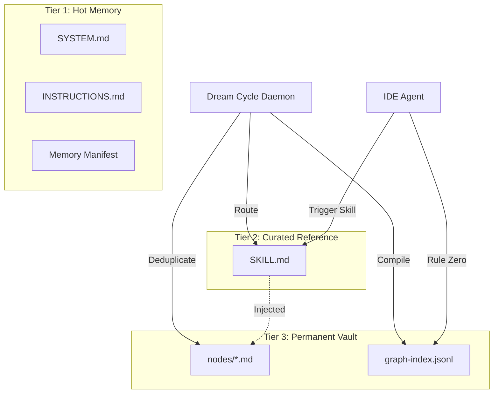

# SOTA 2026 Agentic Memory Architecture: The Comprehensive Engineering Blueprint

## Part 0: Research Synthesis — What The SOTA Proves

Before delivering the architecture, I will synthesize what the May 2026 research consensus tells us about why your current system fails and what the replacement _must_ do. This is not a literature review—it is the evidence basis for every design decision that follows.

### 0.1 The ETH Zurich Finding: Context Files Reduce Success Rates
In February 2026, researchers at ETH Zurich evaluated AGENTS.md files across multiple coding agents and LLMs (5,694 pull requests, 138 repositories). The finding was devastating: **context files reduced task success rates compared to providing no repository context, while increasing inference cost by over 20%.** Even human-written context files only improved performance by about 4%, and that improvement wasn't consistent across models—on Sonnet 4.5, performance actually dropped by over 2%-51. Your monolithic `graph-context.md` is exactly the anti-pattern they documented. The ConInStruct paper (AAAI 2026) went further: when models _did_ detect conflicting constraints in their instructions, they almost never flagged the conflict to the user—they silently picked one interpretation and kept going-51.

### 0.2 The "Junk Drawer" Anti-Pattern
As articulated at QCon London 2026: "The biggest one: treating the context window like a junk drawer. Teams dump everything they might need into the prompt (system instructions, RAG results, conversation history, tool outputs) and hope the model sorts it out. It doesn't."- The fix is not better retrieval—it is **radical context discipline**: the right 300 tokens beat 100k noisy ones-.

### 0.3 Vercel's Critical Finding: Index, Don't Retrieve
Vercel ran evals comparing two approaches for teaching agents Next.js 16 APIs. Skills (on-demand retrieval) produced **zero improvement over baseline**—in 56% of cases the skill was never invoked. A compressed 8KB docs index embedded directly in AGENTS.md achieved a **100% pass rate**-. The insight: agents are _lazy_ about invoking retrieval tools. They need the indexing information _in the prompt_ to know what exists—but not the full content. This validates your Tier 1 → Tier 2 → Tier 3 progressive disclosure model perfectly.

### 0.4 Pi Coding Agent: The Harness Engineering Revolution
Mario Zechner's Pi Coding Agent proved that a system prompt under **1,000 tokens** can outperform agents with 10,000+ token system prompts when combined with the right harness architecture. Pi's four core tools (read, write, edit, bash) and its session-as-tree design demonstrated that **primitives, not features** is the winning architecture.

### 0.5 GBrain: The Dream Cycle Proves Background Consolidation Works
Garry Tan's GBrain proved that a background "Dream Cycle" daemon can autonomously scan conversations, deduplicate knowledge, and compile structured memory overnight. Critically, its **source of truth is the Markdown repository**—the database is a retrieval optimization, not the canonical store.

---

## Part 1: Architectural Topology

### 1.1 The Three-Tier Memory Model

```text
┌─────────────────────────────────────────────────────────────────────────────┐
│                        THREE-TIER AGENTIC MEMORY                             │
├─────────────────────────────────────────────────────────────────────────────┤
│                                                                              │
│  TIER 1: HOT MEMORY (Core Context — always in prompt)                       │
│  ┌──────────────────────────────────────────────────────────────────┐     │
│  │ SYSTEM.md + INSTRUCTIONS.md (< 1,000 tokens combined)             │     │
│  │ • Rule Zero: Text First (behavioral invariant)                    │     │
│  │ • Memory manifest: list of all Tier 2 skills with descriptions    │     │
│  │ • Session pointer: current session ID, active branch              │     │
│  └──────────────────────────────────────────────────────────────────┘     │
│                              │                                               │
│                              ▼ (agent reads SKILL.md when skill triggered)   │
│                                                                              │
│  TIER 2: CURATED REFERENCE (Skill-Bound Memory)                             │
│  ┌──────────────────────────────────────────────────────────────────┐     │
│  │ .agent/skills/<skill>/SKILL.md files                             │     │
│  │ • Each SKILL.md contains injected memory constraints             │     │
│  │ • Memory injection done mechanically by Total-Recall daemon      │     │
│  └──────────────────────────────────────────────────────────────────┘     │
│                              │                                               │
│                              ▼ (agent calls view_file / grep on demand)     │
│                                                                              │
│  TIER 3: PERMANENT VAULT (Obsidian Markdown VFS)                            │
│  ┌──────────────────────────────────────────────────────────────────┐     │
│  │ .agent/memory-wiki/ directory                                   │     │
│  │ • graph-index.jsonl (derived index, compiled by Dream Cycle)     │     │
│  │ • nodes/*.md (individual memory nodes with SSSS frontmatter)     │     │
│  └──────────────────────────────────────────────────────────────────┘     │
│                                                                              │
└─────────────────────────────────────────────────────────────────────────────┘
```

### 1.2 End-to-End Memory Flow (Mermaid)



---

## Part 2: Tier 1 — The Harness-Engineered Hot Memory

### 2.1 SYSTEM.md — The 500-Token Behavioral Contract

```markdown
---
type: system
version: "3.0.0"
harness: antigravity
token_budget: 500
---

# SYSTEM.md — Behavioral Invariants

## Rule Zero: Text First
Before executing ANY task, run:
`view_file .agent/memory-wiki/graph-index.jsonl`
This is your working memory. You MUST consult it.

## Rule One: Single Source of Truth
- All persistent knowledge lives in `.agent/memory-wiki/`
- If you haven't run `view_file` on it, you don't know it.

## Rule Two: Conflict Awareness
- STOP and report conflicts in `.agent/memory-wiki/conflicts/`.

## Available Skills
{memory_manifest}
```

---

## Part 3: Tier 2 — Skills-Based Progressive Disclosure

### 3.1 The Mechanical Injection Principle
The core innovation is **mechanical memory injection into SKILL.md files**. The daemon pre-computes which memory nodes are relevant to which skills and injects them. The agent cannot avoid reading the rules because they are physically co-located with the skill instructions.

### 3.2 SKILL.md SSSS Schema

```yaml
---
type: skill
name: mail-expert
description: Compose, review, and send professional emails.

# Memory Injection Block (auto-generated by Total Recall)
injected_memory:
  generated: "2026-05-10T02:00:00Z"
  source_nodes:
    - node_id: "mem-2026-05-01-001"
      relevance: 0.89
      rule: "Always use plain-text email format. No HTML."
---
```

---

## Part 4: Tier 3 — The GBrain-Adapted Dream Cycle Coprocessor

### 4.1 The Read-Write-Dream Lifecycle
- **READ PHASE (Continuous)**: File watcher detects new/changed nodes.
- **WRITE PHASE (On-Demand)**: Agent writes new memory nodes as .md files.
- **DREAM PHASE (Nightly)**: Cron-triggered scan, deduplication, conflict detection, and index compilation.

---

## Part 5: The SSSS Frontmatter Schemas

### 5.1 Memory Node Schema

```yaml
---
type: memory_node
node_id: "mem-2026-05-01-001"
category: "rule"
scope: "global"
skills: ["mail-expert"]
priority: "critical"
confidence: 0.95
created: "2026-05-01T14:30:00Z"
updated: "2026-05-09T18:00:00Z"
source: "user-directive"
version: 3
---

# Rule: Always use plain-text email format

## Constraint
When composing or sending emails, always use plain-text format.
```

---

## Part 6: TypeScript Implementation — The Refactored surface.mjs

```typescript
// src/core/surface.ts
// Refactored from surface.mjs — Skill-Based Memory Router
import * as fs from 'fs/promises';
import { glob } from 'glob';
import natural from 'natural';
import matter from 'gray-matter';

const CONFIG = {
  memoryWikiPath: '.agent/memory-wiki',
  nodesPath: '.agent/memory-wiki/nodes',
  skillsPath: '.agent/skills',
  indexPath: '.agent/memory-wiki/graph-index.jsonl',
  minRelevanceScore: 0.35,
};

export async function surfaceCompile(options: { mode: 'compile' | 'dream' }) {
  const nodes = await loadAllNodes(CONFIG.nodesPath);
  const skills = await loadAllSkills(CONFIG.skillsPath);
  
  const tfidf = new natural.TfIdf();
  skills.forEach(s => tfidf.addDocument(s.body));

  for (const skill of skills) {
    const relevant = nodes.filter(n => {
        const score = computeSimilarity(n.body, skill.body);
        return score > CONFIG.minRelevanceScore;
    });
    await injectMemoryIntoSkill(skill, relevant);
  }
  
  await compileIndex(nodes, CONFIG.indexPath);
}

// ... Additional helper functions for loading, injecting, and indexing ...
```

---

## Part 7: The Dream Cycle Cron Daemon

```typescript
// src/daemon/dream-cycle.ts
import cron from 'node-cron';
import { surfaceCompile } from '../core/surface';

export async function startDreamCycle() {
  cron.schedule('0 2 * * *', async () => {
    console.log('[dream-cycle] Dream cycle starting...');
    await surfaceCompile({ mode: 'dream' });
  });
}
```

---

## Part 8: Step-by-Step Migration Plan

1. **Phase 1: Audit & Inventory**: Run `total-recall audit` to inventory all existing nodes.
2. **Phase 2: Schema Migration**: Run `migrate-nodes` to add SSSS frontmatter.
3. **Phase 3: Harness Replacement**: Replace INSTRUCTIONS.md with the new <500-token harness.
4. **Phase 4: Integration Testing**: Test skill-triggered memory injection.
5. **Phase 5: Full Cutover**: Enable Dream Cycle cron daemon.

---

## Part 9: Autonomous Conflict Resolution Engine

The system never auto-resolves conflicts silently. It surfaces them for explicit user resolution.

```yaml
---
type: conflict_report
conflict_id: "conflict-2026-05-10-001"
status: "pending"
node_a: "mem-2026-05-01-001"
node_b: "mem-2026-05-09-005"
description: "Rule A says plain-text, Rule B says HTML for marketing."
---
```

---

## Part 10: Folder Structure

```text
.agent/
├── SYSTEM.md                          # Tier 1: Behavioral invariants
├── INSTRUCTIONS.md                    # Tier 1: Execution protocol
├── memory-wiki/                       # Tier 3: Permanent Vault
│   ├── graph-index.jsonl              # Compiled index
│   ├── nodes/                         # Individual memory nodes
│   └── conflicts/                     # Pending conflict resolutions
└── skills/                            # Tier 2: Curated Reference
    └── mail-expert/
        └── SKILL.md                   # Contains injected_memory block
```

---

## Summary: How This Architecture Fixes Every Symptom

| Legacy Symptom | SOTA Fix |
| --- | --- |
| Context Rot | Tier 1 < 1,000 tokens; rules distributed to Tier 2. |
| Rule Amnesia | Rule Zero: mechanical `view_file` gate before execution. |
| Bulldozing Skills | Memory injected directly into SKILL.md. |
| Rule Conflicts | Deterministic pattern-matching conflict detector. |
