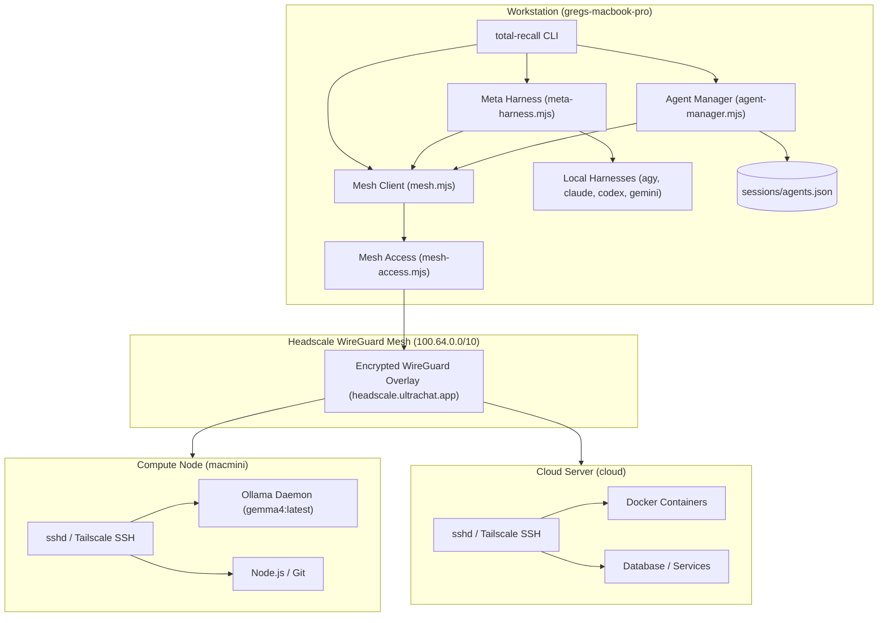

# META_HARNESS_AND_MESH_COMPUTE — System Architecture

> **Project Prefix**: `META_HARNESS_AND_MESH_COMPUTE`  
> **Kanban State**: ✅ Completed  
> **Date**: 2026-09-05  
> **Author**: Antigravity & User  

---

## 1. High-Level System Architecture

The Meta Harness and Mesh Compute architecture connects developer workstations, local compute nodes, and cloud servers into a unified execution network over private WireGuard tunnels.



---

## 2. Component Design & Responsibilities

### 2.1 Meta Harness Subsystem (`src/core/meta-harness.mjs`)
The Meta Harness layer treats external AI CLI tools as interchangeable execution engines:
- **Registry Specification (`HARNESS_SPECS`)**:
  - `agy`: Google Antigravity (`agy`), prompt argument passing.
  - `claude`: Anthropic Claude Code (`claude -p "<task>"`).
  - `codex`: OpenAI Codex (`codex exec "<task>"`).
  - `gemini`: Google Gemini CLI (`gemini "<task>"`).
  - `ollama`: Ollama local neural model runtime (`ollama run gemma4:latest`), executing via `pipe_stdin` mode.
- **Dynamic Binary Discovery**: Probes `$PATH` using `which` to detect installed tools without hardcoded absolute paths.
- **Council Deliberation Runner (`runCouncil`)**: Dispatches the same prompt concurrently across all available harnesses, collecting and comparing individual responses into a structured report.
- **Cross-Node Routing**: Transparently wraps dispatches with `execMeshCommand` when the `--node` flag is provided.

### 2.2 Agent Management Subsystem (`src/core/agent-manager.mjs`)
The Agent Manager acts as a lightweight process supervisor:
- **State Storage**: Persists active and historical agent metadata to `sessions/agents.json` under the brain directory.
- **Process Spawning**:
  - Local: Uses `child_process.spawn` with `{ detached: true, stdio: ['ignore', logFd, logFd] }`.
  - Remote: Dispatches via SSH with `nohup ... > logfile 2>&1 & echo $!` to capture remote process PIDs.
- **Log Streaming**: Reads from the local log file or runs `cat` over mesh SSH for remote nodes.
- **Process Termination**: Sends `SIGTERM` locally or dispatches `kill <pid>` remotely.

### 2.3 Mesh Execution Engine (`src/core/mesh.mjs` & `src/core/mesh-access.mjs`)
- **Address & Credential Resolution**:
  - Queries Headscale nodes via REST or local cache.
  - Resolves login user, port, and identity file from the `mesh_node` entity or `~/.ssh/config`.
- **Command Transmission Contract**:
  - Prepend sanitized `$PATH` directly: `export PATH="/opt/homebrew/bin:/opt/homebrew/sbin:/usr/local/bin:$HOME/.local/bin:$PATH";`.
  - Disables interactive terminal allocation (`-T`) for predictable output piping.
  - Returns structured exit codes, `stdout`, and `stderr`.

---

## 3. Data Models & Schemas

### 3.1 Agent Process Record (`sessions/agents.json`)
```json
{
  "id": "agent-claude-1725525600000",
  "pid": 12345,
  "harness": "claude",
  "name": "Codebase Refactor",
  "task": "Review and run code quality checks",
  "node": "local",
  "status": "running",
  "startedAt": "2026-09-05T02:00:00.000Z",
  "logFile": "/Users/greg/.agent/skills/total-recall/sessions/logs/agent-claude-1725525600000.log"
}
```

### 3.2 Mesh Node Audit Output (`total-recall mesh doctor --json`)
```json
[
  {
    "node": "macmini",
    "ip": "100.64.0.2",
    "ssh": true,
    "runtimes": {
      "node": "v22.14.0",
      "docker": null,
      "git": "git version 2.45.2"
    },
    "harnesses": {
      "agy": null,
      "claude": null,
      "codex": null,
      "gemini": null,
      "ollama": "0.5.12"
    }
  }
]
```

---

## 4. Security Architecture

1. **Network Encryption**: All communication traverses end-to-end encrypted WireGuard tunnels managed by Headscale.
2. **Access Control**: Remote command execution relies on cryptographic SSH keys with `IdentitiesOnly=yes`, preventing credential leakage or agent hijacking.
3. **No Plaintext Passwords**: No root credentials or plaintext passwords are required or stored.
4. **Boundary Isolation**: Remote execution runs within the remote user's unprivileged shell boundary.
