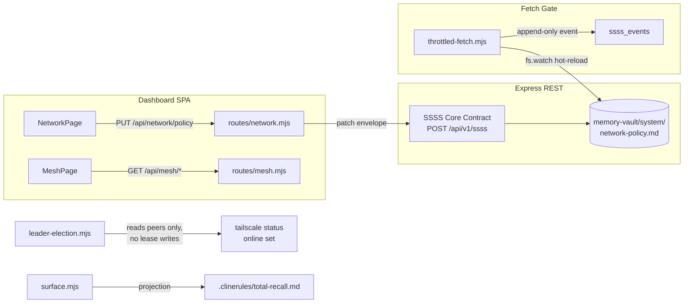

# NETWORK_SECURITY_COMPLETION — Architecture

> **Project Prefix**: `NETWORK_SECURITY_COMPLETION`
> **Kanban State**: 🏗️ In Progress
> **Author**: Cline
> **Date**: 2026-07-17
> **Companion**: [Audit](./NETWORK_SECURITY_COMPLETION_AUDIT.md) · [PRD](./NETWORK_SECURITY_COMPLETION_PRD.md) · [Dev Plan](./NETWORK_SECURITY_COMPLETION_DEVELOPMENT_PLAN.md) · [Tracker](./NETWORK_SECURITY_COMPLETION_PROJECT_TRACKER.md)

---

## 1. Component Map



## 2. minIntervalMs Rate Limiting (the core new logic)

### Policy schema (extends existing `network_policy` VFS frontmatter)

```yaml
type: network_policy
blocked_domains: []
allowed_domains: []
domain_limits:
  api.example.com:
    maxConcurrency: 2        # existing
    minIntervalMs: 2000      # NEW — minimum spacing between request starts to this domain
```

### Gate internals (`src/core/throttled-fetch.mjs`)

- New module state: `domainMinInterval = new Map<string, number>()` and `domainLastStart = new Map<string, number>()`, populated in `loadPolicy()` alongside the existing `domainLimits` map (L61-92 pattern).
- **Activation precondition (P0):** `loadPolicy()` only applies policy when frontmatter has `status: active` (L84) — Phase 0 sets it via SSSS `patch`; without it the entire firewall stays inert (Audit §3a).
- **Dual-path enforcement (required):** the gate has two start paths — direct dispatch in `throttledFetch()` (L337-340, no contention) and `drainQueue()` (L205-225, under contention). A shared `enforceMinInterval(domain)` helper must gate BOTH, otherwise the common no-contention case skips rate limiting entirely (Audit §3d).
- On either start path, before starting a request to domain `d`:
  1. `const interval = domainMinInterval.get(d) ?? 0`
  2. `const wait = interval - (Date.now() - (domainLastStart.get(d) ?? 0))`
  3. If `wait > 0`: delay the start by `wait` (setTimeout, non-blocking), keeping the slot reserved so ordering is deterministic.
  4. Record `domainLastStart.set(d, Date.now())` at actual start.
- Hot-reload: existing `fs.watch` on `network-policy.md` re-runs `loadPolicy()` — new maps re-populate with no other wiring.
- Default `0` = disabled; global behavior unchanged when unset.
- Audit: the existing circular audit log gains a `rate_wait_ms` field; the append-only SSSS `event` per request includes it.
- Mutations: unchanged — UI `PUT /api/network/policy` → SSSS `patch` envelope → VFS → watcher. No new stores.

## 3. Leader Election — Deterministic Redesign (verification, not CAS)

**Superseded:** the lease-based design and its TOCTOU/CAS fix are obsolete. `src/core/leader-election.mjs` (35 lines) now implements **deterministic lowest-mesh-IP election** — no lease documents, no acquisition writes:

- `getLeaderInfo()` sorts online peers (`getMeshPeers({includeSelf:true})`) by IP then hostname, picks the lowest (L12-17).
- `isLeader()` = self equals the winner (L19-23); `tryAcquireLease`/`renewLease`/`releaseLease` are intentional no-op shims preserving the daemon-loop API.

Verification & hardening design (replaces the CAS plan):
1. **Failover-latency measurement** — bounded by tailscale `online` status freshness; measure kill→flip time and document the bound.
2. **Hostname normalization** — guard against MagicDNS trailing-dot mismatch in `isLeader()`'s exact `self.ip === leader.ip && self.hostname === leader.hostname` comparison (zero-leader risk).
3. **Hysteresis decision** — optional min-tenure to prevent online-bit flapping from flapping leadership; implement or document rejection.
4. **Vestigial cleanup** — `memory-vault/system/daemon-leader.md` (null-lease template) archived/annotated via SSSS; HEADSCALE tracker 2A/2B text synced to the deterministic design.

## 4. Frontend Rebuild Pipeline (P0 fix)

1. `cd frontend && npm run build` → new content-hashed `index-<hash>.js`.
2. Express serves `frontend/dist` statically; `index.html` references the new hash.
3. Service worker: hashed assets are cache-first → old bundle orphaned, never requested; `/api/*` SWR may serve one stale envelope on first load — acceptable one-time flash, self-heals on revalidate.
4. Verification: `grep -c "election/force" frontend/dist/assets/*.js` → `0`; browser hard-refresh; Mesh page renders nodes + refresh button 200s.

## 5. Cline Integration Surface

Per live docs (fetched 2026-07-17, docs.cline.bot): rules = `.clinerules/` **directory** of `.md` files; skills = `.cline/skills/`; any enabled skill is `/<name>`; auto-detects `.cursorrules`/`.windsurfrules`/`AGENTS.md`.

| Layer | Change |
|---|---|
| `src/core/surface.mjs` `CLIENT_SHIMS` | `cline: ['.clinerules/total-recall.md']` — directory-form projection (primary). Legacy single-file `.clinerules` tolerated on import only. |
| `src/cli/connect.mjs` | New `cline` client: `label: 'Cline'`, `mode: 'file'`, `target: '.clinerules/total-recall.md'`, `render: instructions => instructions` (no frontmatter). |
| `src/server/routes/integrations.mjs` | Detection path: `~/Library/Application Support/Code/User/globalStorage/saoudrizwan.claude-dev` (verified present on this host). |
| `src/core/import-rules.mjs` | `{ dirPath: '.clinerules', ext: '.md', label: 'Cline rule', ide: 'cline', recursive: false }` + legacy `{ filename: '.clinerules', label: 'Cline rules (legacy)', ide: 'cline' }`. |
| `src/core/protect-instructions.mjs` | Guard `.clinerules/` dir + legacy file. |
| `src/cli/uninstall.mjs` | Add both forms to shim cleanup + inject-pattern strip lists. |
| Tests | Mirror cursor case in `connect.spec.mjs`; surface-compile test asserting the shim projects. |

No application state involved — surface projections only, consistent with SSSS rules.

## 6. Security Considerations

- Rate limiting is per-domain, opt-in, default-off — cannot be used to self-DoS global research throughput.
- Policy mutations remain PAT-authenticated via existing `requireAuth`/`requireScope` on network routes.
- Deterministic election removes lease-write split-brain by construction; remaining risks (failover latency, hostname normalization, flapping) are bounded by Phase 2 verification.
- Cline projection contains only compiled instructions/memory block — no secrets (secrets never enter surfaces; `secrets.enc` remains gitignored and encrypted).

## 7. Data / Event Shapes

- `network_policy` frontmatter: adds optional `domain_limits.<domain>.minIntervalMs: number` (non-negative int).
- Audit event addition: `rate_wait_ms: number` on the existing fetch-gate `event` envelope payload.
- `daemon_leader` doc: retired by the deterministic design; archived/annotated via SSSS in Phase 2.4 (no `lease_id` semantics remain).
