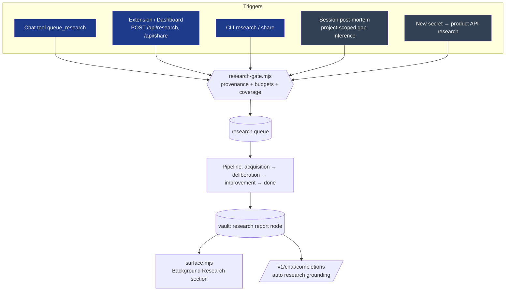

# RESEARCH_SYSTEM2 — Architecture

## Flow



Nothing inside the pipeline writes to the queue, the agenda or the scheduler queue. Research ends when it's answered.

## Queue item schema (additive)

```js
{
  id, topic, status, priority, notes, node_slug, research_phase,
  created_at, updated_at, completed_at, summary,
  origin: 'user' | 'autonomous' | 'legacy', // NEW: 'legacy' = queued before provenance (migration only)
  requested_via: 'chat'|'extension'|'dashboard'|'cli'|'api'|'share'|'session'|'secret', // NEW
  project: string | null,                 // NEW: repo basename, e.g. 'total-recall'
  rationale: string | null,               // NEW: why the AI thought this helps
  session_id: string | null,              // NEW
  attempts: number,                       // NEW: failed-run counter (max 3)
}
```

`addToQueue` accepts and persists the new fields. The existing de-duplication by normalized topic is kept, and a duplicate of a `done` item returns the existing item.

## New module: `src/core/research-gate.mjs`

```js
export const AUTONOMOUS_DEFAULTS = { enabled: true, maxPendingPerProject: 3, maxPerDay: 6, maxPerSession: 2, coverageSimilarity: 0.72 };
export function resolveAutonomousConfig(fileConfig)                  // config/research.yml `autonomous:` block
export function requestResearch({ topic, notes, via, priority })     // origin:'user' → addToQueue (priority high)
export async function proposeAutonomousResearch(candidates, { project, sessionId, via, config, now, coverageCheck })
  // → { queued: [...], skipped: [{topic, reason}] }  reasons: disabled | budget-project | budget-day | budget-session | covered | duplicate
```

`coverageCheck(topic)` is injectable. The default does one `semanticSearch` over research-layer vault nodes and returns the top similarity. Tests stub it.

## Pipeline changes

| File | Change |
|---|---|
| `scheduler.mjs` | Phases are acquisition, deliberation, improvement. Remove the expansion and monitoring scheduling. Cooldown reset: `done` is never reset; `failed` is reset to acquisition only while `attempts < 3`, incrementing `attempts`. User-origin items are ordered before autonomous ones. |
| `daemon-loop.mjs` | improvement success → `done` (with a node) or `failed`. Remove the monitoring and expansion transitions. |
| `task-executors.mjs` | Remove the monitoring and expansion executors. A proactive-research task with no `target` returns `{ success: true, output: 'No topic: nothing to research' }` and doesn't touch the agenda. |
| `fact-seeker.mjs` | Delete `runResearchExpansionCycle`, `runResearchMonitoringCycle`, the follow-up spawn, and the self-diagnosis fallback. `runKnowledgeAcquisitionCycle` requires `forceTopic`. `ingestSessionTopics` becomes the project-scoped gap inferrer feeding `proposeAutonomousResearch`. |
| `research.mjs` | Remove the phase-5 `addToAgenda` re-add. |
| `dream.mjs` / `optimizer.mjs` | Remove the `refreshStaleKnowledge` call and function. |
| `post-mortem.mjs` | Pass the project (from the session file) and the session id into the gap inferrer. |
| `session-watcher.mjs` | Keep `cwd` on parsed entries (Claude Code and Codex provide it). |
| `secret-integration-research.mjs` | Route through `proposeAutonomousResearch` (`via: 'secret'`, no project). |

The monitoring phase is removed along with expansion. Its only product was a list of "ongoing sources" for a re-monitor loop (G6), which no longer exists.

## Surfacing

### Instruction surface: `src/core/research-surface.mjs`

```js
export function selectResearchBriefs({ queueItems, nodes, project, now, limit = 6 })
export function formatResearchBriefs(briefs, { maxChars = 2500 })
```

Selection:
- A queue item qualifies if it's `done`, has a `node_slug` that resolves to an active vault node, and meets one of:
  - `project === currentProject`, or
  - `origin === 'user'` and it completed in the last 30 days (`legacy` items never qualify; they reach chat by relevance only)
- Project items rank first, then newest `completed_at`.

A brief contains:
- title
- completion date
- origin label ("you asked" / "researched for <project>")
- 2–4 findings, taken in this order of preference:
  1. bullets under a findings/summary/bottom-line heading
  2. any bullets
  3. the first sentences of the synthesis
- Only reports whose synthesis passes `isUsableSynthesis` (not empty, not a meta-response to the prompt) qualify.
- the slug, plus a `recall` hint for the full report

`buildRulesBlock` appends the section after corrections and before the CLI reference. The current project is the basename of `projectRoot`, or `process.cwd()` when no root is passed.

### Chat: `server/api.mjs`

After the grounding-nodes block:
- `findRelevantResearch(lastUserMessage, vaultDir)`: one `semanticSearch` call over 20 candidates, keeping research-layer vault results with a usable synthesis and `similarity ≥ 0.45`, top 3.
  - Calibrated on the live vault on 2026-09-22 (usable reports only):
    - related questions scored 0.47–0.70 (Telnyx Call Control 0.47, 10DLC 0.61, TTS pricing 0.70)
    - unrelated questions (React tests, Python refactor, SQL, dinner) matched no usable report
- It appends:
  ```
  === BACKGROUND RESEARCH (System 2) ===
  Findings your background research already produced that bear on this question. Prefer them over guessing; cite the slug.
  ```
  followed by excerpts, each up to 1,500 characters.
- Any failure is non-fatal and logged.

### Chat tool: `server/tools.mjs`

```js
{ name: 'queue_research', description: 'Queue deep background research on a topic ONLY when the user explicitly asks you to research something in depth or later. Returns immediately; results appear in memory and future context. For an answer now, use search_web.', parameters: { topic, notes? } }
```

Handler → `requestResearch({ topic, notes, via: 'chat' })`.

## Migration: `scripts/migrate-research-system2.mjs`

This is a one-off script with a default dry run and `--apply`. It backs up each file to `*.bak-system2-<ts>` first. Then:

1. Queue items in `research_phase` `expansion` or `monitoring`: set `done` with `completed_at` if they have a `node_slug`, otherwise `failed`. Set `origin` to `'legacy'` where missing (the first live run tagged them `'user'`; the second run corrected that).
2. Scheduler queue: pending task files whose `created_by` is `fact-seeker-expansion` or `fact-seeker-deliberation` get `status: cancelled` and `cancel_reason`.
3. Agenda: pending entries with source `follow-up:*` or `deep-research-task` become `cancelled`, with the reason `system2: autonomous spawning removed`.

Run on the live brain 2026-09-22 23:04 after the daemon was restarted onto the new code. Backups: `~/.agent/skills/total-recall/backups/research-system2-2026-09-22/`.

## SSSS note

The research queue, agenda and scheduler tasks remain JSON/Markdown outside the SSSS Core Contract, as they are today. Moving them is recorded as out of scope (PRD). This project adds no new stores.
