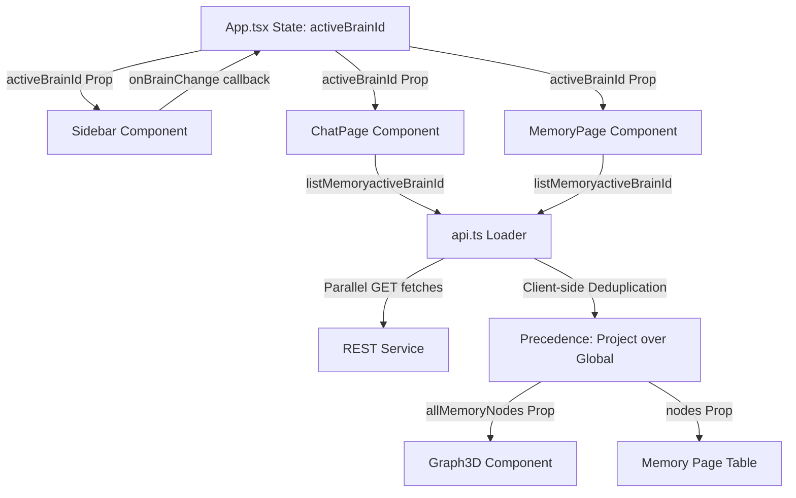

# Dynamic Brain Graph Sync — Architecture Document

## 1. Data Flow & Integration Diagram

## 2. Components Refactored
- **App.tsx**: Shared `activeBrainId` state and sidebar callbacks to route selected brain settings.
- **api.ts**: Refactored `listMemory(brainId)` to accept comma-separated IDs, fetch memory in parallel, and merge nodes applying project-local slug overrides.
- **BrainSelector.tsx**: Implemented checkboxes, multi-layered gradient indicator dot (`linear-gradient(135deg, #a855f7, #6366f1, #10b981)`), aggregated node counts, and click-outside drop-down auto-close.
- **Graph3D.tsx**: 
  - Integrated `renderMarkdown` to display full scrollable markdown VFS memory details in the graph visual drawer.
  - Implemented `Constellation Filters` checkbox selector in the top-right, defaulting visibility to **Research Projects and Observations** while hiding developer rules and chat conversations by default.
  - Integrated distinct color-coding in the 3D space: Rules (Indigo `#6366f1`), Observations (Purple `#8b5cf6`), Research (Gold `#f59e0b`), and Conversations (Cyan `#06b6d4`).
