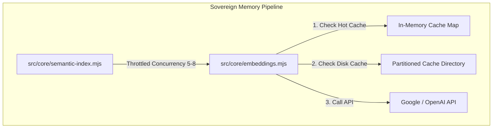

# System Architecture: CLI Command & Cache Performance Optimization

This document outlines the architectural changes for the performance enhancements in the Total Recall Sovereign OS memory pipeline.

---

## 1. Component Topology

---

## 2. Technical Designs

### A. Throttled Concurrency in Semantic Index
- We implement `throttledMap(items, limit, fn)` in `src/core/semantic-index.mjs` to limit concurrent calls during incremental compilation.
- **Limit**: Safe default of 6 concurrent requests.
- **Methodology**:
  - Maintain a rolling set of active Promises.
  - Await `Promise.race(executing)` when the set reaches the limit.
  - Returns `Promise.all` of all resolved values.

### B. Two-Tier Embedding Cache Structure
1. **Tier 1: Hot In-Memory LRU Cache**
   - Implemented as a process-level `Map` with key limits (default: 500).
   - On read hit: move key to the end of the map (most recently used), bypass disk read.
   - On cache miss: fetch from disk (Tier 2) or API, insert into Tier 1. If size > 500, delete oldest key.
2. **Tier 2: Partitioned Disk Cache with LRU Pruning**
   - Keeps 256 subdirectories of `.json` partition shards.
   - Values are stored either as legacy array format `[number, number, ...]` or upgraded object structure `{ embedding: number[], lastUsed: number }`.
   - When writing to a partition shard:
     - Wrap entry in `{ embedding, lastUsed: Date.now() }`.
     - If partition key count exceeds 500, sort by `lastUsed` ascending, and delete the oldest 100 entries.

### C. Stale Index Filtering
- Inside `buildEmbeddingsIndex()`, compare index keys with active vault nodes:
  - If a slug exists in `embeddings.json` but is no longer present in the active nodes list, delete it from `index`.
  - Non-destructively preserves system state while reclaiming storage and reducing index parse latencies.
