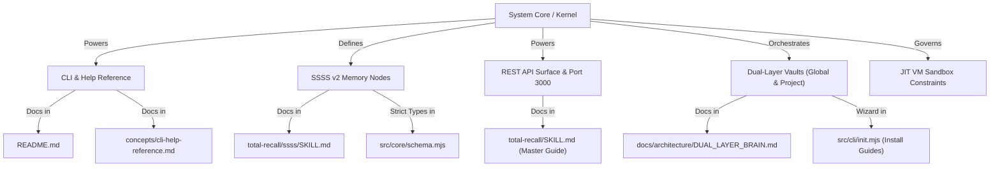

# Documentation Overhaul Architecture

This document maps the architectural areas of the **Total Recall Sovereign AI OS** to the specific documentation files and shims that need to be audited, written, or updated.

---

## 1. Documentation Map & Target Files

### A. The Master Guide (`.agent/skills/total-recall/SKILL.md`)
- **Focus**: The unified developer reference for the Sovereign AI OS.
- **Updates**: 
  - Add full REST API routing reference with standard `curl` snippets (Authorization Bearer PAT header, JSON payload structures).
  - Add SSSS v2 schema compliance rules (decay trackers, modality definitions, absolute invariant keys).
  - Detail background research REST operations (`POST /api/research` and `GET /api/research?status=pending`).

### B. Dual-Layer Brain Guide (`docs/architecture/DUAL_LAYER_BRAIN.md`) [NEW]
- **Focus**: Documenting how the Global and Project brain layers operate and merge.
- **Key Concepts**:
  - Global Vault: `~/.agent/skills/total-recall/memory-vault/` containing broad developer preferences and identity keys (e.g. USER.md, SOUL.md).
  - Project Vault: `<repo>/.agent/skills/total-recall/memory-vault/` containing repository-specific facts and patterns.
  - Precedence Resolution: Project-level memory nodes supersede global memory nodes of the same slug, but both are read, cross-referenced, and indexed by `compileSurface` into a unified `graph-index.jsonl`.
  - Rebuilder drift check: Verifying both local and global vault indexes to eliminate ghost record false positives.

### C. Installation & Wizard Guide (`docs/setup/INSTALLATION.md`) [NEW]
- **Focus**: Detail installation pipelines, environment initialization, and wizard flows.
- **Key Concepts**:
  - Wizard choices for UI deploy locations: Local Server, Cloudflare Tunnel (Quick Tunnel vs. Named Tunnel), Custom Domain.
  - Auto-building React SPA: Detailed explanation of how the Node daemon checks for `frontend/dist/` and compiles it on startup if missing.
  - Dual-layer initialization: How `npx total-recall init` provisions global config in `~/.agent/skills/total-recall/` and project-level configs in the active repository.

### D. System Help Reference (`.agent/skills/total-recall/memory-vault/concepts/cli-help-reference.md`)
- **Focus**: Standard help references returned by CLI queries.
- **Updates**: Update frontmatter and content to reflect all standard commands (`init`, `deploy`, `remember`, `recall`, `research`, `rebuild`, `compile`).

### E. README & Core Integration guides
- **Focus**: First-contact files.
- **Updates**:
  - `README.md`: Align installation commands, default ports, reverse proxy details, and quickstart wizard command references.

---

## 2. Structural Verification Plan

To verify that the documentation changes do not cause schema drifts or build breaks:
1. Run `node bin/total-recall.mjs lint --strict` to verify all vault nodes are perfectly SSSS v2 compliant.
2. Run `npx total-recall compile` to ensure markdown files are successfully parsed and surfaced.
3. Validate that markdown links within artifacts point strictly to valid paths inside the repo workspace.
