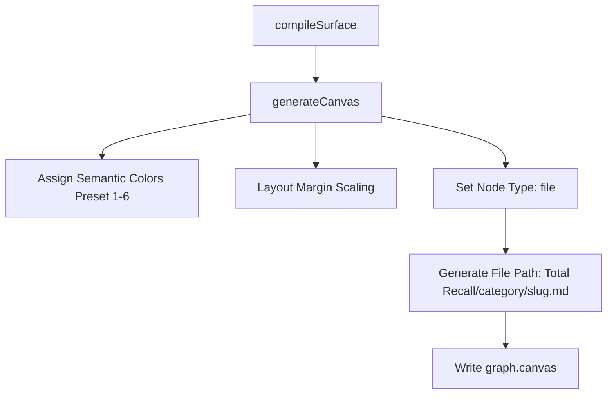

# Obsidian SSSS Integration Architecture

## 1. Topological Graph & Backlinking (Core Engine)

To support rich backlinking and semantic querying of the cognitive graph, the compiler must parse `[[slug]]` references in the Markdown body of SSSS memory nodes.

### Data Flow
1. **Compilation**: `src/core/surface.mjs` -> `compileSurface()` is triggered.
2. **Extraction**: `extractWikilinks(body)` parses `[[slug]]` syntax.
3. **Graph Construction**:
   - Outbound edges are constructed from:
     - Frontmatter `related` array.
     - Extracted wikilinks.
   - Inbound backlinks are computed dynamically:
     - Iterate through all nodes.
     - If Node A has an outbound edge to Node B, register Node A as an inbound backlink for Node B.
4. **Topological Index Serialization**:
   - Save the compiled `links` (outgoing) and `backlinks` (incoming) list for each node directly inside `graph-index.jsonl` (and `memory-layers.jsonl` if relevant).

---

## 2. High-Fidelity Obsidian Canvas

The `graph.canvas` file generated in the memory vault will be upgraded to premium visual quality.



### Layout Margin Scaling
Large file-based cards (containing active Markdown previews) require expanded dimensions and perfect margins to avoid overlapping:
- **Card Size**: `width: 320`, `height: 240` (large enough to preview the SSSS body).
- **Margins**: `GAP_X: 120`, `GAP_Y: 80`.
- **Obsidian Category Coloring Map**:
  - `invariants` -> Orange (`color: "1"`)
  - `patterns` -> Green (`color: "4"`)
  - `anti-patterns` -> Red (`color: "0"`)
  - `preferences` -> Purple (`color: "5")
  - `concepts`/`facts`/`lore` -> Cyan (`color: "3"`)
  - `decisions` -> Yellow (`color: "2"`)

---

## 3. Dedicated `/ssss` Slash Command

The `/ssss` command is registered as an omnichannel developer command that queries, audits, and compiles the SSSS vault directly in the developer context.

```
/ssss <stats|help|map [slug]|compile>
```

### Registries
- **Gemini**: `.gemini/commands/ssss.toml` & `~/.gemini/commands/ssss.toml`
- **Claude Code**: `~/.claude/commands/ssss.md`

### CLI Handlers
- **Recompile**: Invoke `rebuild.mjs` (`npx total-recall compile`).
- **Graph Map**: Update `map.mjs` to render inbound backlinks (`◄──`) in addition to outbound relations (`──►`).
