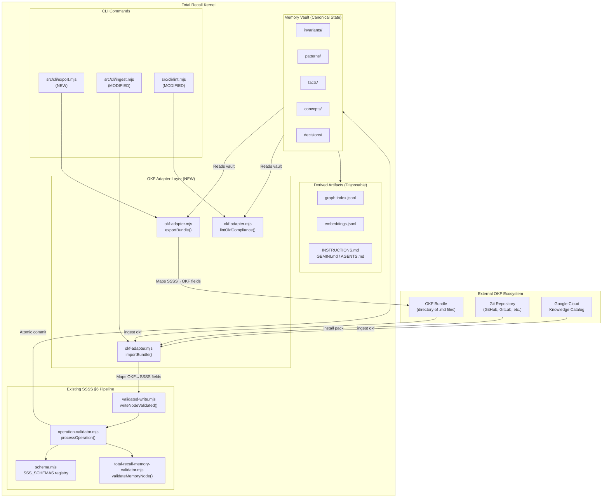
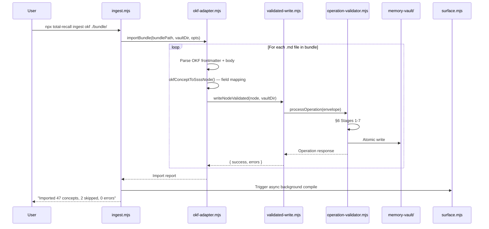
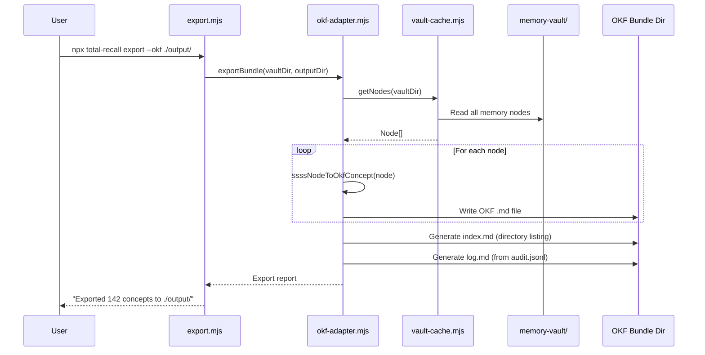

# OKF Integration — Architecture Document

> **Status**: Planned
> **Date**: June 17, 2026
> **Author**: Antigravity (Advanced Agentic Coding)
> **Companion**: [OKF_INTEGRATION_PRD.md](./OKF_INTEGRATION_PRD.md)

---

## 1. Architectural Overview

This document describes **how** Total Recall integrates with the Open Knowledge Format (OKF v0.1). The integration follows a **bridge pattern**: a thin adapter layer translates between the minimal OKF schema and the richer SSSS v0.2 schema, while all mutations continue flowing through the existing §6 Operation Contract pipeline.



> [!IMPORTANT]
> The OKF adapter layer **never bypasses** the SSSS Operation Contract. All imports flow through `writeNodeValidated()` → `processOperation()`. This guarantees envelope validation, idempotency, schema validation, atomic commits, and audit trails for every imported concept.

---

## 2. Component Architecture

### 2.1 OKF Adapter Module — `src/core/okf-adapter.mjs` (NEW)

The central adapter that handles all OKF ↔ SSSS field translation. This is a pure-logic module with no I/O side effects — it transforms data structures.

```javascript
// ─── OKF → SSSS Translation ────────────────────────────────────────────

/**
 * Convert an OKF concept (parsed frontmatter + body) into an SSSS memory node.
 * @param {object} okfFrontmatter - Parsed OKF YAML frontmatter
 * @param {string} okfBody - Markdown body content
 * @param {string} conceptId - OKF Concept ID (file path minus .md)
 * @param {object} [options] - { defaultCategory, defaultImportance }
 * @returns {object} SSSS memory node object ready for writeNodeValidated()
 */
export function okfConceptToSsssNode(okfFrontmatter, okfBody, conceptId, options = {}) { }

/**
 * Convert an SSSS memory node into an OKF-compliant concept file.
 * @param {object} ssssNode - SSSS memory node (frontmatter + body)
 * @returns {{ frontmatter: object, body: string }} OKF-compliant concept
 */
export function ssssNodeToOkfConcept(ssssNode) { }

// ─── Bundle Operations ──────────────────────────────────────────────────

/**
 * Import an entire OKF bundle directory into a Total Recall vault.
 * @param {string} bundlePath - Absolute path to OKF bundle directory
 * @param {string} vaultDir - Absolute path to target vault
 * @param {object} [options] - { dryRun, category, brain }
 * @returns {object} Import report { imported, skipped, errors }
 */
export function importBundle(bundlePath, vaultDir, options = {}) { }

/**
 * Export a Total Recall vault as an OKF-compliant bundle.
 * @param {string} vaultDir - Absolute path to source vault
 * @param {string} outputDir - Absolute path to output bundle directory
 * @param {object} [options] - { format }
 * @returns {object} Export report { exported, indexGenerated, logGenerated }
 */
export function exportBundle(vaultDir, outputDir, options = {}) { }

/**
 * Lint a vault for OKF v0.1 compliance.
 * @param {string} vaultDir - Absolute path to vault
 * @returns {object} Lint report { pass, warnings, errors }
 */
export function lintOkfCompliance(vaultDir) { }
```

### 2.2 Field Mapping Tables

#### OKF → SSSS Import Mapping

| OKF Field | SSSS Field | Transformation |
|---|---|---|
| `type` | `category` | Configurable lookup table (see §2.3). Falls back to `facts`. |
| `title` | `title` | Direct copy. |
| `description` | `description` | Direct copy (new OPTIONAL field). |
| `resource` | `resource` | Direct copy (new OPTIONAL field). |
| `tags` | `tags` | Direct copy (array). |
| `timestamp` | `created` / `updated` | Parse ISO 8601; set both if only one provided. |
| *(body)* | *(body)* | Direct copy. |
| *(Concept ID / filepath)* | `slug` | Derive from filename: `tables/users.md` → `tables-users`. |
| *(not in OKF)* | `type` | Always set to `memory`. |
| *(not in OKF)* | `schema_version` | Always set to `2`. |
| *(not in OKF)* | `confidence` | Default: `0.8` (imported external knowledge). |
| *(not in OKF)* | `importance` | Default: `3` (medium). Configurable via `--importance`. |
| *(not in OKF)* | `modality` | Default: `descriptive`. |
| *(not in OKF)* | `subject` | Auto-derived: first noun phrase of title, or `okf.concept`. |
| *(not in OKF)* | `predicate` | Default: `describes`. |
| *(not in OKF)* | `object` | Auto-derived: OKF `type` value (e.g., `bigquery_table`). |
| *(not in OKF)* | `sentiment_polarity` | Default: `descriptive`. |
| *(not in OKF)* | `source.type` | Set to `okf-import`. |
| *(not in OKF)* | `source.agent` | Set to `total-recall-cli`. |

#### SSSS → OKF Export Mapping

| SSSS Field | OKF Field | Transformation |
|---|---|---|
| `category` | `type` | Capitalize: `facts` → `Fact`, `invariants` → `Invariant`. |
| `title` | `title` | Direct copy. |
| `description` | `description` | Direct copy if present; otherwise derive from body first sentence. |
| `resource` | `resource` | Direct copy if present. |
| `tags` | `tags` | Direct copy. |
| `updated` | `timestamp` | Direct copy (ISO 8601). |
| *(body)* | *(body)* | Direct copy. |
| All SSSS-specific fields | Preserved in frontmatter | OKF allows producer-defined fields. |

### 2.3 OKF Type → SSSS Category Lookup

OKF `type` values are free-form strings (no central registry). We provide a default mapping with override capability:

```javascript
const DEFAULT_OKF_TYPE_MAP = {
  // Google Cloud knowledge catalog types
  'BigQuery Table':    'facts',
  'BigQuery Dataset':  'facts',
  'API Endpoint':      'facts',
  'Metric':            'concepts',
  'Playbook':          'patterns',
  'Runbook':           'patterns',
  'Reference':         'facts',
  'Architecture':      'concepts',
  'Decision':          'decisions',
  'Policy':            'invariants',
  'Best Practice':     'patterns',
  'Anti-Pattern':      'anti-patterns',
  // Fallback
  '*':                 'facts',
};
```

Users can override with `--type-map <path-to-json>` on the CLI.

---

## 3. File-Level Changes

### 3.1 New Files

| File | Purpose |
|---|---|
| `src/core/okf-adapter.mjs` | Pure-logic OKF ↔ SSSS translation layer |
| `src/core/okf-adapter.spec.mjs` | Unit tests for all adapter functions |
| `src/cli/export.mjs` | CLI command: `npx total-recall export --okf` |

### 3.2 Modified Files

| File | Change |
|---|---|
| [schema.mjs](file:///Users/greg/Github/total-recall/src/core/schema.mjs) | Add OPTIONAL `description` (string) and `resource` (string) fields to `MemoryNodeSchema` |
| [ingest.mjs](file:///Users/greg/Github/total-recall/src/cli/ingest.mjs) | Add `okf` subcommand that delegates to `okf-adapter.importBundle()` |
| [lint.mjs](file:///Users/greg/Github/total-recall/src/cli/lint.mjs) | Add `--okf` flag that delegates to `okf-adapter.lintOkfCompliance()` |
| [surface.mjs](file:///Users/greg/Github/total-recall/src/core/surface.mjs) | Parse Markdown cross-links during compilation and add to `graph-index.jsonl` |
| [help.mjs](file:///Users/greg/Github/total-recall/src/cli/help.mjs) | Add `export` and `ingest okf` command documentation |
| [schema.spec.mjs](file:///Users/greg/Github/total-recall/src/core/schema.spec.mjs) | Add tests for new OPTIONAL fields |

### 3.3 Unchanged Files (Explicitly)

| File | Reason |
|---|---|
| [operation-validator.mjs](file:///Users/greg/Github/total-recall/src/core/operation-validator.mjs) | No changes — imports flow through it unmodified via `writeNodeValidated()` |
| [validated-write.mjs](file:///Users/greg/Github/total-recall/src/core/validated-write.mjs) | No changes — the adapter prepares nodes, this function processes them |
| [total-recall-memory-validator.mjs](file:///Users/greg/Github/total-recall/src/core/total-recall-memory-validator.mjs) | No changes — V2 validation still enforced for all imports |
| [vault-cache.mjs](file:///Users/greg/Github/total-recall/src/core/vault-cache.mjs) | No changes — cache invalidation handled by `writeNodeValidated()` |

---

## 4. Data Flow Diagrams

### 4.1 Import Flow



### 4.2 Export Flow



---

## 5. Schema Changes

### 5.1 MemoryNodeSchema Additions

Two new OPTIONAL fields are added to [schema.mjs](file:///Users/greg/Github/total-recall/src/core/schema.mjs):

```diff
 export const MemoryNodeSchema = z.object({
   type: z.literal('memory'),
   slug: z.string(),
   category: z.string(),
   title: z.string(),
+  description: z.string().optional(),
+  resource: z.string().optional(),  // NOT .url() — must accept gs://, s3://, bigquery:// URIs
   status: z.enum(['active', 'superseded', 'deprecated', 'draft']),
   // ... rest unchanged
 });
```

> [!NOTE]
> These fields are OPTIONAL and additive. They do not break any existing vault nodes, tests, or validators. The `resource` field uses Zod's `.url()` validator to enforce URI format when present.

### 5.2 SSSS Spec Alignment

Per SSSS Appendix A, `description` is NOT a reserved key, so adding it is safe. `resource` is also not reserved. Both follow the OKF v0.1 field naming exactly — no `x_` prefix needed since they are OKF-standard fields being adopted into SSSS.

---

## 6. CLI Interface Design

### 6.1 Export Command

```
npx total-recall export --okf [output-path] [options]

Options:
  --format <dir|tar.gz>    Output format (default: dir)
  --brain <global|project>  Source brain layer (default: auto-detect)
  --include-derived         Include SSSS-specific fields in output (default: true)
  --strip-ssss              Strip all SSSS-specific fields, output pure OKF only

Examples:
  npx total-recall export --okf ./my-knowledge-bundle/
  npx total-recall export --okf ./bundle.tar.gz --format tar.gz
  npx total-recall export --okf ./pure-okf/ --strip-ssss
```

### 6.2 Import Command

```
npx total-recall ingest okf <bundle-path> [options]

Options:
  --dry-run                 Preview import without writing
  --category <name>         Override category for all imported concepts
  --importance <1-5>        Set default importance (default: 3)
  --brain <global|project>  Target brain layer (default: project)
  --type-map <path>         JSON file mapping OKF types to SSSS categories
  --on-conflict <skip|warn|overwrite>  Slug collision strategy (default: warn)

Examples:
  npx total-recall ingest okf ./vendor-knowledge/ --dry-run
  npx total-recall ingest okf ./api-docs/ --category facts --importance 4
  npx total-recall ingest okf ./team-wiki/ --brain global
```

### 6.3 Lint Command Extension

```
npx total-recall lint --okf [options]

Options:
  --brain <global|project>  Target brain layer (default: auto-detect)
  --strict                   Treat warnings as errors

Examples:
  npx total-recall lint --okf
  npx total-recall lint --okf --strict
```

---

## 7. Testing Strategy

### 7.1 Unit Tests (`src/core/okf-adapter.spec.mjs`)

- **Field mapping correctness**: `okfConceptToSsssNode()` produces valid SSSS V2 nodes for all OKF field combinations.
- **Round-trip fidelity**: `export → import → diff` produces identical content.
- **Edge cases**: Missing optional fields, unknown OKF types, empty bodies, non-ASCII titles.
- **Slug derivation**: Nested paths (`tables/users.md`) produce valid kebab-case slugs.
- **V2 validation**: All auto-generated V2 fields pass `validateMemoryNode()`.

### 7.2 Integration Tests

- **Import through §6 pipeline**: Verify imports trigger all 7 stages of `processOperation()`.
- **Idempotency**: Importing the same bundle twice does not create duplicates.
- **Audit trail**: Imported nodes produce audit events in `audit.jsonl`.
- **Compilation**: Post-import compile produces valid surfaces.

### 7.3 Fixture Bundles

Create test OKF bundles under `fixtures/okf-bundles/`:
- `minimal/` — Single concept with only `type` field.
- `full/` — Concepts with all OKF fields populated.
- `nested/` — Multi-level directory hierarchy.
- `cross-linked/` — Concepts with Markdown cross-links.

---

## 8. Migration & Backward Compatibility

> [!TIP]
> **Zero migration required.** All changes are additive OPTIONAL fields. Existing vaults, tests, CLI commands, and REST API endpoints continue functioning identically.

- No existing frontmatter field is renamed, removed, or retyped.
- No existing CLI command syntax changes.
- No existing REST endpoint changes.
- The `schema_version` remains `2` — these are optional field additions, not a schema version bump.

---

## 9. Future Considerations

### 9.1 Knowledge Packs (P3)
Once import/export is stable, the next logical step is `npx total-recall install <git-url>` — a package manager for OKF knowledge bundles. This would enable community-contributed knowledge packs (e.g., "React 19 Best Practices", "Stripe API Reference", "AWS IAM Patterns").

### 9.2 OKF v1.0 Tracking
OKF is currently v0.1 Draft. As the spec evolves, we should track changes and update the adapter layer. The adapter pattern isolates these changes from the core SSSS pipeline.

### 9.3 Bidirectional Sync
Future work could enable continuous sync between a Total Recall vault and an external OKF bundle Git repository, similar to the existing Obsidian VFS mirroring strategy.
