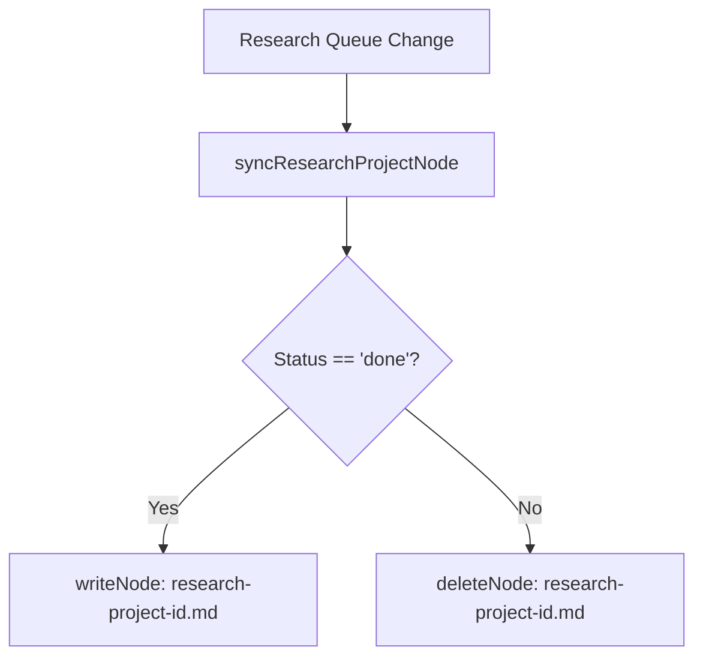

# System Architecture: Research Project Summary Node Pruning

This document outlines the changes to how research summaries are synced to the SSSS Memory Vault.

---

## 1. Sync Logic Flow



---

## 2. Technical Design

### A. Conditional Writing & Deletion in `syncResearchProjectNode`
- Modifies `syncResearchProjectNode(item)` in `src/core/research-queue.mjs`:
  ```javascript
  if (item.status !== 'done') {
    try {
      deleteNode(`research-project-${item.id}`, vaultDir);
    } catch {}
    return;
  }
  ```
- This ensures any initial enqueues (which are `pending`) or failed research tasks do not write file placeholders, and immediately cleans up any existing stale summaries.

### B. Self-Healing Optimization in `loadQueue`
- Modifies the loop inside `loadQueue()`:
  ```javascript
  if (item.status === 'done') {
    const summaryPath = path.join(vaultDir, 'facts', `research-project-${item.id}.md`);
    if (!fs.existsSync(summaryPath)) {
      syncResearchProjectNode(item);
    }
  } else {
    try {
      deleteNode(`research-project-${item.id}`, vaultDir);
    } catch {}
  }
  ```
