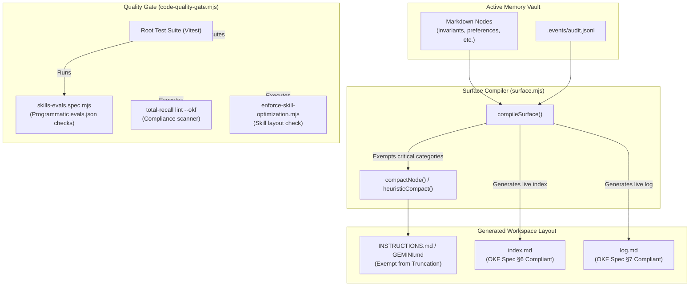

# Sovereign Policy Enforcement & Verification — Architecture

## 1. System Components & Data Flow

## 2. Component Layout & Refinements

### 2.1 Compiler Bypasses (`src/core/surface.mjs`)
- Exempt `invariants`, `preferences`, and `anti-patterns` categories from standard 180-char truncation and single-line extraction.
- Format multi-line bodies with indentation to keep Markdown lists valid.

### 2.2 Live index.md and log.md (`src/core/okf-adapter.mjs`)
- **`generateLiveIndex(vaultDir)`**: Maps memory nodes, groups them by `type` under `# <Type>` headings, sorts alphabetically, and formats items using `*` bullet points.
- **`generateLiveLog(vaultDir)`**: Groups audit records by date under `## YYYY-MM-DD` headings, newest first, and formats entries as `*` bullets.

### 2.3 Quality Gate (`scripts/code-quality-gate.mjs`)
- Executes the skill checker to verify layout optimization and metadata.
- Executes the OKF linter to output visual compliance warnings.
