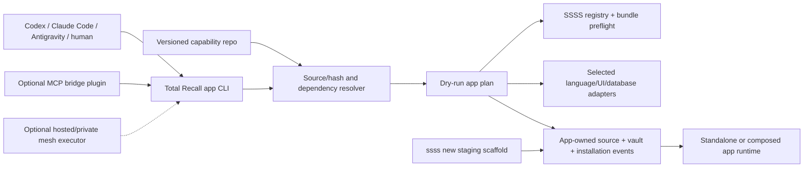

# CAPABILITY_DEPLOYMENT_PLUGINS — Architecture

> **Project Prefix**: `CAPABILITY_DEPLOYMENT_PLUGINS`
> **Kanban State**: 🏗️ In Progress
> **Author**: Codex
> **Date**: 2026-09-25

---

## Boundary and flow



The same CLI and SSSS contracts serve every coding agent. Agent-specific skills supply instructions and examples only. An MCP bridge can be another plugin that exposes the CLI and authorized SSSS operations to MCP clients; it must not fork the generator or business logic. Neither MCP nor hosted mesh is required to create, run, or export an app.

## Artifact contract (proposed)

Keep existing `plugin.json` fields for brain plugins. Add an optional `deploy` object, validated by `metadata.plugin.schema.json` and `src/core/plugin-loader.mjs`, for a capability plugin. Package source, templates, generated assets, tests, authoring skills, registry definitions, and structural SSSS bundle in the **plugin's own repository**. `tr-plugin-bundle/1` distributes plugin bytes; a `.ucw` bundle carries SSSS structural documents. They have separate integrity checks and purposes.

Illustrative schema shape, subject to validation and fixture refinement:

```json
{
  "id": "messaging",
  "version": "1.0.0",
  "deploy": {
    "contract": "tr-app-capability/1",
    "targets": ["existing", "standalone"],
    "requires": { "ssss_core": "0.9", "capabilities": ["identity"] },
    "access": { "read_types": ["messaging:conversation"], "write_types": ["messaging:conversation"] },
    "adapters": [
      { "id": "node-ts-sqlite", "language": "typescript", "projection": "sqlite", "recipe": "deploy/node-ts-sqlite.json" }
    ],
    "ssss": { "extension": "registry/messaging.json", "bundle": "bundles/messaging.ucw.json" },
    "verification": { "command": "npm test", "entrypoint": "test/deploy-smoke.mjs" }
  }
}
```

Every capability plugin also declares three artifact groups the composer renders per target (proposed, validated in Phase 2):

```json
"skills": [{ "id": "code-quality", "template": "skills/code-quality/", "detect": "skills/code-quality/detect.mjs" }],
"commands": { "name": "code-quality", "subcommands": [
  { "name": "check", "args": [{ "name": "tier", "type": "enum", "values": ["fast", "full", "remote"] }], "background": true },
  { "name": "report", "output": "schemas/report.json" } ] },
"ui": { "elements": [{ "id": "gate-status", "kind": "panel", "slot": "dashboard", "props": "schemas/report.json" }],
        "tokens": "design-tokens" }
```

- **`skills`**: two layers per skill.
  - **Core** (`core/` in the plugin): shared scripts and the layer contract, installed under `.agent/skills/<id>/core/` and replaced on upgrade. For code-quality: `check.mjs` runner, background job and lock, report schema, and the `report` renderer.
  - **Repo layer** (`config.json`, `SKILL.md`, `hooks/`, `learnings/`, repo-only scripts): created once from a template by `detect` or by **adopting** the repo's existing skill, which is mapped into the contract without dropping gates. After that it is repo-owned; upgrades never write it.
  - **Customization through the CLI.** The plugin ships `config.schema.json` for its repo layer. From that, the `command` mechanism produces `total-recall <plugin> config get|set`, collection verbs (`gate add|remove|list`), `detect [--apply]`, and a guided `init`. All of them write through the same validated path.
  - **SSSS.** The canonical repo-layer config is an SSSS document (`skill_config`, a host extension type) in the repo's project vault, written through the operation service. `config.json` is a generated projection the scripts read, rebuilt on each change.
  - **Existing skill sync.** The repo layer must be excluded from `total-recall skill push|sync`, which today fans one source copy out to every install (`src/cli/skill.mjs`). Only the core layer syncs.
  - **Built on `skills-registry.mjs`.** `deploySkill`, `skillStatus` (content-hash drift), and `adaptSkillDescription` already install, track, and adapt skills per repo. They gain layer awareness (separate core and repo-layer hashes) instead of a parallel module.
  - `app verify` runs the contract against the repo layer (required fields, every gate command resolvable, tiers valid) and reports drift instead of "fixing" it.
- **`commands`**: two surfaces. **Developer/agent commands** plug into Total Recall's existing composable CLI: the manifest's `cli` handler (routed by `bin/total-recall.mjs`) and project custom commands (`total-recall command create`, files in `.agent/commands/`, dispatched first at `bin/total-recall.mjs:179`). No new dispatcher. The **app-runtime CLI**, which must work with Total Recall absent, is generated per language adapter (Node `bin` script, Python `argparse` module like Dabber's `crm.py`). Every command supports `--json`, stable exit codes, and `--help` from the spec. Long-running commands run in the background with a report file, per the code-quality invariant. The CLI calls the capability's app API or SSSS operations, never raw file writes.
- **`ui`**: elements are framework-adapter components (first: the host's React/Next stack and a plain web-component build for Flask/Jinja hosts such as Dabber). They read only CSS variables generated from the app's design-token file (`DESIGN.md` YAML frontmatter: colors, typography, spacing, radius). The frontend-designer plugin writes that file; an external design tool can too once its export format is verified. No hardcoded brand values in plugin UI.

The actual manifest must specify pinned file hashes, safe relative paths, compatible app/framework versions, requested data/resource permissions, dependency versions, and script execution permissions. `verification.command` above is illustrative; a real recipe uses an allowlisted executable plus an argv array, never interpolated shell. The CLI rejects undeclared adapter/target combinations and manifest fields it cannot safely interpret. The plugin does not gain blanket filesystem, network, or environment access from being installed.

## Proposed CLI operations

| Command | Result |
| --- | --- |
| `total-recall app plan <plugin-source> --target <app> --adapter <id> --json` | Read-only deterministic plan: source pin, dependencies, registry diff, file diff, vault envelopes, grants, resource prompts, and gates. |
| `total-recall app add <plugin-source> --target <app> --adapter <id>` | Apply a reviewed plan to an existing compatible app. A repeated apply with the same source and parameters replays safely. |
| `total-recall app create <dir> --plugin <source> --adapter <id>` | Run `ssss new` into a staging directory, add a runnable application shell and the capability, verify, then publish the directory. |
| `total-recall app upgrade <id> --target <app> --to <pin>` | Plan/apply a structural-only migration with a preserved user vault and rollback/repair path. |
| `total-recall app verify --target <app> --json` | Check source/manifest hashes, SSSS registry lock, conformance, projections, and app feature tests. |

Source can be a local path, git ref, or existing Total Recall hash-pinned public plugin link. `plugin install` remains a separate act that installs a **tool** into the brain. The app CLI may resolve a source directly without first putting a copy inside Total Recall.

## App composition and state

1. **Resolve and preflight.** Fetch pinned source, verify content, reject unsafe paths/symlinks, build a dependency DAG, reject cycles and conflicting owners, and select a named adapter. `ssss registry compose/lock/verify` validates the combined core, app, and plugin extension registries. Required SSSS fixes identified in the audit must land before relying on these commands.
2. **Plan all changes.** Compute source-file writes, protected-file conflicts, dependency changes, resources, migrations, SSSS bundle parameters, identifier remaps, and access grants. Use `ssss provision` and the target host's verified actor/authorization path for dry-run. Do not invoke provider APIs or installer scripts in planning mode.
3. **Apply in a recoverable sequence.** Stage generated source in an isolated tree; run static checks; preflight all SSSS operations; apply source and structural documents with recorded version/hash; run the selected adapter's tests; then record success. A failure leaves a truthful installation status and compensating/repair plan, never a silent half-install. Do not erase tenant data on rollback.
4. **Record in the app, not only the brain.** The app extension registry defines an `app_capability_installation` document (e.g. `system/capabilities/messaging.md`) with plugin id/version, source digest, adapter id, granted type/path scopes, generated-file digests, and status. Append `capability.install_started`, `capability.installed`, `capability.upgrade_failed`, etc. through SSSS event envelopes. Secret values never appear in these records. A TR-side project record may index the app but is disposable from the app's perspective.
5. **Operate independently.** The app runtime implements or bridges the SSSS kernel, checks access under its own verified principals, writes its own vault, and rebuilds SQLite/Postgres/etc. projections. Total Recall can be removed after creation. Optional mesh execution does not change the app's ownership or source of truth.

App data access is explicit at two points: installation approval of requested scopes, then runtime enforcement by the host's SSSS authorizer and filesystem containment. A plugin cannot read the whole vault merely because its source exists in the repository. Export/import tests cover the complete app-owned state and exclude `tenant_private` from template/sale bundles; removing a plugin leaves its private user data intact unless a separately authorized deletion is requested.

## Adapter interface and proof matrix

Each adapter supplies: (a) target detection/compatibility, (b) deterministic source generation, (c) a bridge to the SSSS Operation Contract with verified identity, (d) projection build/rebuild, (e) package/build/run/health commands, and (f) shared conformance and feature fixtures. The SSSS specification, registry, bundle, and envelope shapes stay language-neutral. The current reference kernel is JavaScript; a Python app can use a separately deployed Node kernel bridge or a native adapter only after it passes the same fixtures. The Node dependency must be disclosed when the bridge is used.

The executable shared boundary is `src/core/app-deploy/adapter-contract.mjs`: an adapter exposes `detect`, `generate`, `executeSsss`, `rebuildProjection`, `start`, and `cleanup`. `runAdapterContractFixtures` creates an isolated app, uses a canonical SSSS package operation, and checks principal rejection, idempotent replay, path containment, deterministic output, projection rebuild without changing the vault, health, and tenant-safe cleanup. The reference implementation in `adapter-contract.spec.mjs` tests the fixture runner; each production adapter must run it before its support-matrix entry is marked verified.

| Proof | Language/runtime | Projection | Purpose |
| --- | --- | --- | --- |
| MVP | Node/TypeScript | SQLite | First standalone and existing-app full path. |
| Portability 1 | Python host via the Node stdin-JSON kernel bridge, modeled on Dabber CRM (`moogie_crm/ssss_bridge.py` → `scripts/ssss-store.mjs`) | Markdown reads + optional SQLite | Prove language independence using a host that already runs in production, without claiming a Python kernel. |
| Portability 2 | Node/TypeScript | Postgres or another SQL projection | Prove database choice is independent of canonical vault semantics. |

Other adapter combinations are contributed and advertised only after tests. External provider bindings (mail, domains, payments, social networks) are declared as `resource_bound` requirements in structural bundles and bound by the app owner; developer secrets stay in Total Recall's encrypted store during authoring, while a standalone app selects its own runtime secret provider. No provider credential is embedded in a plugin, bundle, generated repo, or installation record.

A future secrets-manager plugin may offer standalone and composed secret-management UI/integrations, but cryptography, app-to-key binding, scoped projection, and rotation stay in a small audited core. The current `--keys` path needs an explicit target-binding test because named-key selection returns before repo-binding validation in `src/core/secrets-env-export.mjs`. A generated app stores references and grants, not plaintext credentials in its repository/vault; a separately deployed app-owned secret service/store or securely injected deployment environment supplies values at runtime. Total Recall can provision or rotate those values as a control plane, but ordinary app requests must work while it is offline. A live Total Recall secret integration is optional and must be declared. Provider adapters should use narrow, app-tagged keys and verify rotation/deployment without printing values.

## Frontend designer and white label boundary

The frontend designer plugin can adapt existing `web-design`, `ui`, and related skills into generic authoring guidance. It accepts an app brief and SSSS page/brand documents, produces a reviewable design plan and UI source for a selected framework adapter, and ships accessibility, responsive-layout, build, and browser smoke gates. Festech's collective-specific palette, asset paths, translation framework, and content are inputs only when the app owner selects them; the base plugin has no Festech name, logo, domain, or hardcoded provider.

## Parallel execution and security

`app plan --json` is the stable unit for composable CLI automation. Independent capability recipes can be authored or checked in parallel by agents; registry composition, permission resolution, source-file ownership, and final apply are serialized by the planner. Current Total Recall scheduled plugin tasks and mesh `agent spawn` are useful building blocks, but they do not currently implement a dependency-aware deployment DAG or safe workspace merge.

An untrusted deployment plugin is executable source. Plan and verify before apply; execute only declared commands with fixed argv, scoped cwd, timeouts, output limits, and an allowlisted environment. Use explicit grants for vault/provider access, verified signatures or content pins for supply chain integrity, and tests for path escape, collision, denial, partial failure, and replay. Do not claim end-to-end encryption from transport encryption or mesh enrollment.

An API-integration meta-plugin is a later artifact using the same planner. It translates an API description into a **reviewed operation model** and generates CLI/app endpoints, with optional MCP tools/resources/prompts exposed through a separate bridge. A provider recipe must declare auth, pagination, rate limits, webhook signature validation, retry/idempotency, permissions, and SSSS document mapping. The bridge delegates to the same operations; it does not maintain a second generator or domain state. The MCP adapter should use the current official SDK contract when implemented.

## Hosted mesh boundary

Hosted Headscale-based orchestration is a separate optional service. Headscale's [design goal](https://github.com/juanfont/headscale/blob/main/docs/index.md) is a single tailnet for personal or small-organization use; its [FAQ](https://github.com/juanfont/headscale/blob/main/docs/about/faq.md) warns that many frequently changing nodes can overwhelm map calculation. Before selling a hosted multi-user control plane, prove tenant isolation, authorization, separation of tailnets/control planes, resource usage under churn, recovery, and data-exit behavior. Do not assume one shared Headscale instance is safe or scalable for unrelated customers. Generated apps and their vaults remain user-owned even if optional hosted execution is used.

## Repository boundaries

| Repository | Owns |
| --- | --- |
| `gregiteen/total-recall` | Composer CLI, deploy-manifest validation, source/provenance resolution, orchestrator, shared adapter tests, optional mesh integration. |
| `gregiteen/ssss` | Normative contract, registry composition, bundle parameter/id-remap behavior, `ssss new`, language-neutral fixtures and conformance. |
| One repo per substantial capability | Domain extension registry, structural bundle, source recipes/adapters, authoring skill, feature and standalone tests. Optional MCP bridge is its own plugin repo. |
| `gregiteen/festech-modular` | First reference composition and parity/cutover evidence; no generic composer logic. |
| Existing `festech.live` | Current site and production runtime until separately approved cutover. |

Before any plugin is publicly listed, its repository must have a deliberate license and provenance record, a clean independent history rather than a copy of Festech's full private history, a scan for credentials/private generated assets, reproducible package contents, and a pinned immutable artifact digest. A public listing is a later distribution act; a local private plugin is sufficient for the first app proof.
