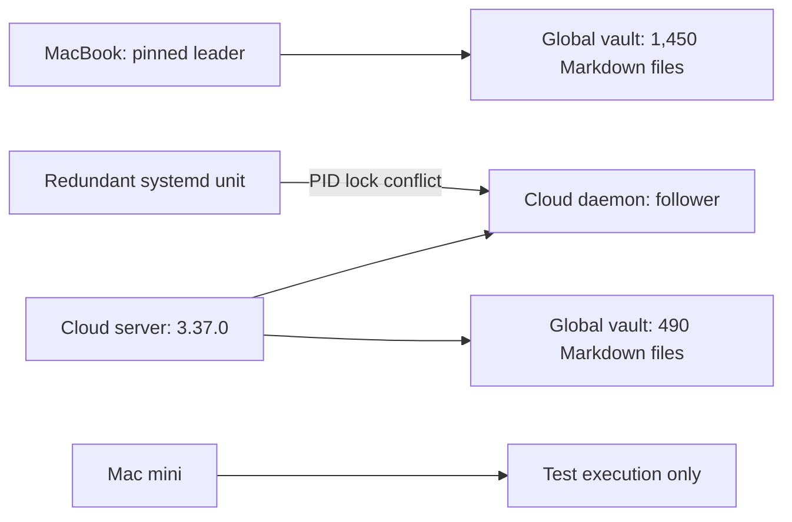
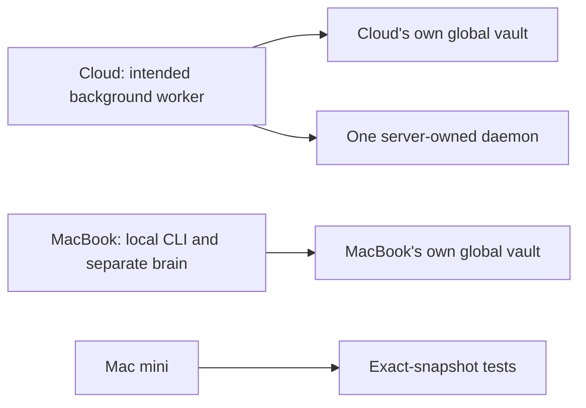

# CLOUD_DAEMON_HANDOFF — Architecture

> **Project Prefix**: `CLOUD_DAEMON_HANDOFF`
> **Kanban State**: 🏗️ In Progress
> **Author**: Codex
> **Date**: 2026-10-06
> **Based on audit**: CLOUD_DAEMON_HANDOFF_AUDIT.md (Complete, `f33cf7e018bb20af1546830619d81f44c1daebcc`)

---

## Audited runtime before handoff

The server watchdog spawns and monitors the cloud daemon (`src/server/index.mjs:960-982`). The enabled direct `total-recall-daemon.service` starts a second copy and fails on the same PID lock. `leaderPin` prefers `TR_LEADER_IP`, then global `config/leader.json` (`src/core/leader-election.mjs:36-90`). Cron invokes `scripts/auto-pull.sh` every five minutes on cloud. [A-001–A-004]

## Target runtime

The cloud server/watchdog remains the single daemon owner. The redundant direct unit is disabled. Cloud's own `config/leader.json` pins `<cloud-mesh-ip>`; the MacBook keeps its own `TR_LEADER_IP=<macbook-mesh-ip>` pin. Each brain therefore elects itself as leader within its own local configuration. The MacBook server runs with `DISABLE_DAEMON=true`, and its worker is stopped. The CLI and local brain remain available. Plugin tasks are per-node; the MacBook's local host checks stop with its worker and were not copied to cloud. (`src/core/daemon-loop.mjs:423-450`). [A-001–A-003, A-007]

## Brain separation contract

1. Keep each timestamped, private backup as a separate restore source. The manifest comparison is diagnostic evidence only.
2. Do not import, merge, or synchronize memory documents between these vaults. The different counts are intentional. [A-002, A-007]
3. `src/core/secrets-sync.mjs:6-64` can replace a follower's encrypted store. Neither node was repinned to follow the other; a hash check confirmed the MacBook's encrypted store still matches its pre-handoff backup.
4. Cloud completed task `task-maintenance-fbae68484e` from its own queue. The MacBook worker was stopped after its local-only plugin duties were inventoried.

## Failure and rollback design

- Keep the independent backup archives private and restore only to their source node. Do not point either node at the other's vault or encrypted store.
- If cloud processing fails, restore its archived `config/leader.json` pin and verify cloud health. The MacBook plist backup can restore its earlier daemon behavior if local work must resume.
- If the cloud daemon exits, retain the server's watchdog as the sole restart owner; do not re-enable the competing unit without first removing the other owner.
- If code must change, stage and health-check a separate release. The current auto-pull process-kill path cannot serve as a zero downtime deployment mechanism. [A-004]

## Security and observability

Use `total-recall mesh exec` with recorded access. Keep credentials and vault content out of shell output and project docs; log paths, hashes, counts, process identity, health and task status. Observe cloud process count, PID lock owner, restart count, memory, CPU, swap, server health, and task outcome before declaring completion.
