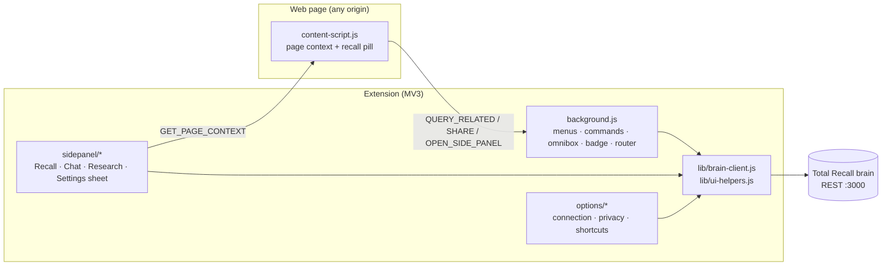

# EXTENSION_OVERHAUL — Architecture

## Components



- **`lib/brain-client.js`** is the single HTTP layer.
  - Resolves `{brainUrl, pat}` from `chrome.storage.local`, plus `activeBrainId` from `storage.sync`.
  - Sends `x-total-recall-brain` on every request so search, share, list and chat all respect the active brain. `resolveVaultFromQuery` / `resolveAllVaultsFromQuery` already read that header.
  - Typed errors: `code: 'offline' | 'unauthorized' | 'http'`, so the UI can show onboarding instead of raw strings.
  - Clears the red badge on the next successful call.
- **`lib/ui-helpers.js`** holds the pure helpers shared by the side panel, options page and tests.
  - Contents: `escapeHtml`, `renderMarkdown` (escape first, then a small whitelist: code, bold, italic, links with `http(s)` only, lists, paragraphs), `timeAgo`, `isCapturableUrl`, `hostnameOf`, `isBlocked`, `buildCaptureExcerpt`, `filterRelated`.
  - Exposed as `self.TRUi`. The vitest spec loads it the way Chrome does, as a classic script evaluated in a `vm` context.
- The **content script** stays dependency-free and builds its overlay with `createElement` + `textContent` only.

## Message contracts

| Type | From → To | Payload | Response |
|---|---|---|---|
| `QUERY_RELATED` | CS → BG | `{title, description, url}` | `{memories: RelatedMemory[]}` (already relevance-filtered) |
| `SHARE` | CS/SP → BG | share body | `{success, ...}` |
| `OPEN_SIDE_PANEL` | CS → BG | — | `{success}` |
| `GET_PAGE_CONTEXT` | SP/BG → CS | — | `{url, title, description, selection, text}` (text ≤ 12k chars, from `article`/`main` if present) |

`RelatedMemory = {slug, title, excerpt, category, similarity}`.

## Relevance gating (server + client)

`semanticSearch` already computes cosine similarity per node (`search.mjs:167-171`) and then throws it away during RRF. The change:

- Carry `similarity` through to each vault result. Sessions keep their existing `score`.
- The route strips `_`-prefixed internal keys and sets `content = body`.
- The client asks with `include_sessions: false` and keeps only vault results with `similarity >= RELATED_MIN_SIMILARITY`. The fused `score` is used only when a brain is too old to report `similarity`.

**Calibration (2026-09-22, live brain: 1,172 global + 567 project nodes).** Top similarity per page title:

| Page title | Top similarity | Verdict |
|---|---|---|
| ElevenLabs: Free Text to Speech… | 0.62 / 0.57 / 0.56 | related |
| Documenso — Open Source DocuSign Alternative | 0.55 | related |
| Headscale — self-hosted Tailscale control server | 0.65 | related |
| Stripe Docs: Webhooks signatures | 0.58 | related |
| React — JavaScript library for UIs | 0.52 | borderline (React Email pattern) |
| Telnyx Mission Control — API Keys | 0.46 | missed (acceptable: conservative) |
| Hacker News / Wikipedia / BBC / Amazon / YouTube / brownie recipe | 0.18–0.48 | unrelated |

**Chosen value: `RELATED_MIN_SIMILARITY = 0.53`.**

The fused score was rejected as a gate. "Kubernetes deployment" matched an unrelated Documenso report at fused 0.927 with similarity 0.381, from a single lexical word.

## Capture payload

```json
{
  "url": "https://…",
  "title": "Page title",
  "excerpt": "> meta description\n\nSelected text or first ~1500 chars of readable text\n\nSource: https://…",
  "action": "remember",
  "tags": ["web", "example.com"],
  "source": "chrome-extension"
}
```

Page captures always carry an excerpt, so `share.mjs` stores real content with the URL as an `x_citations` entry. Research stays `{url, title, excerpt?, action:'research'}`.

## Server changes

| File | Change |
|---|---|
| `src/core/search.mjs` | keep `similarity` on semantic matches and attach it to vault results |
| `src/server/routes/memory.mjs` | semantic route strips `_*` keys and adds `content`; `GET /api/memory?sort=recent` sorts by `created` desc (`sort=updated` by `updated`) before paging. Recency keys on creation because dream consolidation re-stamps `updated` |
| `src/server/routes/collab.mjs` | JWT secret = `JWT_SECRET` env, or a random 48-byte secret persisted at `<brainDir>/collab/.jwt-secret` (0600); chat, join and leave broadcasts only reach sockets that share a group with the sender |

No new state is written by the extension to the brain except through the existing `POST /api/share` and `POST /api/research` contract paths.

## Security

- **No brain data through `innerHTML` unescaped.** The side panel's markdown renderer escapes first, and links are limited to `http(s):`.
- **PAT stays in `chrome.storage.local`**, never in `sync`. Any legacy `sync.pat` is migrated and deleted.
- **Host permission for a remote brain is requested at runtime**, per origin, from the options page, via `optional_host_permissions`. The manifest never grants `<all_urls>` host access.
- **Content script** runs on `http(s)://*/*` only (was `<all_urls>`), because it has to answer `GET_PAGE_CONTEXT` for grounding. It does no network work unless page recall is on and the domain isn't blocked.

## Visual system

`extension/lib/tokens.css` mirrors `frontend/src/index.css:6-68`: surfaces, accent, text, borders, radii, shadows and transitions. The side panel and options page import it. The content script inlines the same values into its shadow root, because a page's CSS can't be relied on and `web_accessible_resources` isn't needed for inline styles.

- **Icons:** inline SVG, 1.75 stroke, lucide-style.
- **Brand:** the arch mark in headers, the cube PNG (from `frontend/public/icon-192.png`) for the toolbar at 16/32/48/128.
