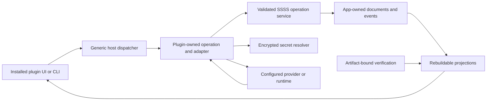

# PLUGIN_IMPLEMENTATION_CORRECTIONS — Architecture

Status: Target design; current gaps remain in the [audit](PLUGIN_IMPLEMENTATION_CORRECTIONS_AUDIT.md).

## Ownership and flow

Core retains portable memory, vault and instruction shims. Plugins own runtime, settings schema, tasks, provider clients and UI. Core extraction remains open; today's five bundled directories are not proof of independent operation.

## Contract repairs

| Boundary | Target / current gap |
|---|---|
| Generator to context | One accepted output shape and actual consumer test; DSH/search objects are currently discarded by string-only host |
| UI to host | Validated design tokens/source and installed adapter mount; current generators reject sources and preview registry is unconnected |
| CLI to save | Running-host resolution, awaited child/operation, verified persistence; search currently advertises saved after failure |
| Settings to consumers | One validated app-owned SSSS configuration; localStorage and loose JSON currently diverge |
| Provider to status | Strict receipt validation and distinct acceptance/delivery; malformed success and stub success are current gaps |
| Runtime discovery | Configurable identity-checked endpoint and authoritative tools/metrics; current port checks/fixed tools are insufficient |

## State and identity

Register a valid namespaced review extension through the canonical SSSS process before persistence work. Do not assume `plugin_review` is already valid. Define universal frontmatter, authenticated author, plugin/artifact identity, content and timestamps; use one canonical category/path for writer and reader. Test real authorization, validation, idempotency and restart. Review lists are projections of committed documents.

Settings, opt-outs, decisions and notification events use the same operation path. Direct JSONL/Markdown writes are current gaps. Preserve existing user state and reconcile through validated import/replay when necessary; never delete it to manufacture a clean report. This does not invent external-install compatibility requirements.

Bind authorship to the authenticated principal. Caller-supplied identity or verification flags cannot establish trust. Verification evidence references tested artifact digest, verifier, command, environment, date and result. Missing/stale proof is unknown; artifact change invalidates prior proof. Public bundles exclude secrets and private runtime/vault state; both sender and recipient verify integrity.

## UI and verification

Installed plugin-owned views invoke actual operations and consume the same projections as CLI/tasks. Unknown metrics remain unknown; unavailable actions explain unmet requirements. Recovery clears stale errors and reconstructs views. Development prototypes never count as product proof.

Test synthetic boundaries first, then actual SSSS/host integration without mocking the contract under review. All gates run in background on the Mac mini. Separate live provider, independent runtime, clean installation and public exchange evidence from client tests. Attach redacted revision/command/exit/digest evidence to owning trackers.
