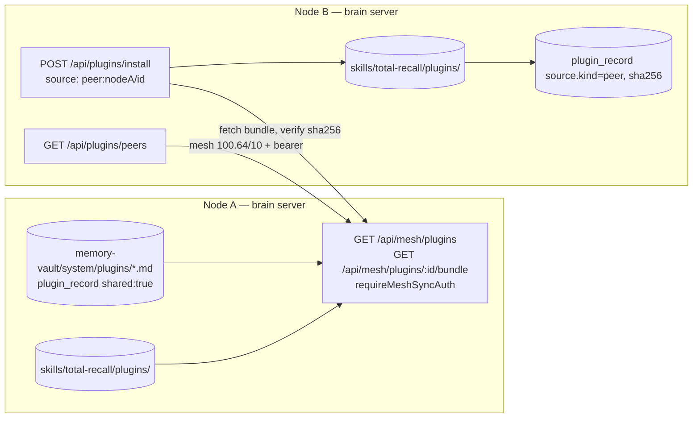

# PLUGIN_P2P — Architecture

> **Project Prefix**: `PLUGIN_P2P` · **Date**: 2026-09-22

## 1. Overview



The diagram shows the optional own-device mesh path. The all-user path is a direct HTTPS link from sender to recipient: `GET /api/public/plugins/:id/bundle#sha256=<hash>`. The URL fragment is kept by the recipient and pins the bundle contents; it is not sent to the server. The sender sets `TR_PUBLIC_BASE_URL` to an externally reachable HTTPS origin. There is no central catalog.

## 2. Module layout

| Module | Responsibility |
|---|---|
| `src/core/plugin-loader.mjs` | Manifest validation (+ `use_cases`, task `command`), discovery, plugin dir resolution (`pluginDirs()`), bundled listing. |
| `src/core/plugin-bundle.mjs` (new) | Canonical file walk, SHA-256 content hash, `packPlugin(dir)` → JSON bundle, `unpackPlugin(bundle, dest)` with path-traversal + size guards and atomic rename. |
| `src/core/plugin-public.mjs` | Direct share-link parser and builder; HTTPS fetch with pinned public DNS result, response cap, no redirects, mandatory hash pin. |
| `src/core/plugin-store.mjs` (new) | Install/remove/share operations shared by CLI and REST; writes `plugin_record` docs and `plugin.*` events via `ssss-operation-service.mjs`. |
| `src/core/plugin-peers.mjs` (new) | Query online mesh peers for shared plugins; fetch + verify a peer bundle. Reuses `getMeshPeers`, `getMeshSyncAuthorization`, CGNAT URL guard. |
| `src/core/plugin-runner.mjs` (new) | Run a plugin CLI handler in a child `node` process (timeout, output cap, env `TR_PACKAGE_ROOT`). |
| `src/core/plugin-tasks.mjs` (new) | 5-field cron matcher; `runDuePluginTasks()` called from the daemon loop. Last-run slot persisted in the `plugin_record`. |
| `src/server/routes/plugins.mjs` | User-facing REST (requireAuth + scopes). |
| `src/server/routes/plugins-mesh.mjs` (new) | Peer-facing REST (requireMeshSyncAuth). |
| `src/cli/plugin/*` | `list`, `available [--use-case]`, `peers`, `install <id|peer:host/id|git|path>`, `share <id>`, `unshare <id>`, `remove`, `info`, `create --use-case`. |
| `plugins/<id>/` (repo root, shipped) | Bundled plugin sources. |

## 3. Directory layout (layout invariant)

- Project plugins: `<project>/.agent/skills/total-recall/plugins/<id>/`
- Global plugins: `~/.agent/skills/total-recall/plugins/<id>/` (i.e. `brainDir/plugins`)
- Bundled sources: `<package>/plugins/<id>/` (read-only; installed by copy)

Project shadows global by id (unchanged semantics). `.agent/plugins/` and `.agent/config/plugin-ratings.json` are removed.

## 4. Manifest additions

```jsonc
{
  "use_cases": ["software-development"],          // free-form kebab-case tags, filterable
  "tasks": [
    { "intent": "Record a host telemetry sample",  // human description
      "schedule": "*/15 * * * *",                  // 5-field cron, local time
      "command": "sample" }                         // plugin CLI subcommand to run
  ]
}
```

`tasks[].command` is required for a task to be scheduled; a task without it fails validation (no more display-only tasks). `hooks`, `tools`, `openwiki_hubs` are dropped from REST/UI output (nothing consumes them).

## 5. Data model — `plugin_record` (SSSS host extension type)

Path: `system/plugins/<id>.md` in the vault of the brain that owns the plugin dir (`<brainRoot>/memory-vault`).

```yaml
type: plugin_record
title: "Git Sentinel"
description: "Install record for plugin git-sentinel."
timestamp: 2026-09-22T12:00:00.000Z
plugin_id: git-sentinel
version: 1.0.0
scope: project | global
shared: false                    # legacy private mesh opt-in
public_shared: false             # explicit all-user opt-in
source:
  kind: bundled | public | peer | git | local | link
  ref: "peer:mac-mini/git-sentinel" | "https://…" | "/abs/path" | "git-sentinel"
  peer_hostname: mac-mini        # peer only
sha256: "<content hash at install>"
installed_at: 2026-09-22T12:00:00.000Z
task_runs: { "sample": "2026-09-22T12:15" }   # last minute-slot per task command
```

Events (append-only, subject `plugins/<id>`): `plugin.installed`, `plugin.removed`, `plugin.shared`, `plugin.unshared`, `plugin.task_run` (exit code, duration), `plugin.peer_install` (peer, sha256).

A plugin directory without a record (e.g. hand-copied) is still discovered and treated as `shared: false`, `source.kind: local`.

## 6. Bundle format & hashing

- File set: all regular files under the plugin dir, excluding `.git/`, `node_modules/`, dotfiles, symlinks. Sorted by POSIX relative path.
- `sha256 = SHA256( for each file: path + "\0" + size + "\0" + bytes )`.
- Bundle: `{ format: "tr-plugin-bundle/1", id, version, sha256, files: [{ path, mode, data_b64 }] }`.
- Limits: 200 files, 5 MB total decoded. Paths must be relative, no `..`, no absolute, no backslashes.
- Unpack writes into `<pluginsDir>/.staging-<id>-<rand>` then `rename` → atomic.
- Receiver recomputes the hash from the unpacked bytes and compares to both the listing's advertised hash and the bundle header; mismatch → delete staging, 502.

## 7. API

### Peer-facing (`requireMeshSyncAuth`: CGNAT/loopback source + bearer `TR_MESH_SYNC_TOKEN`)
- `GET /api/mesh/plugins` → `{ node: {hostname}, plugins: [{ id, name, version, description, use_cases, sha256, file_count, size_bytes }] }` — only `shared: true` and valid.
- `GET /api/mesh/plugins/:id/bundle` → bundle JSON (404 unless shared).

### Public person-to-person (`shared` is insufficient; `public_shared: true` required)
- `GET /api/public/plugins/:id/bundle` → bundle JSON, with no listing endpoint. The existing API rate limiter applies. Old mesh-only records cannot be served here.
- The sender shares `https://<their-origin>/api/public/plugins/<id>/bundle#sha256=<64-hex-hash>`. The receiver checks the pin against decoded bytes before any install write.

### User-facing (`requireAuth`)
- `GET /api/plugins` (`config:read`) → installed: manifest facts + `scope`, `shared`, `source`, `sha256`, `installed_at`, `tasks` with last run.
- `GET /api/plugins/available` (`config:read`) → bundled plugins + `installed` flag.
- `GET /api/plugins/peers` (`config:read`) → `{ mesh: {available, configured}, peers: [{ hostname, ip, online, status: ok|unreachable|not_configured|unsupported|error, error?, plugins: [...] }] }`.
- `POST /api/plugins/install` (`config:write`) body `{ source, link?, global? }`.
- `POST /api/plugins/:id/share` (`config:write`) body `{ shared: boolean }`.
- `DELETE /api/plugins/:id` (`config:write`).
- `GET /api/plugins/:id`, `GET /api/plugins/:id/readme` (`config:read`).
- `POST /api/plugins/:id/run` (`config:write`) → child-process runner.

`root` / `projectRoot` overrides are removed; project root is the server's cwd.

## 8. Security

- Peer and public routes never accept writes; they only read what the owner marked shared for the corresponding audience.
- The public endpoint is accessible to anyone who can reach the server and knows the plugin ID once `public_shared` is enabled. The link's hash provides integrity, not publisher identity or a sandbox.
- The recipient requires HTTPS, a public IPv4 destination, a strict route path, no credentials/query/custom port, no redirects, an 8 MB response cap, and a content hash match. DNS is resolved before the request and pinned for the socket lookup.
- Peer URL built only from a live mesh peer IP inside 100.64.0.0/10 (same guard as `secrets-sync.mjs`), with `brain_port` from the SSSS mesh-node entity. Each node records its configured port during its self update; the local configured port is a fallback for older entities.
- Bundle size/file-count caps, traversal guard, hash verification, atomic rename.
- Installing peer code is an explicit user action; nothing auto-installs from peers.
- Runner: child process, 60 s timeout (tasks) / 30 s (dashboard), 256 KB output cap, `cwd` = project root, no shell.

## 9. Integration points

- `daemon-loop.mjs` → `runDuePluginTasks()` next to `runCrons()`.
- `plugin-context.mjs` unchanged contract; const bug fixed.
- `schema.mjs` → `PluginRecordSchema`, added to `SSSS_HOST_EXTENSION_TYPES` and `SSSS_SCHEMAS`.
- `package.json` `files` += `plugins/`.
