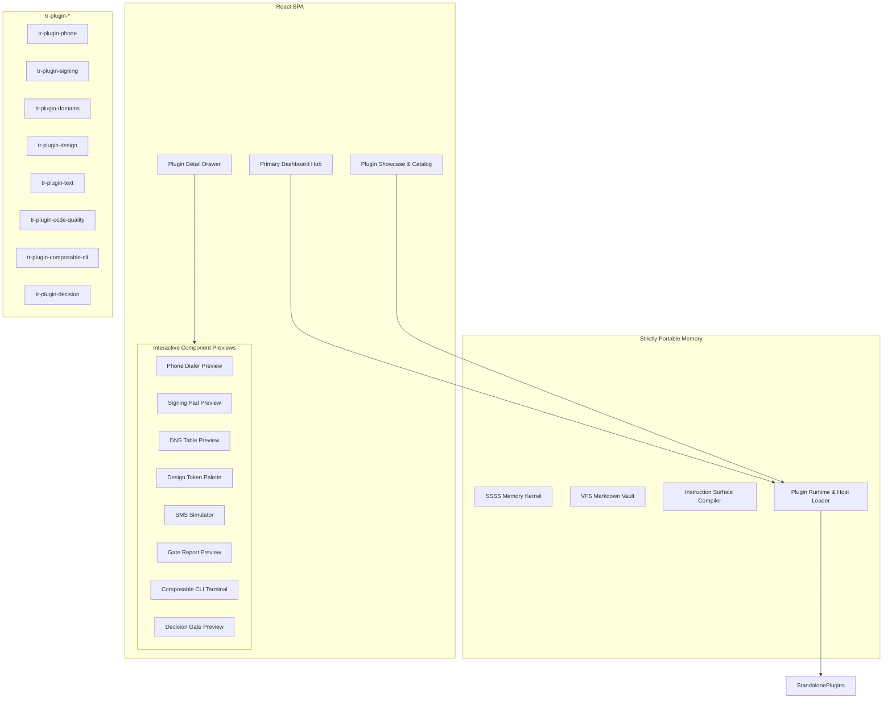

# PLUGIN_SHOWCASE_UI — Architecture Document

> **Project Prefix**: `PLUGIN_SHOWCASE_UI` · **Project ID**: `8dcccc83-ff9a-4804-b2d0-dcc3304fb92d`
> **Repository**: `total-recall`
> **Kanban State**: 🚧 In progress
> **Author**: Antigravity with Greg Iteen
> **Date**: 2026-09-28

---

## 1. System Topology & Separation



---

## 2. Frontend Component Architecture

### 2.1 Primary Dashboard Hub (`frontend/src/pages/DashboardPage.tsx`)
- Mounts at `/` as the central operational cockpit.
- **Header**: Active brain switch, system memory count, and mesh status.
- **Hero Hub**: Quick-access cards for installed capability plugins.
- **Activity Stream**: Recent memory writes, audit events, and background agent status.

### 2.2 Re-architected Plugin Showcase (`frontend/src/pages/PluginsPage.tsx`)
- **Filters**: Category selector (`All`, `Telecom & Comms`, `Security & Quality`, `Infrastructure`, `Design & Media`, `CLI & Workflow`, `Intelligence`).
- **Showcase Cards (`PluginCard.tsx`)**:
  - Plugin icon, version, and publisher provenance badge.
  - Conformance badges (`SSSS v2`, `100% Tested`, `White-Label`).
  - Peer star rating and review count.
  - Action buttons (`Preview`, `Open`, `Run`, `Install`).
- **Detail Drawer Tabs**:
  1. `preview`: Live interactive mockup of the extracted UI component.
  2. `marketing`: Detailed value proposition, use case scenarios, and architectural highlights.
  3. `reviews`: User ratings, peer comments, and community feedback.
  4. `run`: Interactive CLI subcommand executor with argument inputs.
  5. `readme`: Rendered GitHub-style markdown documentation.

### 2.3 Interactive Preview Registry (`frontend/src/components/plugins/previews/`)
Each capability plugin maps to an interactive preview component rendering real UI logic:
- `PhonePreview`: Renders the extracted dialer layout from `festech-modular`, with clickable DTMF keypad, call timer, and active audio device controls.
- `SigningPreview`: Renders the Documenso agreement viewer layout with recipient fields and signature placement markers.
- `DomainsPreview`: Renders the Vercel DNS record table with live filtering by record type (`A`, `CNAME`, `TXT`, `MX`) and TTL status.
- `DesignPreview`: Renders the `DESIGN.md` CSS variable palette with primary color swatches, typography hierarchy, and glassmorphic button variants.
- `TextPreview`: Renders the Telnyx two-way SMS thread interface with inbound and outbound message bubbles.
- `CodeQualityPreview`: Renders the unified gate matrix with passing and failing status badges.
- `ComposableCliPreview`: Renders the interactive terminal emulator showing custom registered commands and help output.
- `DecisionPreview`: Renders the interactive decision evaluator with confidence threshold sliders and fallback routes.

---

## 3. SSSS Data Model for Reviews & Conformance

All review data persists in the SSSS filesystem vault:
- **Location**: `memory-vault/reviews/review-<plugin_id>-<node_id>.md`
- **Frontmatter Schema**:
```yaml
---
type: plugin_review
title: Review for tr-plugin-phone
description: Peer audit review and usability assessment
timestamp: 2026-09-28T20:30:00Z
plugin_id: phone
rating: 5
reviewer_node: macmini
verified_conformance: true
portability: structural
tags: [plugin, review, phone, telecom]
---

Extracted WebRTC dialer works reliably across the local mesh network. All 42 unit tests passed during validation.
```

---

## 4. API Endpoints

Add routes to `src/server/routes/plugins.mjs`:
- `GET /api/plugins/:id/reviews`: Reads all `plugin_review` nodes from the vault filtered by `plugin_id`.
- `POST /api/plugins/:id/reviews`: Validates and writes a new `plugin_review` SSSS document via standard Total Recall operations.
- `GET /api/plugins/:id/conformance`: Returns automated static analysis results, SSSS test pass rates, and white-label verification flags.
