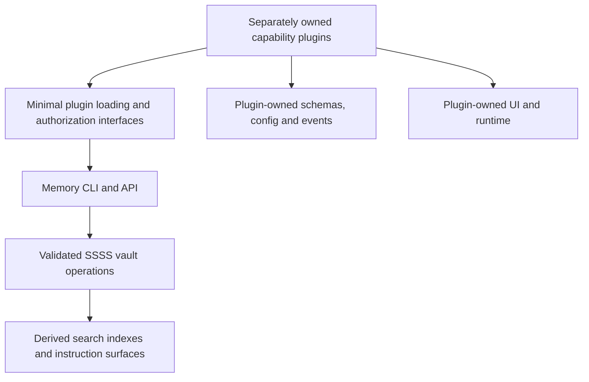

# TR_CORE_PLUGIN_SPLIT — Architecture

> **Project Prefix**: `TR_CORE_PLUGIN_SPLIT`
> **Kanban State**: In Progress
> **Date**: 2026-10-07
> **Based on audit**: TR_CORE_PLUGIN_SPLIT_AUDIT.md (Complete, 9b2e21f)

## Target

The diagram is the target. Current source still directly mounts feature routers and embeds agent/research task behavior. Extraction is incomplete.

## Current source and required boundary

| Area | Current owning source | Target owner / required proof |
| --- | --- | --- |
| Memory and instructions | `src/core/kernel-*`, vault/search/recall/surface/context; memory/instructions/rules routes | Core; offline memory workflow and complete required-rule coverage |
| Plugin discovery and artifact loading | `src/core/plugin-loader.mjs`, plugin-store/runner/context, `src/cli/plugin.mjs` | Minimal generic host contract; digest, scope, lifecycle and failure isolation |
| Feature router/tool mounts | `src/server/rest.mjs`, `src/server/tools.mjs` | Manifest-driven scoped contracts consumed by plugin owners |
| Research, agents, scheduling and host administration | `src/core/daemon-loop.mjs`, task-executors, research, runtime/meta-harness, mesh and rotation modules | Capability plugins; generic memory maintenance retained only with a justified interface |
| Skill registry/config/optimizer and IDE tooling | skills-registry, skill-config, skill-optimizer, skill CLI/connect/startup modules | Tooling plugins/adapters; preserve repo-owned layers and instruction access |
| Capability app composition | `src/core/app-deploy/`, `src/cli/app/` | Composer plugin; canonical scaffolding, operation-backed state, independent runtime |
| Plugin product panels | `frontend/src/components/plugins/previews/`, PluginsPage and capability pages | Installed plugin-owned interfaces; host supplies generic slots only |
| Browser capture and integration | `extension/`, capture/import/integration routes | Extension/capture capability owner; explicit permissions and actual installed reload proof |
| Cloud service and rollout | current launch/service configuration and `scripts/auto-pull.sh` | Operations owner; deployment cannot stop the sole serving process |

## State and compatibility

A plugin owns its extension schemas and writes through authorized SSSS operations. Rebuildable projections may cache state but cannot become an independent source. Memory and app records survive uninstall. Secret access uses audited references/grants; public artifacts contain no private values or machine instances.

Reuse existing capability repositories and source rather than reconstructing each feature in the core. Compatibility command adapters delegate to the owner, expose failures and have a recorded removal condition. No permanent duplicate implementation. A missing plugin reports unconfigured/unavailable instead of running a hidden built-in substitute.

## Minimum migration path

Select an existing working capability with low coupling, use its existing repository/artifact, and prove the smallest memory-host interface needed to install and invoke it. Existing CLI/task/loading interfaces are the starting point. Route/tool/event/UI extension families are not a prerequisite bundle; introduce only an interface required by a selected real consumer.

Audit every remaining feature import as reused/extracted, removed as unused, or a necessary generic memory interface. Preserve existing data even when unused code is removed. The app composer and new capability catalogs remain with their external owners and have no new core implementation scope.

## Shared contracts

Add route/tool/event/config/UI contracts only when an extracted consumer requires them. Define namespace, permissions, timeout, unload, restart, error propagation and artifact identity together. The current schema's UI/app CLI fields and generators are useful source foundations, but they do not prove generic runtime mounts or independent app execution.

Installation needs artifact identity and a verified selected-plugin path. Memory initialization has no feature-bundle dependency. New public exchange/discovery/reviews are outside this reduced project; their plugin owner can support those behaviors with its own evidence. Remove unsupported core trust surfaces during extraction. Memory-host acceptance does not require every provider or every distribution channel.

## Project architecture

This five-file project owns order and acceptance. `evidence/consolidation/source-items.json` maps all 549 historical checklist claims, and `SOURCE_PROJECT_REGISTER.md` explains each predecessor's disposition. Archived projects retain their original documents and logs with successor links. External owner projects are dependencies, not competing Total Recall plans. HANDOFF points here first.
