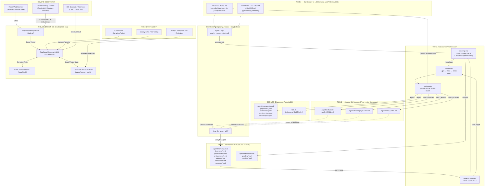

# Total Recall 3-Tier Memory Architecture — Architecture Document

> Derived from the synthesized audit of four frontier model research reports. Every design decision traces back to a specific finding in the AUDIT.

## 1. System Topology



## 2. Filesystem Layout

```text
.agent/
├── memory-vault/                      # TIER 3: Source of Truth (Git-versioned)
│   ├── invariants/                    # priority: absolute rules
│   │   ├── rule-zero-text-first.md
│   │   └── rule-skills-first.md
│   ├── preferences/                   # priority: normal user prefs
│   ├── anti-patterns/                 # "never do X" patterns
│   ├── patterns/                      # "always do X" patterns
│   ├── decisions/                     # one-time architectural decisions
│   └── concepts/                      # domain knowledge
├── memory-derived/                    # DERIVED: Disposable indexes
│   ├── graph-index.jsonl              # one JSON object per node per line
│   ├── skill-routes.jsonl             # routing log: slug → skill mappings
│   ├── conflict-index.jsonl           # all detected conflicts
│   └── dream-report.jsonl             # daemon execution log
├── memory-inbox/                      # STAGING: Pending & quarantined
│   ├── pending/                       # new rules awaiting conflict check
│   └── conflicts/                     # quarantined collision pairs
├── skills/                            # TIER 2: Progressive Disclosure
│   ├── code-quality/
│   │   └── SKILL.md                   # contains injected memory capsule
│   ├── deploy/
│   │   └── SKILL.md
│   └── <skill>/
│       └── SKILL.md
├── sessions/                          # Branching JSONL DAGs
│   └── <session-id>.jsonl
└── .backups/                          # Pre-migration snapshots
    └── <timestamp>/

INSTRUCTIONS.md                        # TIER 1: Compiled hot memory (< 1,000 tokens)
AGENTS.md                              # Adapter shim (symlink to INSTRUCTIONS.md)
.cursorrules                           # Adapter shim (symlink to INSTRUCTIONS.md)
CLAUDE.md                              # Adapter shim (symlink to INSTRUCTIONS.md)
```

## 3. SSSS Frontmatter Schemas

> **Strict Validation (Phase 13):** All YAML frontmatter is strictly evaluated against Zod schemas in `vault.mjs`. If an agent or user writes malformed SSSS YAML, the file write is rejected, and an error is thrown back to the agent for immediate correction.

### 3a. Memory Node (`.agent/memory-vault/<category>/<slug>.md`)

```yaml
---
type: memory
slug: prefer-pm2-reload              # globally unique, kebab-case, == filename
category: patterns                    # matches parent directory name
title: "Deployment uses PM2 reload, never stop+start"
status: active                        # active | superseded | deprecated | draft
confidence: 0.92                      # 0..1, adjusted by Dream Cycle
importance: 4                         # 1..5, set by user or distillation
created: 2026-05-04T08:12:00Z
updated: 2026-05-10T14:03:00Z
last_accessed: 2026-05-09T17:55:00Z
source:                               # provenance (append-only)
  type: chat                          # chat | manual | mined | import
  session_id: 7f3a2b1c
  agent: antigravity
  evidence_count: 3
supersedes: []                        # slugs this node replaces
superseded_by: null                   # slug that replaces this node
contradicts: []                       # slugs flagged by conflict detector
tags: [deploy, ops, pm2, zero-downtime]
related: [no-downtime-policy]
routes_to_skills: []                  # written by surface.mjs router
sentiment_polarity: directive_must    # directive_must | directive_must_not | descriptive | preference
sentiment_target: "deployment"        # noun phrase this rule constrains
modality: must                        # must | must_not | should | should_not
subject: agent                        # who is constrained
predicate: use_pm2_reload             # what action
object: deployment                    # on what target
decay:
  half_life_days: 180
  access_count: 12
schema_version: 2
---
```

### 3b. Absolute Rule (`.agent/memory-vault/invariants/<slug>.md`)

Same as 3a but with:
```yaml
priority: absolute                    # only absolute rules compile into Tier 1
immutable: true                       # surface.mjs refuses to overwrite without --force
```

### 3c. Skill Manifest (`.agent/skills/<skill>/SKILL.md`)

```yaml
---
type: skill
name: deploy
description: >-
  Deploy Node.js services with zero downtime. Use when the user mentions
  deploy, release, ship, rollout, PM2, or production push.
needs: []                             # ★ injected by surface.mjs (sorted slug list)
token_budget: 4500                    # body + needs; surface.mjs enforces < 5000
last_compiled: 2026-05-10T14:03:00Z
schema_version: 1
---

# Deploy

## Authoritative Rules (compiled from memory-vault)

<!-- BEGIN INJECTED MEMORY: do not edit by hand; rebuilt by total-recall surface -->
<!-- @route: hybrid-bm25-tfidf, generated_at: 2026-05-10T14:03:00Z -->

- **prefer-pm2-reload** (confidence 0.92, importance 4):
  Use `pm2 reload <app>` for zero-downtime restarts. Never `stop && start`.
- **no-downtime-policy** (confidence 0.88, importance 5):
  Production deploys must not drop in-flight requests.

<!-- END INJECTED MEMORY -->

## Procedure
1. Run `pnpm -w build` and confirm exit 0.
2. Run `pm2 reload ecosystem.config.cjs --update-env`.
```

### 3d. JSONL Index Schema (`.agent/memory-derived/graph-index.jsonl`)

One JSON object per line. Disposable — fully rebuildable from vault Markdown.

```jsonc
{
  "v": 2,
  "slug": "prefer-pm2-reload",
  "path": ".agent/memory-vault/patterns/prefer-pm2-reload.md",
  "type": "memory",
  "title": "Deployment uses PM2 reload, never stop+start",
  "category": "patterns",
  "status": "active",
  "confidence": 0.92,
  "importance": 4,
  "tags": ["deploy", "ops", "pm2"],
  "routes_to_skills": ["deploy"],
  "sentiment_polarity": "directive_must",
  "sentiment_target": "deployment",
  "modality": "must",
  "subject": "agent",
  "predicate": "use_pm2_reload",
  "object": "deployment",
  "token_count": 187,
  "updated": "2026-05-10T14:03:00Z",
  "content_sha256": "8c2f...e1"
}
```

### 3e. Conflict Record (`.agent/memory-inbox/conflicts/<conflict-id>.md`)

```yaml
---
type: conflict
conflict_id: conflict-2026-05-10-001
status: pending                       # pending | resolved
new_slug: use-html-email
existing_slug: use-plaintext-email
similarity: 0.847
polarity_flip: true
detected_at: 2026-05-10T18:30:00Z
reason: "Polarity flip on target 'email-format' with similarity 0.847 ≥ 0.78"
resolution: null                      # keep-existing | supersede-new | merged | null
resolved_at: null
---
```

### 3f. Session Entry (`.agent/sessions/<id>.jsonl`)

```jsonc
{"id": "a1", "parentId": null, "type": "task", "ts": "...", "content": "Deploy API"}
{"id": "a2", "parentId": "a1", "type": "tool_call", "ts": "...", "content": "view_file SKILL.md"}
{"id": "a3", "parentId": "a2", "type": "branch_summary", "ts": "...", "content": "Investigated build error; resolved via pnpm rebuild"}
```

## 4. Core Algorithms

### 4a. Routing Algorithm (surface.mjs)

```text
FOR each active memory node in vault:
  1. Build routing_text = title + tags + first_240_chars(body)
  2. Query FTS5 BM25:   bm25_scores[skill] = -bm25(skill_fts, routing_text)
  3. Compute TF-IDF:    tfidf_scores[skill] = tfidf(routing_text, skill_corpus)
  4. Z-normalize both score arrays
  5. combined[skill] = 0.7 * z(bm25) + 0.3 * z(tfidf)
  6. Pick top-K skills where combined ≥ 0.35 (default K=3)
  7. Union with explicit routes_to_skills from frontmatter
  8. Append node slug to each matched skill's needs[] array

FOR each skill:
  1. Sort needs[] alphabetically
  2. Cap at 7 highest-scoring slugs
  3. Render <!-- BEGIN INJECTED MEMORY --> block
  4. Atomic write to SKILL.md

FOR absolute rules only:
  1. Compile into INSTRUCTIONS.md
  2. Hard-fail if total exceeds 1,000 tokens
```

### 4b. Conflict Detection Algorithm (steering.mjs)

```text
FOR each new_node vs each existing active node in same category:
  LAYER 1 — O(1) Ontology Check:
    IF new.modality OPPOSITE existing.modality
       AND new.subject == existing.subject
       AND new.predicate == existing.predicate
       AND new.object == existing.object
    THEN → conflict (certainty: 1.0)

  LAYER 2 — Fuzzy Similarity:
    jaccard  = |tokens(new) ∩ tokens(existing)| / |tokens(new) ∪ tokens(existing)|
    cosine   = dot(trigram_vec(new), trigram_vec(existing))
    combined = 0.5 * jaccard + 0.5 * cosine
    flip     = sentiment_polarity(new) OPPOSITE sentiment_polarity(existing)
               AND jaccard(target_NP(new), target_NP(existing)) ≥ 0.5

    IF combined ≥ 0.78 AND flip == true
    THEN → conflict

  ON CONFLICT:
    1. Write conflict record to .agent/memory-inbox/conflicts/
    2. Set new_node.status = "draft" (block promotion)
    3. Log to .agent/memory-derived/conflict-index.jsonl
    4. NEVER delete the existing node
```

### 4c. Dream Cycle Algorithm (dream.mjs)

```text
PHASE 1 — Light Sleep (Scan & Ingest):
  [Lock: dream]
  1. Read all .md files in .agent/memory-vault/ modified in last 24h
  2. Read all .agent/sessions/*.jsonl modified since last cycle
  3. Extract candidate observations → write to scratchpad.yml as pending_nodes[]

PHASE 2 — REM (Pattern Recognition):
  [Retry: 2, Timeout: 300s, OnError: Phase 4]
  FOR each pending node:
    1. Compute Jaccard similarity vs every existing node in same category
    2. Compute trigram cosine on title+body
    3. Check sentiment polarity flip
    4. IF collision → emit conflict record
    5. ELSE compute dream_score = f(evidence_count, recency, importance)

  PHASE 2a — [Parallel] Conflict Surfacing:
    Append conflicts to .agent/memory-inbox/conflicts/
    Block promotion of conflicting nodes

  PHASE 2b — [Parallel] Promote:
    FOR nodes with dream_score ≥ 0.65:
      Set status = active, bump confidence += 0.05 (cap 0.99)
    FOR nodes not accessed in 90d AND importance < 3:
      Decay confidence -= 0.02
    FOR nodes with confidence < 0.10:
      Set status = deprecated

PHASE 3 — Deep Sleep (Recompile):
  [Lock: surface]
  1. Run surface.compileSurface() → rebuild indexes, FTS5, skill capsules
  2. Run surface.compileTier1Instructions() → rebuild INSTRUCTIONS.md
  3. Append execution summary to .agent/memory-derived/dream-report.jsonl

PHASE 4 — Recover (OnError target):
  Restore .agent/skills/ and indexes from .agent/.backups/<timestamp>/
  Append failure to dream-report.jsonl
```

## 5. Component Boundaries

| Component | File | Responsibility | Dependencies |
|-----------|------|----------------|--------------|
| `surface.mjs` | `total-recall/src/core/surface.mjs` | BM25+TF-IDF routing, skill injection, Tier 1 compilation, index generation | `gray-matter`, `better-sqlite3`, `graph.mjs` |
| `steering.mjs` | `total-recall/src/core/steering.mjs` | Conflict detection (ontology + fuzzy), quarantine, CLI resolution | `gray-matter` |
| `dream.mjs` | `total-recall/src/core/dream.mjs` | Dream Cycle orchestration (Light/REM/Deep phases) | `surface.mjs`, `steering.mjs`, `node-cron`, `chokidar` |
| `graph.mjs` | `total-recall/src/core/graph.mjs` | `synthesizeNodeDeterministic()` — distill node body without LLM | (existing, preserved) |
| `fts5.mjs` | `total-recall/src/core/fts5.mjs` | SQLite FTS5 connection management, disposable DB lifecycle | `better-sqlite3` |
| CLI | `total-recall/bin/total-recall` | `compile`, `dream`, `resolve`, `reindex`, `lint`, `daemon` subcommands | all core modules |

## 6. Security Model

- **Tier 1 is immutable.** `priority: absolute` rules have `immutable: true` — `surface.mjs` refuses to overwrite them without `--force-rule-zero`.
- **Conflict quarantine is blocking.** No rule can transition from `draft` to `active` while an unresolved conflict exists in `.agent/memory-inbox/conflicts/`.
- **Atomic writes prevent corruption.** All file mutations use `write → rename` atomicity to prevent race conditions between the daemon and the IDE agent.
- **Backups before every Dream Cycle.** Phase 0 of every dream run snapshots `.agent/skills/` and `.agent/memory-derived/` to `.agent/.backups/<timestamp>/`.

## 7. Deployment Topology (The Sovereign SSSS OS)

To achieve a true "Database-Free Operating System", the architecture relies on a fine-tuned LLM kernel executing autonomous Markdown workflows, deployed adaptively based on hardware constraints:

1. **The Kernel (TotalRecall-Gemma-SSSS):** The core engine is a Gemma 4 E4B model fine-tuned on 15,000 synthetic DeepSeek-V4 trajectories. It natively understands SSSS syntax, meaning it does not require brittle Node.js parsers to execute workflows, spawn parallel agents, or write sandbox code.
2. **Continuous Intelligence (Infinite Compute):** Instead of a batched 3:00 AM cron job, the OS runs continuously in the background. Because local inference costs $0.00, it performs up to 8,000 "Analyze and Improve" loops per day—autonomously rewriting its own code, merging memory conflicts in real-time, and surveilling external APIs.
3. **Continuous On-Device Learning:** The OS runs a scheduled SSSS workflow that compiles the user's weekly interactions and executes a local LoRA fine-tune on the Gemma 4 weights. The OS continuously learns the user's personality and logic without sending data to external labs.
4. **Standardized Gateway (`npx total-recall deploy`):** The OS explicitly targets the Oracle Cloud Always Free tier (24GB RAM). This completely eliminates the need for API fallback logic, external Google Drive integrations, or Val.town cron triggers. The OS runs its fine-tuned Gemma 4 model natively, writing directly to its persistent 200GB local block storage.
5. **The Omnichannel Interface:** The OS exposes a multi-layered interface:
   - **Standalone UI:** A visually stunning React dashboard served directly from the VM for manual oversight.
   - **Direct Model API:** The local Ollama instance exposes an OpenAI-compatible endpoint for scripts and iOS Shortcuts.
   - **MCP Gateway (Streamable HTTP):** Allows remote AI clients (Claude, Cursor) to securely access the Memory Vault.
   - **MCP Apps:** Embeds the visual React dashboard directly inside Claude/Cursor via an iframe and `postMessage`.
