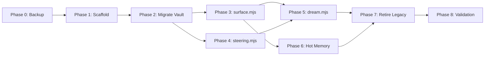

# Total Recall 3-Tier Memory Architecture — Development Plan

> Translates the ARCHITECTURE into a sequenced, executable build plan. Each phase has explicit inputs, outputs, verification criteria, and rollback procedures.

## Phase 0: Backup & Branch (Day 1, ~30 min)

**Input:** Current working state of `.agent/` directory.
**Output:** Timestamped backup + feature branch.

```bash
cp -a .agent .agent/.backups/$(date -u +%Y%m%dT%H%M%SZ)
git checkout -b refactor/three-tier-memory
git add . && git commit -m "checkpoint: pre-migration"
```

**Verify:** `ls .agent/.backups/` shows fresh timestamped directory.
**Rollback:** `git checkout main`.

---

## Phase 1: Directory Scaffold & Schema Definitions (Day 1, ~2 hrs)

**Input:** Architecture document §2 (Filesystem Layout) and §3 (Schemas).
**Output:** Empty directory structure + TypeScript interface definitions.

### 1a. Create directory structure
```text
.agent/memory-vault/invariants/
.agent/memory-vault/preferences/
.agent/memory-vault/anti-patterns/
.agent/memory-vault/patterns/
.agent/memory-vault/decisions/
.agent/memory-vault/concepts/
.agent/memory-derived/
.agent/memory-inbox/pending/
.agent/memory-inbox/conflicts/
.agent/sessions/
```

### 1b. Define TypeScript interfaces
Create `total-recall/src/types/memory.ts` with interfaces for:
- `MemoryNode` (§3a schema)
- `SkillManifest` (§3c schema)
- `ConflictRecord` (§3e schema)
- `SessionEntry` (§3f schema)
- `RouteScore` (routing result)
- `CompileResult` (surface output)
- `DreamReport` (dream cycle output)

### 1c. Define SSSS frontmatter constants
Create `total-recall/src/constants/schema.ts`:
- `TIER1_TOKEN_CEILING = 1000`
- `SKILL_TOKEN_BUDGET = 4500`
- `MAX_RULES_PER_SKILL = 7`
- `BM25_WEIGHT = 0.7`, `TFIDF_WEIGHT = 0.3`
- `ROUTING_THRESHOLD = 0.35`
- `CONFLICT_THRESHOLD = 0.78`
- `DECAY_HALF_LIFE_DEFAULT = 180`
- Stopwords set, sentiment polarity enum, priority enum

**Verify:** `npx tsc --noEmit` passes. Directory structure matches architecture §2.
**Rollback:** `rm -rf .agent/memory-vault .agent/memory-derived .agent/memory-inbox .agent/sessions`

---

## Phase 2: Migrate Vault Nodes (Day 1–2, ~3 hrs)

**Input:** Existing `.agent/memory-wiki/**/*.md` nodes.
**Output:** SSSS-compliant nodes in `.agent/memory-vault/<category>/`.

### 2a. Build migration script
Create `total-recall/scripts/migrate-nodes.mjs`:
1. Walk all `.md` files in `.agent/memory-wiki/`.
2. Parse existing frontmatter via `gray-matter`.
3. Map legacy fields to new schema (add `modality`, `subject`, `predicate`, `object`, `decay`, `sentiment_polarity`, `sentiment_target` with sensible defaults).
4. Categorize into subdirectories based on existing `category` or content heuristics.
5. Write to `.agent/memory-vault/<category>/<slug>.md`.
6. Preserve `created`, `updated`, `source` provenance.

### 2b. Run migration
```bash
node total-recall/scripts/migrate-nodes.mjs --dry-run    # preview
node total-recall/scripts/migrate-nodes.mjs --execute     # migrate
```

### 2c. Install seed invariants
Create `.agent/memory-vault/invariants/rule-zero-text-first.md` and `rule-skills-first.md` with `priority: absolute`, `immutable: true`.

**Verify:**
- `find .agent/memory-vault -name "*.md" | wc -l` matches original node count + 2 seed rules.
- Every file passes `gray-matter` parse with all required schema fields present.
- `git diff --stat` shows only additions.

**Rollback:** `rm -rf .agent/memory-vault`

---

## Phase 3: Build the Routing Engine — `surface.mjs` (Day 2–3, ~6 hrs)

**Input:** Architecture §4a (Routing Algorithm), Claude report reference implementation.
**Output:** Drop-in replacement for `total-recall/src/core/surface.mjs`.

### 3a. Implement core functions
Using Claude's production code as the reference implementation:

1. **`tokenize(text)`** — Lowercase, strip punctuation, filter stopwords.
2. **`buildTfidf(docs)`** — Build per-document TF-IDF vectors (pure JS, no deps).
3. **`tfidfScore(query, docId, model)`** — Score a query against a document.
4. **`buildSkillIndex(db, skills)`** — Create/rebuild FTS5 virtual table.
5. **`bm25Query(db, query, limit)`** — Query FTS5, negate scores (FTS5 returns negative).
6. **`routeNodesToSkills(nodes, skills, db, opts)`** — The main hybrid router:
   - BM25 primary, TF-IDF tiebreaker
   - z-normalize both, combine at 0.7/0.3
   - Pick top-K (default 3) above threshold (0.35)
   - Union with explicit `routes_to_skills`
   - **Enforce 7-rule cap per skill** (new vs Claude's code)
7. **`injectIntoSkillManifest(skill, nodes, slugs)`** — Render fenced block, update `needs:`.
8. **`compileTier1Instructions(rules)`** — Compile `priority: absolute` rules, hard-fail at 1,000 tokens.
9. **`compileSurface(vaultDir, skillsDir, db)`** — Orchestrate all of the above.
10. **`writeSurface(result, paths)`** — Atomic write all outputs.

### 3b. Implement graph-index.jsonl emission
One JSON object per node per line. Include all index fields from schema §3d.

### 3c. Implement skill-routes.jsonl emission
Log every routing decision: `{ slug, skill, bm25, tfidf, combined, timestamp }`.

**Verify:**
- Unit test: given 3 mock nodes and 2 mock skills, routing produces correct assignments.
- Unit test: Tier 1 compilation hard-fails if token budget exceeded.
- Unit test: 7-rule cap enforced per skill.
- Integration test: `node bin/total-recall compile` exits 0 and produces `graph-index.jsonl` + updated `SKILL.md` files.

**Rollback:** `git checkout -- src/core/surface.mjs`

---

## Phase 4: Build the Conflict Engine — `steering.mjs` (Day 3–4, ~4 hrs)

**Input:** Architecture §4b (Conflict Detection Algorithm), Claude's reference implementation.
**Output:** Drop-in replacement for `total-recall/src/core/steering.mjs`.

### 4a. Implement Layer 1 — O(1) Ontology Check
Compare `modality` + `subject` + `predicate` + `object` fields. If same SPO but opposite modality → instant conflict.

### 4b. Implement Layer 2 — Fuzzy Similarity
1. **`jaccard(setA, setB)`** — Token overlap.
2. **`trigramVec(text, dim=256)`** — Hash trigrams into 256-dim sparse vector, L2-normalize.
3. **`cosine(vecA, vecB)`** — Dot product of normalized vectors.
4. **`polarityFlip(nodeA, nodeB)`** — Check `directive_must` vs `directive_must_not` on overlapping target NPs.
5. **`detectConflicts(newNode, existingNodes)`** — Run both layers, return `Conflict[]`.

### 4c. Implement quarantine & CLI
1. **`appendToConflictsDir(conflict, dir)`** — Write one `.md` file per conflict to `.agent/memory-inbox/conflicts/`.
2. **`gatePromotion(newNode, existing, conflictsDir)`** — Block promotion if conflicts exist.
3. **`cliResolve(args, vaultDir, conflictsDir)`** — `--keep` or `--supersede`, mutate frontmatter `supersedes`/`superseded_by`, update `status`.

**Verify:**
- Unit test: polarity-flip conflict detected between `directive_must` and `directive_must_not` on same target.
- Unit test: no false positive across unrelated categories.
- Unit test: identical polarity on same target → no conflict.
- Unit test: `gatePromotion` blocks draft nodes with pending conflicts.
- Integration test: `total-recall resolve --keep <slug>` cleans conflict file and sets loser to `deprecated`.

**Rollback:** `git checkout -- src/core/steering.mjs`

---

## Phase 5: Build the Dream Cycle — `dream.mjs` (Day 4–5, ~4 hrs)

**Input:** Architecture §4c (Dream Cycle Algorithm).
**Output:** New `total-recall/src/core/dream.mjs` + workflow definition.

### 5a. Implement Phase 1 — Light Sleep
1. Walk vault for files modified in last 24h.
2. Walk sessions for new JSONL entries.
3. Extract candidate nodes → `scratchpad.yml`.

### 5b. Implement Phase 2 — REM
1. For each candidate, run `detectConflicts()` from steering.
2. For non-conflicting nodes: compute `dream_score = f(evidence_count, recency_days, importance)`.
3. Promote nodes with `dream_score ≥ 0.65` → `status: active`, bump confidence.
4. Decay nodes with `last_accessed > 90 days AND importance < 3` → confidence -= 0.02.
5. Deprecate nodes with `confidence < 0.10`.

### 5c. Implement Phase 3 — Deep Sleep
1. Call `compileSurface()` → rebuild everything.
2. Append execution summary to `dream-report.jsonl`.

### 5d. Implement Phase 4 — Recovery
1. On any error, restore from `.agent/.backups/`.
2. Log failure.

### 5e. Wire daemon
1. `chokidar` watcher on `.agent/memory-vault/` for real-time conflict checks.
2. `node-cron` schedule at `0 3 * * *` for nightly Dream Cycle.
3. CLI: `total-recall daemon start | stop | status`.

**Verify:**
- Integration test: `total-recall dream --dry-run` completes all 3 phases and logs to `dream-report.jsonl`.
- Stale node with `last_accessed` > 90 days gets confidence decayed.
- Node with `confidence < 0.10` gets status set to `deprecated`.

**Rollback:** `rm src/core/dream.mjs`, existing daemon preserved.

---

## Phase 6: Shrink Hot Memory & Install Adapters (Day 5, ~2 hrs)

**Input:** Compiled Tier 1 output from `surface.mjs`.
**Output:** Production `INSTRUCTIONS.md` + IDE adapter shims.

### 6a. Compile Tier 1
```bash
node bin/total-recall compile --tier1-only
```
Produces `INSTRUCTIONS.md` from `priority: absolute` rules only.

### 6b. Create adapter shims
```bash
cp INSTRUCTIONS.md AGENTS.md
cp INSTRUCTIONS.md .cursorrules
cp INSTRUCTIONS.md CLAUDE.md
```
Or symlink if the IDE supports it.

### 6c. Verify token budget
```bash
wc -c INSTRUCTIONS.md    # must be < 4000 bytes ≈ 1000 tokens
```

**Verify:** Token count < 1,000. Old `DISTILLED MEMORY` block is gone.
**Rollback:** Restore from `.agent/.backups/`.

---

## Phase 7: Retire Legacy Monolith (Day 5–6, ~1 hr)

**Input:** Verified working Tier 1 + Tier 2 + Tier 3 system.
**Output:** Legacy `graph-context.md` archived.

### 7a. Verify no references remain
```bash
grep -rn "graph-context" INSTRUCTIONS.md .cursorrules AGENTS.md CLAUDE.md || true
```

### 7b. Archive
```bash
mkdir -p .agent/.legacy
git mv .agent/rules/graph-context.md .agent/.legacy/graph-context.archived.md
git commit -am "retire monolithic graph-context.md"
```

**Verify:** Ask an IDE agent "What rules apply to deployment?" — it must answer by reading only `.agent/skills/deploy/SKILL.md`, never `graph-context.md`.
**Rollback:** `git mv .agent/.legacy/graph-context.archived.md .agent/rules/graph-context.md`

---

## Phase 8: End-to-End Validation (Day 6–7, ~4 hrs)

### Test Matrix

| Test Case | Method | Expected Result |
|-----------|--------|-----------------|
| Direct question turn | Ask agent a simple question | Agent responds immediately without loading any skills |
| Skill-triggered task | Ask agent to deploy | Agent loads `deploy/SKILL.md`, cites injected memory slugs |
| Conflicting directive | Give agent a rule that contradicts an invariant | Conflict quarantined, agent surfaces the conflict |
| Stale memory decay | Manually set a node's `last_accessed` to 120 days ago | Dream Cycle decays its confidence |
| Rule routing accuracy | Add a new vault node about testing | It routes to `test/SKILL.md`, not `deploy/SKILL.md` |
| Tier 1 budget guard | Add a 6th `priority: absolute` rule that blows the budget | `total-recall compile` hard-fails with clear error |
| Index regeneration | Delete all `.agent/memory-derived/` files | `total-recall reindex` regenerates everything from vault |
| Concurrent access | Run daemon while agent is editing files | Atomic writes prevent corruption |

---

## Dependency Graph



**Critical path:** P0 → P1 → P2 → P3 → P5 → P7 → P8
**Parallelizable:** P3 (surface) and P4 (steering) can be built concurrently after P2.

---

## Estimated Timeline

| Phase | Duration | Cumulative |
|-------|----------|------------|
| Phase 0: Backup | 0.5 hrs | 0.5 hrs |
| Phase 1: Scaffold | 2 hrs | 2.5 hrs |
| Phase 2: Migrate | 3 hrs | 5.5 hrs |
| Phase 3: surface.mjs | 6 hrs | 11.5 hrs |
| Phase 4: steering.mjs | 4 hrs | 15.5 hrs |
| Phase 5: dream.mjs | 4 hrs | 19.5 hrs |
| Phase 6: Hot Memory | 2 hrs | 21.5 hrs |
| Phase 7: Retire Legacy | 1 hr | 22.5 hrs |
| Phase 8: Validation | 4 hrs | 26.5 hrs |
| **Total** | **~27 hrs** | ~3–4 working days |
