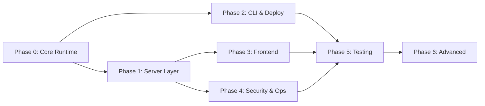

# Total Recall 3.0 — Development Plan

> Phased implementation roadmap derived from PRD v3.0 and ARCHITECTURE.md.
> Each phase produces a testable, self-contained deliverable.

---

## Build Strategy

This repo is an npm package. The build order is:

1. **Core Runtime** — The modules that run on the target machine (mostly done)
2. **Server Layer** — HTTP endpoints that expose the core (mostly done)
3. **CLI & Deploy** — The `npx total-recall deploy` pipeline (not started)
4. **Frontend** — React SPA dashboard (scaffolded, not built)
5. **Security & Ops** — TLS, auth, backup, monitoring (not started)
6. **Testing & Validation** — E2E tests proving acceptance criteria (not started)

---

## Phase 0: Core Runtime

> **Goal:** All `src/core/` modules exist and are individually functional.

### Deliverables
- `src/core/vault.mjs` — Atomic read/write/walk of SSSS nodes
- `src/core/schema.mjs` — Zod validators for schema v2
- `src/core/surface.mjs` — BM25+TF-IDF routing + Tier 1 INSTRUCTIONS.md compiler
- `src/core/steering.mjs` — Conflict detection (SPO + fuzzy layers)
- `src/core/sandbox.mjs` — Isolated Node.js/Bash execution with credential injection
- `src/core/dream.mjs` — Dream cycle daemon (Light/REM/Deep sleep phases)
- `src/core/task_runner.mjs` — P0–P5 priority queue manager
- `src/core/frontier.mjs` — BYOK frontier API routing client
- `src/core/pattern_detector.mjs` — User pattern recognition → task generation
- `src/core/blackboard.mjs` — Workflow state tracking
- `src/core/evolution.mjs` — Schema self-evolution proposals
- `src/core/watchdog.mjs` — Log monitor + automated circuit breakers

### Acceptance
- Each module can be imported and called independently
- `schema.mjs` validates a sample memory node without error
- `vault.mjs` can read/write/walk a test vault directory

---

## Phase 1: Server Layer

> **Goal:** Unified Express server exposing all interfaces.

### Deliverables
- `src/server/index.mjs` — Main server entry that mounts all routes
- `src/server/api.mjs` — `/v1/chat/completions` OpenAI-compatible proxy
- `src/server/mcp.mjs` — `/mcp` Streamable HTTP gateway (tools, resources, prompts)
- Health check endpoint (`GET /health`)
- Static file serving for built frontend assets

### Acceptance
- `node src/server/index.mjs` starts a server on the configured port
- `POST /v1/chat/completions` proxies to Ollama or frontier API
- `POST /mcp` completes MCP initialization handshake
- `GET /health` returns JSON system status

---

## Phase 2: CLI & Deploy Pipeline

> **Goal:** `npx total-recall deploy` provisions a target machine end-to-end.

### Deliverables
- `bin/total-recall.mjs` — CLI entrypoint with subcommand routing
- `src/cli/deploy.mjs` — Host provisioning (detect arch, install Ollama, pull models, scaffold VFS, install Caddy, create systemd units, start services)
- `src/cli/compile.mjs` — Rebuild indexes + INSTRUCTIONS.md
- `src/cli/dream.mjs` — Manually trigger dream cycle
- `src/cli/reindex.mjs` — Delete + regenerate derived indexes
- `src/cli/lint.mjs` — Validate vault nodes against schema v2
- `src/cli/daemon.mjs` — start/stop/status for background daemon
- `src/cli/backup.mjs` — Encrypted tarball creation (AES-256 + GPG)
- `src/cli/restore.mjs` — Restore from backup + reindex
- `src/cli/export.mjs` — Portable VFS export
- `src/cli/import.mjs` — Import VFS on new host
- `src/cli/upgrade.mjs` — Swap kernel model
- `scaffold/.agent/` — VFS directory skeleton with defaults
- `templates/Caddyfile` — Reverse proxy + auto-TLS config
- `templates/total-recall-server.service` — systemd unit for Express server
- `templates/total-recall-daemon.service` — systemd unit for dream cycle daemon
- `templates/default-config/frontier.yml` — Default frontier API config
- `templates/default-config/security.yml` — Default privacy/export controls
- `package.json` `"bin"` field → `"total-recall": "./bin/total-recall.mjs"`

### Acceptance
- `npx total-recall deploy` runs on a fresh Ubuntu 24.04 ARM64 VM and produces a working Brain
- `npx total-recall compile` rebuilds indexes from the vault
- `npx total-recall backup` + `npx total-recall restore` round-trips without data loss
- All CLI commands print `--help` with usage info

---

## Phase 3: Frontend Dashboard

> **Goal:** React SPA that provides a visual interface for all Brain operations.

### Deliverables
- Chat/Voice unified interface component
- SSSS VFS Graph Explorer (browse memory nodes, view conflicts)
- Code Sandbox playground (run Code Mode from the browser)
- Task scheduler viewer (pending/completed tasks)
- System health dashboard (inference stats, disk, uptime)
- File manager for sovereign storage (`~/.agent/files/`)
- Settings/Config editor (frontier.yml, security.yml)
- Voice mode toggle (Kokoro-82M TTS)

### Acceptance
- `cd frontend && npm run build` produces static assets
- Dashboard served by Express at `/*` (SPA catch-all)
- Chat interface sends/receives messages via `/v1/chat/completions`
- VFS explorer reads memory nodes via MCP resources

---

## Phase 4: Security & Operations

> **Goal:** Production-ready security, TLS, auth, and observability.

### Deliverables
- Caddy auto-TLS configuration (Let's Encrypt)
- `src/core/crypto.mjs` — Argon2id master password + AES-256-GCM encryption for `secrets.enc`
- Session auth: bcrypt password + cookie sessions for dashboard
- Bearer PAT authentication for API and MCP endpoints
- Rate limiting (token bucket per endpoint)
- `src/core/watchdog.mjs` — Log monitor with:
  - Sandbox circuit breaker (≥3 consecutive failures → quarantine)
  - Exfiltration monitor (abnormal token spikes → suspend routing)
  - Latency anomaly trigger (>2x baseline → KV cache flush)
  - Disk space monitor (>80% → rotation, >95% → halt writes)
  - Auth lockout (≥5 failures → IP firewall block)
- JSONL structured logging for all subsystems
- `/health` endpoint with full system diagnostics

### Acceptance
- All endpoints require authentication (except `/health` on localhost)
- `secrets.enc` is AES-256-GCM encrypted, decrypted at runtime with master password
- Watchdog correctly triggers circuit breaker after 3 sandbox failures
- Caddy serves valid HTTPS certificate on port 443

---

## Phase 5: Testing & Validation

> **Goal:** Prove the acceptance criteria from PRD §12.

### Deliverables
- Vitest specs for `steering.mjs` collision layers
- Vitest specs for `surface.mjs` BM25+TF-IDF routing accuracy
- Vitest specs for `schema.mjs` validation (valid + invalid nodes)
- Clean-account walkthrough: `npx total-recall deploy` on empty VM
- Code Mode sandbox escape prevention test
- MCP handshake + tool call integration test
- API proxy memory injection integration test
- Backup/restore round-trip test
- Dream cycle completion test (Light → REM → Deep)
- Full acceptance criteria matrix mapped to test IDs

### Acceptance
- All PRD acceptance criteria (AC-1 through AC-14) have at least one test
- `npm test` passes with zero failures
- Clean deploy on a fresh VM completes in under 10 minutes

---

## Phase 6: Advanced Features (Future)

> **Goal:** Recursive self-improvement and fine-tuning.

### Deliverables
- SSSS schema evolution engine (propose → test → apply)
- Friction detection (identify workflow bottlenecks)
- QLoRA fine-tuning pipeline (optional, cloud-burst or on-device)
- `TotalRecall-Gemma-SSSS` custom weights generation

### Acceptance
- System proposes ≥1 schema improvement/month
- Frontier model validates proposed changes
- No regression in existing workflow execution

---

## Dependency Graph

**Phases 0, 1, and 2 can be developed in parallel.** Phase 3 (Frontend) and Phase 4 (Security) depend on the server being stable. Phase 5 (Testing) validates everything. Phase 6 is future work.
