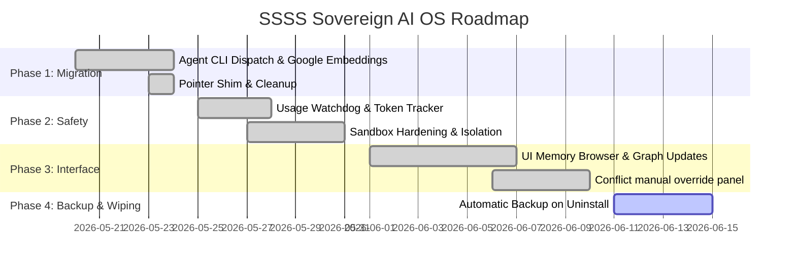

# SSSS Sovereign AI OS — Project Tracker

> **Status**: In-Progress  
> **Last Updated**: May 25, 2026  
> **Active Milestone**: Milestone 7 (Radically Useful UI & Cloudflare Quick Tunnel)  

---

## 📅 Roadmap Overview

---

## 📋 Task Checklist

### Phase 1: Core Pivot Migration & Cleanup (100% COMPLETE)
- [x] Remove local Gemma 4 / Ollama inference system and codebase linkages
- [x] Implement Unified Headless CLI Dispatch system (`dispatch.mjs`) for Antigravity, Claude, and Codex
- [x] Create agents registry (`.agent/skills/total-recall/skills/cli-agents/agents.yml`) mapping binary paths and CLI parameters
- [x] Replace local `nomic-embed-text` with Google `text-embedding-004` (featuring OpenAI fallback) via `GOOGLE_API_KEY`
- [x] Deprecate bulky 106KB instruction blocks and replace with a **5-line pointer shim** pointing to `SKILL.md`
- [x] Expunge the old `scaffold/` directory (91 files) completely
- [x] Expunge the old `scratch/` directory (3 files) completely
- [x] Turn `runtime.yml` into a minimal stub configuration
- [x] Implement dynamic remember CLI engine to append rules and recompile surfaces in-process
- [x] Implement robust semantic recall CLI command to search memory vault and session history

### Phase 2: Runtime Usage Limits & Token Tracking (P1 Priority — 100% COMPLETE)
- [x] Push-Based Rules Projection to Workspace Instruction Shims (Hotfix)
- [x] Implement universal remember CLI options (tags, importance, priority, modality, confidence, slug, title, status, SPO, related)
- [x] Implement universal recall CLI filtering options (category, tags, modality, importance, priority)
- [x] Create `src/core/usage-tracker.mjs` to ingest CLI usage logs
- [x] Implement Claude Code `stats-cache.json` parser
- [x] Implement Gemini session JSONL token counting logic
- [x] Establish daily/weekly maximum dollar budget limits in `config/budget.yml` (Pivot from `frontier.yml`)
- [x] Wire usage watchdog into pre-flight checks of `runtime.mjs` (Pivot from `dispatch.mjs`) to block runs when limits are reached
- [x] Add active dispatch loop watchdog that halts and kills unresponsive/runaway subagent processes (spawnSync timeout)

### Phase 3: Sandbox Hardening & Security (P1 Priority — 100% COMPLETE)
- [x] Research and implement POSIX namespace isolation for shell calls in `sandbox.mjs` (Darwin sandbox-exec & Linux unshare)
- [x] Restrict subagent file modifications to designated workspaces and git worktrees (OS directory constraints)
- [x] Write system egress firewall rules to restrict network communication to whitelisted domains (Outbound network denials)
- [x] Build command execution whitelist, blocking high-risk shell inputs (e.g. recursive deletes, arbitrary curl downloads)

### Phase 4: UI Memory Browser & Graph Updates (P2 Priority — 100% COMPLETE)
- [x] Rebuild React constellation graph to visualize SSSS v2 node relations
- [x] Implement dark-mode, glassmorphic SSSS vault memory browser in `frontend/`
- [x] Develop SSE-driven conflict warning panel for quarantined records in `.agent/memory-inbox/conflicts/`
- [x] Support manual conflict resolution triggers (promotions/supersedes) from UI panel
- [x] Integrate vault browser with Live Agent Monitor (running on port 9111)

### Phase 5: Verification & Integration Testing (Active)
- [ ] Align Total Recall Test Suite (`.agent/skills/test/SKILL.md`) to verify `semantic-index.mjs` and `surface.mjs` with text-embedding-004.
- [ ] Run automated integration tests simulating parallel subagent dispatches and pointer routing.
- [ ] Ensure local cache hit latencies stay strictly under 50ms.

### Phase 6: Automatic Backup-on-Uninstall & Full Wiping (100% COMPLETE)
- [x] Implement active backup remote auto-discovery in `uninstall.mjs`.
- [x] Integrate automatic commit and push sequence to the detected git remote.
- [x] Enable secure hard purging of the entire local `.agent` directory (including version-controlled skills & vault folders) post-backup.
- [x] Author comprehensive test cases in `uninstall.spec.mjs` verifying safety gates and full wiping behavior.

### Phase 7: Radically Useful UI & Cloudflare Quick Tunnel (Active)
- [x] Implement background `cloudflared` Quick Tunnel spawner inside `src/cli/init.mjs`
- [x] Extract dynamically allocated `trycloudflare.com` domain and persist inside `wizard-config.json`
- [x] Modernize memory list cards with border visualizer, confidence progress tracks, and priority stars
- [x] Re-engineer details layout in `MemoryPage.tsx` using frontmatter visual overlays
- [x] Create split-screen Markdown text-editor and live HTML render preview in `MemoryPage.tsx`
- [x] Implement multi-functional `"Scripts"` tab in `FilesPage.tsx` with editable script textarea, save actions, sandboxed execution runner, and live dynamic process streams terminal log

---

## 🚀 Next Strategic Action Items

1. **Implement Cloudflare spawner inside init.mjs**: Dynamically capture quick tunnel domain.
2. **Build SSSS Memory Editor split-screen layout**: Inject frontmatter borders, stars, sliders, and HTML live rendering preview.
3. **Build Interactive Scripts tab & terminal**: Enable execution and save endpoints in files page.

