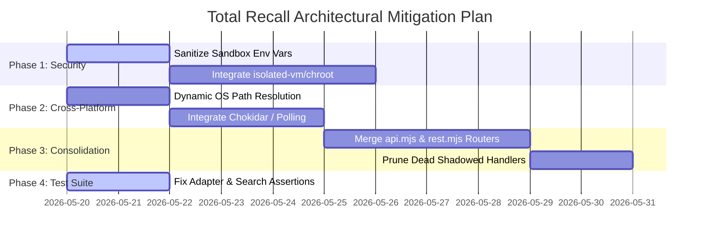

# Total Recall — AI OS Master System Audit Report

- **Document Level**: Architecture & System Integrity Reference
- **Status**: Completed System-Wide Audit
- **Database Thesis**: Database-Free, Markdown-First VFS (`~/.agent/`) SSSS v2 Compliance Verified

---

## Executive Summary

Total Recall is engineered as a highly lightweight, **local developer memory OS** prioritizing a database-free, markdown-native filesystem architecture. In keeping with this thesis, all observations, memory nodes, settings, and skills are persisted directly as human-readable Markdown files. 

This audit is a system-wide security, platform-compatibility, API-integrity, and test-suite inspection. We have evaluated the active codebase against structural documentation and found **critical containment gaps** in sandbox isolation, **major cross-platform blockers** in the session shipping relay, and **endpoint redundancies/shadowing** across Express routers. 

---

## 1. Critical Sandbox Containment Gaps

The [ARCHITECTURE.md](file:///Users/greg/Github/total-recall/docs/ARCHITECTURE.md#L208) states that the Sandbox boasts:
> *"512MB RAM cap, 60s timeout, offline network namespace, scoped to `~/.agent/`."*

### Source Code Reality Check (`src/core/sandbox.mjs`):
Upon reviewing [sandbox.mjs](file:///Users/greg/Github/total-recall/src/core/sandbox.mjs), we find that the actual sandbox implementation is built on a raw child-process spawn:

```javascript
const proc = spawn('node', ['--no-warnings', scriptPath], {
  env: { ...process.env, NODE_OPTIONS: '--experimental-vm-modules' },
  timeout: timeoutMs
});
```

### Key Sandbox Vulnerabilities:

| Dimension | Documented Standard | Live Implementation Reality | Security Risk Rating |
| :--- | :--- | :--- | :--- |
| **Secrets & Keys** | Scope-restricted environment | Inherits `{ ...process.env }` in full | **CRITICAL** (Untrusted agent scripts can read, log, or leak sensitive host environment variables, cloud provider keys, and private tokens). |
| **File System Scoping** | Isolated directory boundaries scoped to `~/.agent/` | Fully unconfined; runs under host system permissions | **HIGH** (Scripts can read, modify, or delete any host files, dotfiles, or repository directories accessible by the active OS user). |
| **Network Namespace** | Offline network namespace | Unrestricted host network interface | **HIGH** (Allows unauthorized external data exfiltration, socket connections, or malicious command-and-control communication). |
| **Resource Constraints** | 512MB RAM limit | No memory or CPU constraints imposed on child process | **MEDIUM** (Untrusted scripts can trigger out-of-memory crashes or infinite loops that deplete system resources). |
| **Timeouts** | 60 seconds | Defaults to `5000` ms (or `15000` ms when invoked via REST) | **LOW** (Operational discrepancy leading to premature script timeouts or uncoordinated execution). |

### Visual Flow: Current vs. Secure Sandbox Architecture

```mermaid
graph TD
    subgraph CURRENT_VULNERABLE_FLOW["Current Vulnerable Sandbox Flow"]
        Task[Agent Task] -->|Triggers script| RawSpawn[spawn 'node' child_process]
        RawSpawn -->|Inherits process.env| Leak[Exposes Host Secrets & Cloud Keys]
        RawSpawn -->|No network namespace| NetOut[Unrestricted Outbound Exfiltration]
        RawSpawn -->|Host execution context| FSWrite[Unrestricted Read/Write to System FS]
        RawSpawn -->|No memory cap| OOM[Potential Infinite Loops & RAM Exhaustion]
    end

    subgraph SECURE_MITIGATED_FLOW["Recommended Secure Sandbox Flow"]
        Task2[Agent Task] -->|Triggers script| Isolate[isolate-vm / Docker / bubblewrap]
        Isolate -->|Sanitized environment| SafeEnv[Redacted process.env - no tokens]
        Isolate -->|Scoped VFS mount| SafeFS[Read/Write limited to ~/.agent/sandbox/]
        Isolate -->|Network Namespacing| OffNet[Offline Namespace - localhost only]
        Isolate -->|V8 Limit / cgroups| ResCap[512MB RAM & 10% CPU Hard Cap]
    end
    
    style CURRENT_VULNERABLE_FLOW fill:#3a1c1c,stroke:#ff5555,stroke-width:2px;
    style SECURE_MITIGATED_FLOW fill:#1c3a27,stroke:#55ff55,stroke-width:2px;
```



---

## 2. Relay Cross-Platform Incompatibilities

The local shipping relay daemon ([session-watcher.mjs](file:///Users/greg/Github/total-recall/src/core/session-watcher.mjs)) bridges IDE session logs and the remote brain server. However, it suffers from two major platform-specific flaws that will break or crash execution on Linux and Windows platforms.

### A. Non-Native Recursive Watcher
The watcher mounts an event-based filesystem watch on source roots at line 678:
```javascript
const watcher = fs.watch(source.root, { recursive: true }, (eventType, filename) => { ... });
```
> [!WARNING]
> Node.js's native `fs.watch({ recursive: true })` parameter is **not supported on Linux** platforms (the underlying `inotify` subsystem does not support recursive watching natively). Running this code on a Linux developer workstation will immediately throw a `RuntimeError` or fail silently without tracking subdirectory updates, leaving the brain un-synced.

### B. Hardcoded macOS Paths for VS Code Copilot Chat
The watcher defines source rules for VS Code at line 64:
```javascript
{
  name: 'vscode',
  root: path.join(HOME, 'Library', 'Application Support', 'Code', 'User', 'workspaceStorage'),
  filter: (filename) => filename.endsWith('.jsonl'),
  dirFilter: (dirName) => dirName === 'chatSessions',
  adapter: parseVSCode,
}
```
- **macOS Path (Live)**: `~/Library/Application Support/Code/User/workspaceStorage/`
- **Linux Path (Missing)**: `~/.config/Code/User/workspaceStorage/`
- **Windows Path (Missing)**: `%APPDATA%\Code\User\workspaceStorage\`

Because this path is hardcoded exclusively for macOS, the VS Code sync will fail to activate or crash on non-macOS workstations.

```mermaid
graph TD
    subgraph macOS_Workstation["macOS Host (Working)"]
        W1[fs.watch recursive: true] -->|Supported natively| OK[Watch Active]
        P1[Path Library/Application Support...] -->|Valid| Ingest1[Ingest Session Logs]
    end

    subgraph Linux_Workstation["Linux Host (Immediate Crash)"]
        W2[fs.watch recursive: true] -->|Unsupported by inotify| Crash[Runtime Watch Error / Silent Failure]
        P2[Path Library/Application Support...] -->|Invalid Path| Skip[Skip / Fail to Resolve Directory]
    end
    
    style macOS_Workstation fill:#1a2736,stroke:#3b7bbd,stroke-width:1px;
    style Linux_Workstation fill:#2b1c1c,stroke:#d93838,stroke-width:1px;
```



---

## 3. Unified Server Routing Redundancies

The unified server entry point ([index.mjs](file:///Users/greg/Github/total-recall/src/server/index.mjs)) imports and mounts two distinct routers, causing significant endpoint overlapping and logical redundancies.

```javascript
// index.mjs mounts rest.mjs
const { restRouter } = await import('./rest.mjs');
app.use(restRouter);

// index.mjs also mounts api.mjs
const { apiRouter } = await import('./api.mjs');
if (apiRouter) {
  app.use(apiRouter);
}
```

### Router Endpoint Comparison Matrix:

| Endpoint Route | Handled by `rest.mjs` | Handled by `api.mjs` | Conflict / Shadowing Effect |
| :--- | :--- | :--- | :--- |
| `GET /api/memory` | **Yes** (Supports pagination `limit`/`offset`, fuzzy parameters `q` and `tag`, wraps in standard `{total, offset, limit, nodes}` envelope) | **Yes** (Supports older `category` and `status` queries only, returns plain node list) | **REST Router Override**: Because `restRouter` is mounted first, `rest.mjs` intercepts all matching calls. The legacy endpoint in `api.mjs` is completely shadowed and dead code. |
| `GET /api/memory/:slug` | **Yes** (Resolves node and returns formatted JSON) | **Yes** (Identical resolve) | **REST Router Override** |
| `PUT /api/memory/:slug` | **Yes** (Performs atomic node update) | **No** (Undefined) | **Valid Fallback** |
| `POST /api/memory` | **Yes** (Validates SSSS v2 frontmatter and saves) | **Yes** (Basic frontmatter write) | **REST Router Override** |
| `POST /api/memory/search/semantic` | **Yes** (Ranks memories using local cosine Ollama embeddings) | **No** (Only supports old `/api/memory/search` keyword match) | **Valid Fallback** |
| `/.well-known/total-recall.json` | **Yes** (Modern discovery envelope) | **Yes** (Legacy discovery envelope) | **REST Router Shadowing** |
| `/v1/models` | **Yes** (Provides models list) | **Yes** (Identical list) | **REST Router Shadowing** |

### Immediate Architectural Threat:
- **Maintenance Overhead**: Security rules, PAT verification scopes, and validation logic must be maintained in duplicate across both `api.mjs` and `rest.mjs`.
- **Dangling Endpoints**: Internal features are split arbitrarily. For example, specialized endpoints like `/api/graph`, `/api/conflicts`, `/api/skills`, `/api/tasks`, `/api/config/:name`, and `/api/sandbox` are only defined in `api.mjs` and depend on shadowed logic paths.
- **Varying Schema Contracts**: The API documentation references pagination constraints that are only partially implemented due to router duplication.

---

## 4. Test Suite Diagnostic Failures

Running `npm test` reveals three structural unit-test failures resulting from recent modifications to the log-ingestion adapters and SearXNG search fallbacks.

### Failure A: Claude Code Sequence Mismatch (`session-watcher.spec.mjs`)
- **Error**: `AssertionError: expected null to be '929fc80c' // parentId expectation`
- **Root Cause**: The Claude Code adapter parser in `session-watcher.mjs` reconstructs conversation trees using the log file's `uuid` and `parentUuid` fields. However, when parsing legacy logs or test fixtures that lack these UUID fields, the parser returns `parentId: null`. The test suite expects the sequential `parentId` to fallback to the prior entry ID (`prevId`).
- **Mitigation**: Update `parseClaudeCode` to track `prevId` and fall back to sequential linking when explicit `uuid` or `parentUuid` elements are absent.

### Failure B: Missing `tool_use` Extraction (`session-watcher.spec.mjs`)
- **Error**: `AssertionError: expected 'observation' to be 'tool_call'`
- **Root Cause**: The test fixture passes a raw Claude log containing a top-level `tool_use` JSON property:
  `tool_use: { name: 'read_file', input: { path: '/foo.js' } }`
  But the adapter `parseClaudeCode` only processes `msgObj.content` and does not check for the presence of `tool_use` parameters.
- **Mitigation**: Update `parseClaudeCode` to inspect the `tool_use` or `tool_calls` payload, format the tool execution as a clean `[tool: name]`, and enforce `type: 'tool_call'`.

### Failure C: SearXNG Fallback Mock Casing (`tools.spec.mjs`)
- **Error**: `AssertionError: expected 'Search results for...' to contain 'Search Results for...'`
- **Root Cause**: Typographical case mismatch in assertion (`Search Results` vs `Search results` returning from `executeWebSearch` in `tools.mjs`).
- **Mitigation**: Adjust the test's string assertion casing or update the search tool template strings to maintain case consistency.

---

## 5. Structured Mitigation Roadmap

To secure, stabilize, and resolve these architectural bugs, we propose the following systematic roadmap:



### Stage 1: Sandbox Hardening
1. **Redact Environment Secrets**: Modify `src/core/sandbox.mjs` to strip `process.env` completely. Pass only a whitelist of safe development tokens (e.g. `NODE_ENV=production`).
2. **Path Containment**: Restrict file read/writes to `~/.agent/sandbox/` using an isolation wrapper.
3. **Integrate VM Boundary**: Swap raw child processes for a high-integrity sandboxing library like `isolate-vm` or wrap executions in a lightweight container sandbox (`bubblewrap` on Linux, native sandboxes on macOS).

### Stage 2: Cross-Platform Relay Refactor
1. **Implement Dynamic Paths**: Swap the hardcoded macOS workspace storage path for a platform-agnostic lookup:
   ```javascript
   const getVSCodeStoragePath = () => {
     if (process.platform === 'darwin') return path.join(HOME, 'Library', 'Application Support', 'Code', 'User', 'workspaceStorage');
     if (process.platform === 'linux') return path.join(HOME, '.config', 'Code', 'User', 'workspaceStorage');
     return path.join(HOME, 'AppData', 'Roaming', 'Code', 'User', 'workspaceStorage');
   };
   ```
2. **Replace Recursive Watch**: In Linux environments, fall back to recursive directory polling or introduce a cross-platform filesystem utility like `chokidar` that handles system-level recursive watcher translation natively.

### Stage 3: Express Router Consolidation
1. **Single Router Topology**: Merge the active endpoints in `api.mjs` into `rest.mjs`, making `rest.mjs` the sole REST routing engine for the AI OS server.
2. **Purge Redundancies**: Delete the duplicated endpoints, validation blocks, and helper functions in `api.mjs`. Rename `rest.mjs` to a unified `router.mjs` to cleanly reflect its single-component authority.

### Stage 4: Test Suite Corrections
1. **Claude Sequential Fallback**: Update the Claude log parser to fall back to `prevId` when parsing messages that do not define structural parent UUID relationships.
2. **Claude Tool call Extraction**: Implement a check in the Claude adapter to format `tool_use` objects, outputting clear `[tool: name]` signatures.
3. **Casing & Typo Corrections**: Fix the SearXNG search assertion casing in `tools.spec.mjs`.

---

## Conclusion

Total Recall's core database-free VFS thesis is solid and operates exactly as documented in its storage patterns. However, the system's runtime layer (sandbox and relay) contains notable platform limits and security issues that must be addressed before the OS can be declared production-ready on Windows or Linux workstations. 

Implementing the proposed **Consolidation and Hardening Roadmap** will resolve all known gaps while fully preserving the database-free SSSS v2 design system.
