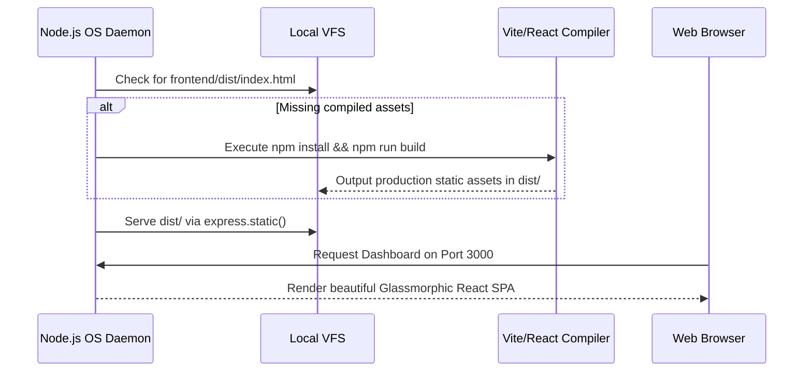

# Total Recall — AI OS Installation & Setup

This guide details the complete installation pipeline, environment initialization, and selectable deployment strategies for the **Total Recall Local AI OS**.

---

## 🚀 1. The `npx total-recall init` Wizard

The primary entry point to initialize Total Recall in any environment is the interactive setup wizard. To start the wizard, execute:

```bash
npx total-recall init
```

The wizard automates the provisioning of both the **Global Brain Layer** and the **Project-specific configurations** inside your active repository.

### Interactive Steps:
1. **Model Endpoint Configuration**: Configures local reasoning paths (Ollama/Gemma 4) and credentials for optional frontier fallbacks (OpenAI, Anthropic).
2. **Personal Access Token (PAT) Generation**: Provisions the Bearer token required for all REST API operations (stored in `.agent/skills/total-recall/config/brain.json`).
3. **Selectable Deployment Location**: Prompts you to select your public UI and server access layout.

---

## 🌐 2. Selectable UI Deployment Modes

During initialization, you can select one of the following deployment configurations:

| Mode | Target | Description | Configuration Key |
| :--- | :--- | :--- | :--- |
| **Local Bind** | `http://127.0.0.1:3000` | Bind strictly to localhost. Ideal for standard local operations. | `deploy-mode: local` |
| **Quick Tunnel** | `https://*.trycloudflare.com` | Instantly spins up a public Cloudflare quick tunnel for remote browser access. | `deploy-mode: quick-tunnel` |
| **Named Tunnel** | `https://your-tunnel.domain.com` | Connects securely to a pre-configured Cloudflare named tunnel daemon. | `deploy-mode: named-tunnel` |
| **Custom Domain** | `https://your-domain.com` | Hooks up to your own public DNS reverse-proxied through a custom server. | `deploy-mode: custom-domain` |

> [!TIP]
> **Cloudflare Tunnels on Headless Servers:**
> If you are running Total Recall on a headless home server (Linux, appliance, or any always-on host), selecting **Quick Tunnel** allows you to securely access the React Dashboard from any browser worldwide without manual port-forwarding or dynamic DNS.

---

## 🏗️ 3. Automatic Frontend Compilation

Total Recall features a self-compiling React frontend. 

When you start the OS daemon using `npm start` or the background service, the Express server executes the following startup sequence:
1. Checks for the existence of compiled static files in the target directory (`frontend/dist/index.html`).
2. **If missing**: The daemon automatically wakes up, executes `npm install`, and triggers the production build pipeline (`npm run build`) in the `frontend` subdirectory.
3. Serves the resulting React Single Page Application (SPA) on port `3000` dynamically, ensuring a zero-setup dashboard experience.



---

## 🧠 4. Dual-Layer Brain Provisioning

During the initialization phase, the system configures the brain to operate as a **Dual-Layer Memory System**:

### Global Layer (`~/.agent/`)
- Contains global preferences, master API keys, global logs, and the identity layer (`SOUL.md`, `USER.md`).
- Loaded by the kernel upon booting to establish baseline system behavior.

### Project Layer (`<repo>/.agent/`)
- Contains repository-specific facts, workspace patterns, and localized research agendas.
- Overrides global configurations when active inside a project directory, allowing for highly contextual workspace intelligence.

### Interoperability:
- **Together**: The rebuilder automatically merges both directories, allowing project-specific facts to interact with global invariants.
- **Separately**: In air-gapped workspaces, the global layer can be fully disabled to restrict the agent's memory to the local repository boundaries.

---

## 🖧 5. Mesh devices as entity variables (not product hardcoding)

Each machine in your fleet is a **`mesh_node` entity** under the brain vault:

```text
<brain>/memory-vault/system/mesh-nodes/<slug>.md
```

Product code never embeds your hostnames. It discovers live facts (Tailscale, LAN ARP, NICs, I/O) and merges them with **entity variables** you store on each document.

| Variable group | Examples | Purpose |
| :--- | :--- | :--- |
| Identity | `hostname`, `ip`, `title`, `role`, `labels` | Who this device is in *your* install |
| Network | `interfaces[]` (wifi/ethernet/vpn_overlay…), `lan_ip`, `transports` | How it connects (mesh + LAN) |
| I/O for agents | `io.channels` (screen, touch, mic, speaker, keyboard, camera, headless), `io.ui_hints` | So agents generate UI for the right surface |

### APIs (authenticated)

```bash
# Enriched peers + vault entity fields
curl -H "Authorization: Bearer $TR_PAT" "$TR_BRAIN/api/mesh/nodes"

# Local NIC kinds
curl -H "Authorization: Bearer $TR_PAT" "$TR_BRAIN/api/mesh/interfaces"

# LAN neighbors + optional Total Recall /health probe
curl -H "Authorization: Bearer $TR_PAT" "$TR_BRAIN/api/mesh/lan?probe=1"

# This host I/O profile (agent UI hints)
curl -H "Authorization: Bearer $TR_PAT" "$TR_BRAIN/api/mesh/io"
```

### Annotate a device (SSSS / vault)

Patch install-specific detail onto the entity (touch kiosk example):

```yaml
# system/mesh-nodes/<derived-slug>.md
type: mesh_node
hostname: <from-live-discovery>
role: kiosk
labels: [lobby]
io:
  display: { present: true, touch: true }
  channels: [screen, touch, speaker]
  ui_hints: [touch_targets_large, avoid_hover_only, voice_output_ok]
```

Daemon heartbeat (`patchOwnMeshNode`) refreshes **live** fields (`ip`, `status`, `interfaces`, detected `io`) without wiping your role/labels/notes overrides.

Dashboard: **Mesh → Daemon Status** shows topology, LAN discovery, local interfaces, and “I/O for agent UI”.
