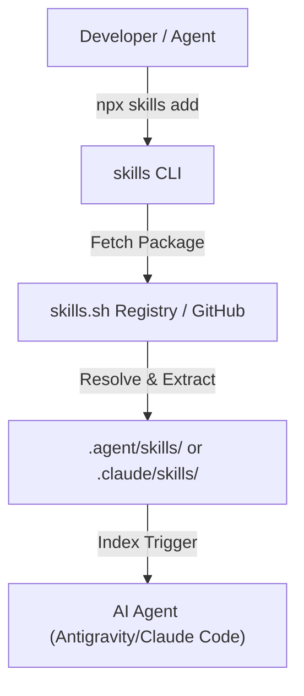

# 🧠 Project Recall: Skill Discovery & Improvement Research

This research project explores the state of modular AI agent skills, investigates the emerging registry ecosystem surrounding [skills.sh](https://skills.sh), defines strategies for building resilient agent skill systems, and compiles the definitive **Top 10 High-Impact Agent Skills** for developer productivity.

---

## 1. Executive Summary & Scope

Modular agent skills represent the primary operational substrate connecting an AI agent to its execution environment. While large language models possess general text capabilities, they lack localized, execution-level expertise for specialized developer workflows. 

**Agent Skills** bridge this gap. A skill is a **portable unit of execution and instruction** that teaches an agent exactly *how* to perform a highly specialized task. Rather than consuming valuable context windows with massive prompt lists, skills are loaded dynamically (progressive disclosure) when their trigger conditions are met.

### Core Goals of this Research:
1. **Analyze Registry Infrastructure**: Examine how ecosystems like `skills.sh` package, distribute, and manage skills.
2. **Define Quality & Hardening Protocols**: Standardize the universal skill format to prevent fragile, "prompt-only" skills.
3. **Curate the Definitive Top 10**: Identify the ten most valuable skills that can be introduced into the Total Recall OS or any modern agent environment to dramatically upgrade developer experience.

---

## 2. Deep Dive: The `skills.sh` Ecosystem

[skills.sh](https://skills.sh) represents a critical milestone in agentic engineering—effectively serving as the **"npm for AI agents."**

### Key Architectural Pillars:
*   **Zero-Config Distribution**: Using a standard command like `npx skills add <owner/repo>`, developers can pull skills directly from GitHub repositories.
*   **Modular Encapsulation**: A skill is packaged as a single directory. The agent parses the metadata, and only injects the system prompt when it is highly relevant.
*   **Cross-Assistant Portability**: Because skills are structured around standard `SKILL.md` documents, they are highly portable across **Antigravity**, **Claude Code**, **Cursor**, and **Gemini CLI**.

### Security & Trust Audits:
> [!CAUTION]
> **The Executable Code Risk:**
> Because skills can contain executable Node.js, Python, or shell scripts (`scripts/`), installing third-party skills exposes the host system to potential arbitrary command execution.
> *   **Audit Mandate**: Before executing scripts from a newly installed skill, the agent must run a static analysis script (e.g., `run-audit.mjs`) to look for suspicious shell string interpolation, unchecked network calls, or hidden file system changes.

---

## 3. Continuous Improvement Strategies for Agent Skills

To move beyond fragile prompt wrappers, agent skills must be treated as **production software packages**. We define the **Universal Skill Architecture (v2.0)**, which enforces five canonical folders:

| Folder | Core Strategy for Continuous Improvement |
| :--- | :--- |
| **`SKILL.md`** | **Trigger Optimization**: Refine frontmatter descriptions using strict, negative-constraint conditions (e.g., *"Do NOT use for vanilla styling"*). This prevents the agent from triggering the skill under incorrect contexts. |
| **`scripts/`** | **Idempotent Automation**: Replace LLM-hallucinated workflows with deterministic, testable scripts. If a task involves parsing, linting, or transpilation, run a compiled JS/TS utility rather than asking the LLM to format it. |
| **`references/`** | **Context Caching**: Embed verified specification snapshots (e.g. Next.js App Router rules) so the agent does not depend on outdated internet knowledge or hallucinations. |
| **`evals/`** | **Assertive Validation**: Every skill must have at least 3 rigorous validation criteria in `evals.json`. Run autonomous tests in the sandbox to verify output correctness before declaring success. |
| **`subagents/`** | **Role Decomposition**: Break large, complex skill executions into specialized delegation prompts (e.g., separating the "Planner" from the "Hardening Reviewer"). |

---

## 4. Curated Top 10 High-Impact Agent Skills

Below is the definitive **Top 10 Agent Skills List**, designed to turn any standard AI coding assistant into a premium, world-class developer partner.

### 📊 Top 10 Skills Overview
| Rank | Skill Name | Primary Function | Primary Script / Tool |
| :---: | :--- | :--- | :--- |
| **1** | [git-wizard](#1-git-wizard) | Auto-branches, conventional commits, interactive rebases & clean PR creation. | `scripts/pr-builder.mjs` |
| **2** | [nextjs-expert](#2-nextjs-expert) | Optimizes Next.js 15 Server Components, routing paradigms, and React hydration. | `references/nextjs-15-spec.md` |
| **3** | [security-audit](#3-security-audit) | Scans for command injections, unsafe regex, path traversals, and secret leakage. | `scripts/run-audit.mjs` |
| **4** | [tdd-runner](#4-tdd-runner) | Enforces test-driven development: red, green, refactor iterations. | `scripts/test-loop.sh` |
| **5** | [db-migrator](#5-db-migrator) | Manages database migrations, schema synchronization, and secure mock seeding. | `scripts/migrate.mjs` |
| **6** | [mcp-bridge](#6-mcp-bridge) | Connects local workspaces directly to Slack, Linear, Jira, and Notion APIs. | `scripts/sync-board.mjs` |
| **7** | [web-perf](#7-web-perf) | Audits Chrome DevTools data, calculates Core Web Vitals (LCP, INP) and auto-optimizes. | `scripts/perf-analyzer.js` |
| **8** | [total-recall-sync](#8-total-recall-sync) | Analyzes active session trajectories, creates SSSS v2 nodes, and compiles the brain. | `scripts/vault-sync.mjs` |
| **9** | [ui-engine](#9-ui-engine) | Generates responsive, glassmorphic modern layouts using curated HSL color systems. | `scripts/generate-assets.sh` |
| **10**| [swarm-director](#10-swarm-director) | Orchestrates concurrent background subagents, locking file resources safely. | `scripts/lock-manager.mjs` |

---

### Detailed Skill Profiles

#### 1. `git-wizard`
*   **Trigger**: Use this skill when creating branches, preparing commits, handling merge conflicts, or generating Pull Requests.
*   **Execution Script**: `scripts/pr-builder.mjs` – Safely analyzes differences via `git diff`, queries the user for scope, writes a premium markdown PR description, and pushes the branch.
*   **Assertion (`evals.json`)**:
    *   Commit messages match Conventional Commit rules.
    *   No temporary edit markers or unresolved conflicts exist in git staged files.

#### 2. `nextjs-expert`
*   **Trigger**: Use this skill when editing or creating pages, layouts, API routes, or server actions in a Next.js workspace.
*   **Execution Script**: Static context routing.
*   **References**: `references/nextjs-15-spec.md` – Integrates Next.js 15 rendering patterns, caching settings, dynamic headers, and App Router guidelines.
*   **Assertion (`evals.json`)**:
    *   All Server Actions are annotated with `'use server'`.
    *   Components utilizing `useState` or browser-only APIs are correctly marked with `'use client'`.

#### 3. `security-audit`
*   **Trigger**: Use this skill before committing code changes touching I/O, process execution, external inputs, or authentication.
*   **Execution Script**: `scripts/run-audit.mjs` – Executes AST parsing of files to detect unsafe `execSync` patterns, unsanitized inputs in `path.join`, and raw HTML bindings.
*   **Assertion (`evals.json`)**:
    *   Zero critical security warnings remain in the modified files.
    *   Audit exit code is `0`.

#### 4. `tdd-runner`
*   **Trigger**: Use this skill when implementing a new feature or refactoring existing code.
*   **Execution Script**: `scripts/test-loop.sh` – Runs test watchers, compiles results, and guides the agent iteratively through the TDD lifecycle.
*   **Assertion (`evals.json`)**:
    *   Tests were written and confirmed failing *before* implementation code was modified.
    *   All new and regression tests pass successfully on the completed implementation.

#### 5. `db-migrator`
*   **Trigger**: Use this skill when editing database schemas, writing seed scripts, or executing migrations.
*   **Execution Script**: `scripts/migrate.mjs` – Safely dry-runs migrations, handles SQL backups, and verifies referential integrity.
*   **Assertion (`evals.json`)**:
    *   Database schema compiles without circular dependency loops.
    *   Seed script executes successfully on empty database tables.

#### 6. `mcp-bridge`
*   **Trigger**: Use this skill when assigning issues, syncing status, or reading workspace tasks from external trackers.
*   **Execution Script**: `scripts/sync-board.mjs` – Connects via MCP toolsets to check Linear or Jira project tasks and align them with the local `task.md` file.
*   **Assertion (`evals.json`)**:
    *   Task descriptions and statuses are perfectly synchronized.
    *   No duplicate task IDs exist in the local task manifests.

#### 7. `web-perf`
*   **Trigger**: Use this skill when auditing client-side load speed, visual shifting, or rendering lag.
*   **Execution Script**: `scripts/perf-analyzer.js` – Launches a headless browser, measures LCP, CLS, and INP metrics, and reports recommended code changes.
*   **Assertion (`evals.json`)**:
    *   Largest Contentful Paint (LCP) remains under 2.5 seconds.
    *   All critical above-the-fold images utilize `fetchpriority="high"`.

#### 8. `total-recall-sync`
*   **Trigger**: Use this skill when the user updates system-wide patterns, states a workflow preference, or repairs compilation pipelines.
*   **Execution Script**: `scripts/vault-sync.mjs` – Generates structured SSSS v2 memory nodes based on the conversation log and compiles vault indexes via `npx total-recall compile`.
*   **Assertion (`evals.json`)**:
    *   Memory nodes contain valid SSSS YAML frontmatter.
    *   Compile script returns successful compilation status (exit code 0).

#### 9. `ui-engine`
*   **Trigger**: Use this skill when crafting new web pages, styling UI components, or building landing mockups.
*   **Execution Script**: `scripts/generate-assets.sh` – Auto-provisions harmonious dark-mode CSS tokens, configures fonts, and generates custom media assets via image-generation tools.
*   **Assertion (`evals.json`)**:
    *   Visual designs contain zero raw color hex codes (all use structured CSS variables or HSL scales).
    *   Components adapt fluidly to screen dimensions (fully responsive).

#### 10. `swarm-director`
*   **Trigger**: Use this skill when launching background subagents to solve concurrent programming tasks.
*   **Execution Script**: `scripts/lock-manager.mjs` – Handles parallel agent coordination, prevents concurrent file-write conflicts, and manages inter-agent task queues.
*   **Assertion (`evals.json`)**:
    *   Inter-agent messaging completes with zero deadlocks.
    *   Temporary branch workspaces are cleanly deleted upon subagent termination.

---

## 5. Conclusions & Future Outlook

Integrating these 10 core skills represents an immediate, massive leap forward for developer automation. By moving away from unstructured prompts and toward **hermetic, testable skills** following the `skills.sh` registry model, we pave the way for a highly resilient, autonomous agent ecosystem.

Future research will focus on:
1. **Dynamic Execution Verification**: Equipping the `tdd-runner` skill with native virtualization to test scripts in fully isolated containers.
2. **Registry Sync Pools**: Automating the process of querying `skills.sh` on startup to keep all locally installed skills continuously updated.
