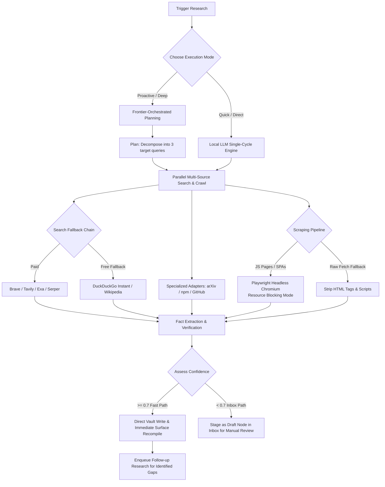

# Total Recall — Background Research & Continuous Intelligence Skill

This skill governs the execution, queueing, status management, and dynamic search query retrieval of local background **Research Projects** in the Total Recall Sovereign OS. It details the underlying **multi-source intelligence gathering engine**, the web crawling and scraping pipeline, specialized domain adapters, and the Structured Semantic Syntax System (SSSS) v2 citation and frontmatter schema.

---

## 🎯 SYSTEM OVERVIEW & WORKFLOWS

Total Recall features a highly robust, proactive continuous intelligence system that runs as an autonomous, concurrent background daemon. Under the hood, this engine performs deep context collection, crawls live web pages, cross-verifies facts across multiple independent APIs, and compiles structured Markdown memory nodes with valid SSSS v2 metadata.



---

## 🎯 WHEN TO TRIGGER BACKGROUND RESEARCH

You must carefully choose when to delegate a topic to background research vs when to handle it immediately:

### 🚀 Trigger Research If:
1. **The topic requires high-density domain learning**: Deep framework updates (e.g., Next.js 15 routing mechanics), complete architectural standards, complex security protocols, or large open-source specifications.
2. **You plan to run long-horizon tasks**: When executing highly demanding workflows (e.g., overnight or via the `/goal` command) and you want the system to continuously study and ingest complex material in the background.
3. **The domain knowledge has high reuse potential**: Factual guidelines or patterns that multiple subsequent agent turns will need to reference frequently.

### 🚫 DO NOT Trigger Research If:
1. **You need a quick API reference**: Finding the signature of a common library function, checking standard CLI flags, or looking up simple code snippets. Use immediate web search features.
2. **The query is highly specific or transient**: Specific bugs unique to the current file workspace that will not represent a reusable systemic memory.

---

## 🛡️ CORE RESEARCH MODES

The Total Recall research engine operates in two modes:

### 1. Proactive / Deep Research (`handleProactiveResearch`)
*   **Orchestration**: Leverages the frontier model (if configured in `~/.agent/config/frontier.yml`) to decompose the high-level objective into **3 distinct, specific search queries**.
*   **Parallelization**: Launches parallel multi-source crawlers for each query.
*   **Drafting**: Writes separate draft batch files inside `~/.agent/memory-inbox/pending/`.
*   **Synthesis**: Synthesizes the aggregated draft batches using the frontier model (falling back to the local LLM if the frontier is unavailable) to produce a comprehensive final report.
*   **Continuous Tracking**: Automatically registers the primary topic in the **Research Agenda** for ongoing continuous intelligence.

### 2. Quick Research (`handleQuickResearch` / `runKnowledgeAcquisitionCycle`)
*   **Speed**: Runs a fast, single-cycle research task driven by the local LLM.
*   **Direct Execution**: Immediately queries available search APIs, synthesizes results, and produces a cited memory node in a single turn.

---

## 🌐 MULTI-API WEB SEARCH & FALLBACKS

To bypass limitations and ensure high availability, the search engine utilizes a robust, prioritized fallback chain configured in `~/.agent/config/research.yml`:

$$\text{Brave Search} \longrightarrow \text{Tavily Search} \longrightarrow \text{Exa Search} \longrightarrow \text{Serper Search} \longrightarrow \text{DuckDuckGo (Always-Free Fallback)}$$

### 1. Paid Search Providers (Configured via API Keys)
*   **Brave Search API** (*Primary*): Web search with high relevancy and structured metadata. Free tier offers 2,000 queries/month.
*   **Tavily Search** (*Agent-Purpose*): Purpose-built for AI agents. Delivers clean extracted page text snippets directly, often bypassing the need for secondary scraping.
*   **Exa Search** (*Neural/Semantic*): Uses semantic/meaning-based neural searches instead of simple keywords; highly recommended for fresh, recent articles.
*   **Serper.dev** (*Google Fallback*): Clean Google Search API wrapping, ideal as a final fallback.

### 2. Always-Free Web Fallbacks (No Auth Required)
*   **DuckDuckGo Instant Answers**: Used automatically when paid budgets are exhausted or keys are missing. Excellent for definitions, structured entity facts, and direct calculations.
*   **Daily Search Budget Tracker**: To protect free-tier developers from unexpected overage charges, Total Recall tracks daily searches in `~/.agent/config/search-usage.json`. The default limit is **50 paid searches/day** (roughly 1,500/month). When this cap is exceeded, the engine gracefully falls back to free DuckDuckGo search so that research never halts.

---

## 🔬 SPECIALIZED KNOWLEDGE ADAPTERS

For academic, package-ecosystem, and repository queries, the engine routes search queries through specialized adapters that bypass generic web search filters:

### 1. arXiv API (Academic & ML Research)
*   **Triggers**: Activated when query contains words like `model`, `llm`, `neural`, `ml`, `ai`, `research`, `paper`, or `algorithm`.
*   **Function**: Queries academic paper repositories, parses the XML feeds without external dependencies, and extracts title, summary, publication date, and academic links.

### 2. npm Registry & Detail API (JavaScript Ecosystem)
*   **Triggers**: Activated when query contains terms like `npm`, `node`, `javascript`, `typescript`, `package`, or `library`.
*   **Function**: 
    *   **Search**: Finds the top 5 package names matching the query text.
    *   **Details**: Directly fetches a package's exact package metadata (dependencies, version history, license, homepage, and repository URL).

### 3. GitHub Search API (Code & Repositories)
*   **Triggers**: Activated when query contains `github`, `repo`, `open-source`, `cli`, `sdk`, or `api`.
*   **Function**: Queries star-sorted repositories or issues. Authenticates using `GITHUB_TOKEN` to scale rate limits from 60 to 5,000 requests/hour.

### 4. Wikipedia REST API (Structured Facts)
*   **Triggers**: Always queried in parallel.
*   **Function**: Fetches clean summaries, page IDs, timestamps, and desktop page links for entities and historical events.

---

## 🕷️ HEADLESS CRAWLING & SCRAPING (PLAYWRIGHT)

When a web search returns a high-relevance URL, the crawler performs deep content extraction.

### 1. Playwright Headless Browser Mode
If `playwright` is installed, the engine launches a headless Chromium instance to fetch pages. This handles:
*   **JavaScript-Rendered Pages**: SPAs, React, Next.js, and complex frontend architectures.
*   **Bot Detection & Protections**: Spoofs common desktop headers and sets real device viewports (`1280x800`).
*   **Performance Optimization (Resource Blocking)**: Speeds up scraping and conserves bandwidth by intercepting and **blocking** requests for:
    *   `image`
    *   `media`
    *   `font`
    *   `stylesheet`
*   **Selector Traversal**: Prioritizes key readable elements (`article`, `main`, `[role="main"]`, `.content`, `#content`) before resorting to `body` text, extracting the first 8,000 characters of clean content.

### 2. Graceful Plain Fetch Fallback
If Playwright is not installed or Chromium fails to launch, the engine falls back to a plain Node `fetch`.
*   **HTML Sanitization**: Automatically strips out `<script>` tags, `<style>` blocks, and other HTML/CSS markup using regex to return clean text.

---

## 🧠 FACT SYNTHESIS, VERIFICATION & TRUST

Once raw data is gathered, it is processed to ensure accuracy:

1.  **Temporal Verification**: Synthesizers are injected with the current real-world date and the model's training cutoff date (e.g., *January 2025*). Sources published *after* the cutoff are prioritized to capture new developments.
2.  **Cross-Verification**: Facts must be cross-verified across multiple independent sources.
3.  **Confidence Grading**: Confidence scores (`0.0` to `1.0`) are mathematically computed:
    *   *Single Source*: Maximum confidence capped at `0.6`.
    *   *3+ Agreeing Sources*: Promoted up to `0.95` confidence.
4.  **Contradiction Analysis**: If sources disagree, the engine flags the conflict in a `contradictions` array.
5.  **Self-Multiplication (Gap Tracking)**: Unresolved questions are placed in a `further_research_needed` array. High-priority gaps are automatically added back to the Research Agenda as new pending topics.

---

## 🗂️ SSSS v2 MEMORY NODE CITATION SCHEMA

Fact-seeker results are saved as structured Markdown files containing valid **SSSS v2 YAML frontmatter**. 

### Confidence-Based Routing
*   **High Confidence ($\ge 0.7$) [FAST PATH]**: Written directly to the active memory vault (`~/.agent/memory-vault/facts/`) as an `active` node, triggering an **immediate surface recompile** so the knowledge appears in `INSTRUCTIONS.md` within seconds.
*   **Low Confidence ($< 0.7$) [INBOX PATH]**: Staged in `~/.agent/memory-inbox/pending/` as a `draft` node for manual review and subsequent promotion by the conclusion-writer.

### SSSS v2 Frontmatter Fields Specification
```yaml
type: memory
slug: fact-a1b2c3d4e5                     # Unique kebab-case identifier
category: facts
title: "React 19 Server Components Specifications"
status: active                             # active (fast-path) | draft (inbox-path)
confidence: 0.92                          # 0.0 to 1.0 (based on source agreement)
importance: 6                             # 6 for fast-path, 4 for draft
created: "2026-05-21T06:15:00.000Z"
updated: "2026-05-21T06:15:00.000Z"
last_accessed: "2026-05-21T06:15:00.000Z"
source:
  type: knowledge-acquisition
  session_id: "fact-seeker-lo9z8x7c"
  agent: fact-seeker
  evidence_count: 4
supersedes: []
superseded_by: null
contradicts: []
tags:
  - fact-seeker
  - auto-researched
  - cited
  - fast-path
related: []
routes_to_skills: []
sentiment_polarity: descriptive
sentiment_target: external-knowledge
modality: should
subject: agent
predicate: know
object: "React 19 Server Components"
decay:
  half_life_days: 60                      # Facts decay and require re-verification
  access_count: 1
schema_version: 2
x_memory_layer: research
x_topic: "React 19 Server Components"
x_temporal_context: "2026-05"
x_sources_count: 4
x_citations:                              # List of all consulted URLs and scores
  - source: brave-search
    type: web
    title: "React 19 Release Changelog"
    url: "https://react.dev/blog/2024/12/05/react-19"
    published: "2024-12-05"
    relevance: 0.95
    accessed: "2026-05-21T06:15:00.000Z"
  - source: npm
    type: package-detail
    title: "react@19.0.0"
    url: "https://www.npmjs.com/package/react"
    published: "2024-12-05"
    relevance: 1.0
    accessed: "2026-05-21T06:15:00.000Z"
```

---

## 🌐 REST API ENDPOINT REFERENCE

All communication with the research queue must use standard shell `curl` commands directed to the local Total Recall REST brain.

*   **Header Required:** `Authorization: Bearer <YOUR_PAT_TOKEN>`
*   **Default Brain URL:** `http://localhost:3000` (or the value of `<YOUR_BRAIN_URL>`)

| Method | Endpoint | Query Parameters | Description |
|:---|:---|:---|:---|
| **POST** | `/api/research` | None | Enqueue a new research project topic. |
| **GET** | `/api/research` | `status`, `query`, `limit`, `offset` | Search and list enqueued research projects. |
| **PATCH** | `/api/research/:id` | None | Update priority, notes, or status of a project. |
| **DELETE** | `/api/research/:id` | None | Revoke and delete a project from the agenda. |

### 1. Enqueue a Research Project (`POST /api/research`)
*   **Payload Schema (JSON):**
    *   `topic` (string, **required**): Concise, highly descriptive title of the target domain/subject.
    *   `priority` (string, optional): `high` | `medium` | `low` (default: `medium`).
    *   `notes` (string, optional): Details on what information needs collection or constraints to follow.

*   **curl Template:**
    ```bash
    curl -X POST \
      -H "Authorization: Bearer <YOUR_PAT_TOKEN>" \
      -H "Content-Type: application/json" \
      -d '{
        "topic": "TypeScript 5.8 ECMAScript module syntax compatibility",
        "priority": "high",
        "notes": "Verify moduleResolution options and output configurations."
      }' \
      <YOUR_BRAIN_URL>/api/research
    ```

### 2. Search & List Research Projects (`GET /api/research`)
Allows you to list the background research agenda, filter by status, or perform a dynamic query search across the `topic` and `notes` fields.
*   **Query Parameters:**
    *   `status` (string, optional): `pending` | `in_progress` | `done` | `failed` | `all`
    *   `query` (string, optional): Search keyword query matched case-insensitively against the topic and notes.
    *   `limit` (number, optional): Maximum items to return (default: 100).
    *   `offset` (number, optional): Index offset for pagination.

*   **curl Templates:**
    ```bash
    # A) List all research projects
    curl -H "Authorization: Bearer <YOUR_PAT_TOKEN>" \
      <YOUR_BRAIN_URL>/api/research

    # B) Get active/running research topics
    curl -H "Authorization: Bearer <YOUR_PAT_TOKEN>" \
      "<YOUR_BRAIN_URL>/api/research?status=in_progress"

    # C) Dynamically search queue by keywords (matches topic and notes)
    curl -H "Authorization: Bearer <YOUR_PAT_TOKEN>" \
      "<YOUR_BRAIN_URL>/api/research?query=TypeScript"
    ```

### 3. Update a Research Project (`PATCH /api/research/:id`)
*   **curl Template:**
    ```bash
    curl -X PATCH \
      -H "Authorization: Bearer <YOUR_PAT_TOKEN>" \
      -H "Content-Type: application/json" \
      -d '{"priority": "high", "notes": "Escalate priority: urgent workspace integration needed"}' \
      <YOUR_BRAIN_URL>/api/research/c62fb293-1383-4a11-b0e6-1234abcd5678
    ```

### 4. Revoke / Remove a Research Project (`DELETE /api/research/:id`)
*   **curl Template:**
    ```bash
    curl -X DELETE \
      -H "Authorization: Bearer <YOUR_PAT_TOKEN>" \
      <YOUR_BRAIN_URL>/api/research/c62fb293-1383-4a11-b0e6-1234abcd5678
    ```

---

## 🛠️ CODE INTEGRATION CHEATSHEET

Here is a quick Node.js wrapper for agents wishing to query and manage research programmatically inside workspace tools:

```javascript
import { spawnSync } from 'node:child_process';

const BRAIN_URL = process.env.TR_BRAIN || 'http://localhost:3000';
const PAT_TOKEN = process.env.TR_PAT;

function callBrain(method, path, body = null) {
  const args = [
    '-s',
    '-X', method,
    '-H', `Authorization: Bearer ${PAT_TOKEN}`,
    '-H', 'Content-Type: application/json'
  ];
  if (body) {
    args.push('-d', JSON.stringify(body));
  }
  args.push(`${BRAIN_URL}${path}`);
  
  const res = spawnSync('curl', args, { encoding: 'utf8' });
  if (res.error) throw res.error;
  return JSON.parse(res.stdout);
}

// Example 1: Enqueue a research task
const enqueued = callBrain('POST', '/api/research', {
  topic: 'Ollama model catalog specifications',
  notes: 'Query local endpoint catalog model sizes.'
});
console.log('Enqueued:', enqueued.id);

// Example 2: Search active items
const results = callBrain('GET', '/api/research?query=Ollama');
console.log(`Found ${results.total} matching research tasks.`);
```
