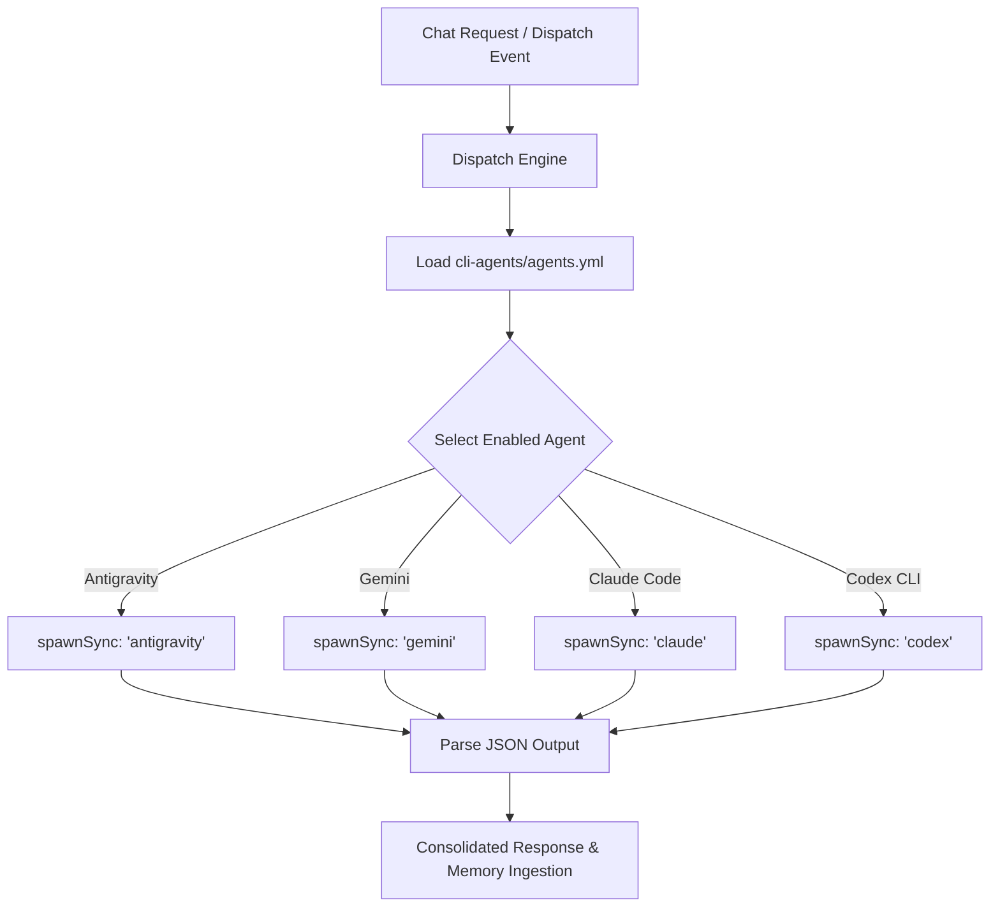

# CLI Agents — Headless Multi-Agent Orchestration & Dispatch Engine

This system skill governs the discovery, configuration, and execution of headless **CLI Agents** within the Total Recall Sovereign OS. It replaces local models (via Ollama/Gemma) with a high-speed, parallelized dispatch engine that orchestrates elite external developer agents (`antigravity`, `gemini`, `claude`, `codex`) via synchronous subprocess execution (`spawnSync`).

---

## 🎯 SYSTEM OVERVIEW

The CLI Agent Dispatch Engine parses agent profiles from the central registry file:
`.agent/skills/total-recall/skills/tr-cli-agents/agents.yml`



### Core Execution Modality
To maintain deterministic control, security compliance, and bypass complex permission prompts, agents are headlessly spawned with custom default models, auto-accept parameters, and yolo bypass flags configured per-binary.

---

## 📂 REGISTRY CONFIGURATION (`agents.yml`)

The primary configuration format defines active binaries, default flags, priorities, and execution modes:

```yaml
agents:
  - name: antigravity
    binary: antigravity
    flags: --sandbox=false --yolo -o json
    priority: 1
    enabled: true
    exec: flag
  - name: gemini
    binary: gemini
    flags: --sandbox=false --yolo -o json
    priority: 2
    enabled: true
    exec: flag
  - name: claude
    binary: claude
    flags: --output-format json --permission-mode bypassPermissions
    priority: 3
    enabled: true
    exec: flag
  - name: codex
    binary: codex
    flags: --full-auto --json
    priority: 4
    enabled: true
    exec: subcommand
timeout: 300
max_retries: 2
```

### Key Execution Modes (`exec`)
*   **`flag`**: Appends input strings or JSON schemas as standard execution flags directly to the command invocation.
*   **`subcommand`**: Passes execution commands as a nested subcommand (e.g., `codex run --payload=...`).

---

## 🛡️ SECURITY & COMPLIANCE

1.  **Strict Sandbox Isolation**: When running third-party code generated during multi-agent dispatches, dispatches MUST enforce `--sandbox=true` unless explicitly overridden by `security.yml` locality rules.
2.  **State Verification**: The dispatch engine captures and parses `stderr` streams separately. Any unhandled exit code > 0 automatically raises a fallback sequence to the next enabled agent in the priority queue.
3.  **Authentication Handshake**: All spawned dispatches carry the active brain PAT token securely mapped via the `TR_PAT` environment variable to ensure seamless VFS memory access during execution.

---

## ⚠️ HARD-EARNED LESSONS & RECOVERY MANUAL (CRITICAL RUNTIME KNOWLEDGE)

The following architectural realities represent hard-earned technical breakthroughs required to ensure 100% stable execution of the `antigravity` agent and associated background dispatch loops. **DO NOT DEVIATE from these patterns during future updates or refactoring sessions.**

### 1. macOS LaunchAgent & Background Process PATH Isolation Pathology
*   **The Problem**: Background execution managers (like macOS LaunchAgents, cron jobs, and daemon processes) boot with a highly restricted, shell-isolated environment. This results in an empty or deeply stripped `$PATH` variable.
*   **The Pathology**: Spawning standard child processes (such as `spawnSync('which antigravity')`) under these contexts fails silently or throws empty strings, making active agents completely undiscoverable even if they are globally linked or installed.
*   **The Immutable Resolution**:
    1.  **Boot PATH Expansion**: Maintain proactive PATH expansion at the absolute top of the configuration system ([src/core/config.mjs](file:///Users/greg/Github/total-recall/src/core/config.mjs)) to expand `$PATH` using verified node versions and standard locations before any other logic compiles.
    2.  **Pure JS Resolver (`findBinaryInPath`)**: Never spawn external process calls (like `which`) for discovery. Instead, use the native Node.js filesystem resolver (`findBinaryInPath` in [src/core/runtime.mjs](file:///Users/greg/Github/total-recall/src/core/runtime.mjs)) which checks stat entries (`fs.statSync`) and file execution modes directly against path segments.

### 2. Gemini API Active Model Realities (2026)
*   **The Problem**: Many standard or legacy model mappings are deprecated, causing silent failures or standard `404` errors directly from the Google API endpoints.
*   **The Pathology**:
    -   `gemini-2.0-flash` is deprecated on modern API profiles and returns a `404` error for standard generation calls.
    -   `gemini-3.1-flash-live-preview` exists in the model registry but is restricted to audio/bidi streaming (`bidiGenerateContent`) and throws error codes for standard text generation.
*   **The Immutable Resolution**:
    1.  **Frontier Default**: Always default standard text dispatches directly to **`gemini-3.5-flash`** (verified active).
    2.  **Alias Mapping**: Maintain the robust alias mapping inside the CLI agent wrapper to dynamically map generic aliases to verified, functional frontier models:
        -   `gemini`, `default`, `flash`, `gemini-flash`, `3.5-flash` $\to$ **`gemini-3.5-flash`**
        -   `pro`, `gemini-pro`, `3.1-pro` $\to$ **`gemini-3.1-pro-preview`**

### 3. Standalone CLI Ingestion & Budget Safety compliance
*   **The Problem**: Standalone executions of custom CLI wrappers (like `antigravity`) run outside the main Express route controllers, making their token spend completely invisible to local tracking tools.
*   **The Pathology**: The `total-recall` budget safety system ([src/core/usage-tracker.mjs](file:///Users/greg/Github/total-recall/src/core/usage-tracker.mjs)) scans `~/.gemini/tmp/<folder>/chats/*.jsonl` to calculate daily/weekly spending. If an agent does not log its token metadata upon execution, the budget watchdog remains blind to its consumption, leaving the user vulnerable to rate limit bans or massive billing spikes.
*   **The Immutable Resolution**:
    -   The `antigravity` wrapper *must* capture `usageMetadata` (`promptTokenCount` and `candidatesTokenCount`) from successful API responses and append it directly as a standard JSONL line to:
        `~/.gemini/tmp/antigravity/chats/usage.jsonl`
    -   This guarantees perfect compliance and zero-leak tracking under both manual shell executions and high-throughput background daemon runs.

### 4. System-Wide CLI Agent Ingestion & Inherent Tracking Mechanics
To maintain accurate monitoring and ensure budget safeties remain 100% synchronized across all reasoning tasks, the central `usage-tracker` scans and parses execution metrics dynamically per agent:
*   **`claude` (Claude Code)**: Automatically writes local logs to `~/.claude/stats-cache.json`. Total Recall parses this file on demand to sum token usages and calculate current expenditure.
*   **`codex` (OpenAI Codex CLI)**: Appends JSONL logs recursively under `~/.codex/sessions/`. Total Recall traverses this folder structure and aggregates `prompt_tokens` and `completion_tokens` directly.
*   **`gemini` (Standard Gemini CLI)**: Saves chat history files ending with `.jsonl` directly to `~/.gemini/tmp/<hash>/chats/`. Total Recall reads the `tokens.input` and `tokens.output` fields for each log turn.
*   **`antigravity` (Native Agent Wrapper)**: Replicates standard Gemini CLI structure by appending token entries directly to `~/.gemini/tmp/antigravity/chats/usage.jsonl` on every single query turn, ensuring full compliance with the central tracking core.
